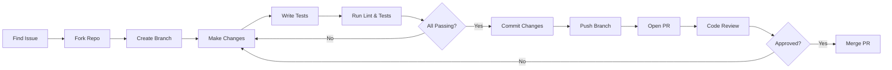
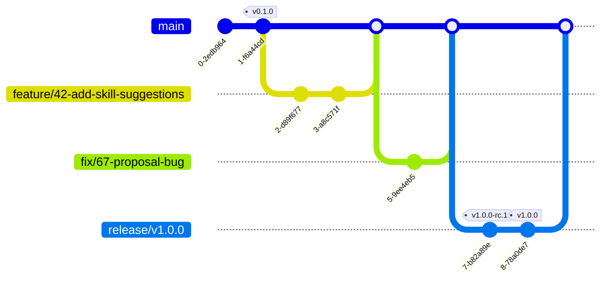

# Contributing to Jobilo — المساهمة في Jobilo

> First off, thank you for considering contributing to Jobilo! We welcome contributions from the community, whether it's bug fixes, new features, documentation improvements, or translations.

---

## Code of Conduct | مدونة قواعد السلوك

This project and everyone participating in it is governed by our [Code of Conduct](CODE_OF_CONDUCT.md). By participating, you are expected to uphold this code. Please report unacceptable behavior to `conduct@jobilo.ai`.

---

## How to Contribute | كيفية المساهمة

### Ways to Contribute

| Type | الوصف | Description | How to Start |
|------|-------|-------------|-------------|
| 🐛 **Bug Reports** | تقارير الأخطاء | Report bugs with clear reproduction steps | [Open an issue](https://github.com/jobilo/jobilo/issues) |
| 💡 **Feature Requests** | طلبات الميزات | Suggest new features or improvements | [Open a discussion](https://github.com/jobilo/jobilo/discussions) |
| 📝 **Documentation** | التوثيق | Improve docs, fix typos, add translations | Fork repo → edit docs/ → PR |
| 🌐 **Translations** | الترجمات | Help with Arabic/English translations | See i18n contributing guide |
| 💻 **Code** | الكود | Fix bugs or implement features | See development setup below |
| 🧪 **Testing** | الاختبارات | Write unit, integration, or E2E tests | Pick untested modules |
| 🔒 **Security** | الأمان | Report security vulnerabilities | Email security@jobilo.ai (not public issues) |

### Contribution Workflow



---

## Development Setup | إعداد بيئة التطوير

### Prerequisites

| Tool | الأدوات | Version | Installation |
|------|---------|---------|-------------|
| **Node.js** | نود.جيإس | ≥ 18.x | [nodejs.org](https://nodejs.org/) |
| **pnpm** | بي إن بي إم | ≥ 8.x | `npm install -g pnpm` |
| **Docker** | دوكر | Latest | [docker.com](https://www.docker.com/) |
| **PostgreSQL** | بوستجريس | 16 | Via Docker (recommended) |
| **Git** | جيت | ≥ 2.40 | [git-scm.com](https://git-scm.com/) |
| **VS Code** | فيجوال ستوديو كود | Latest | Recommended editor |

### Step-by-Step Setup

```bash
# 1. Fork and clone the repository
git clone https://github.com/YOUR_USERNAME/jobilo.git
cd jobilo

# 2. Add upstream remote
git remote add upstream https://github.com/jobilo/jobilo.git

# 3. Install dependencies
pnpm install

# 4. Set up environment variables
cp .env.example .env
# Edit .env with your local settings

# 5. Start infrastructure services (PostgreSQL, Redis, MinIO)
docker compose up -d

# 6. Push database schema
pnpm prisma:push

# 7. Seed the database
pnpm prisma:seed

# 8. Start development servers
pnpm dev
```

### Development Scripts

| Command | الوصف | Description |
|---------|-------|-------------|
| `pnpm dev` | بدء التطوير | Start all development servers (web + api) |
| `pnpm build` | بناء | Build all packages for production |
| `pnpm lint` | فحص الكود | Run ESLint across all packages |
| `pnpm format` | تنسيق | Format code with Prettier |
| `pnpm test` | اختبار | Run all tests |
| `pnpm test:watch` | اختبار مستمر | Run tests in watch mode |
| `pnpm test:e2e` | اختبار شامل | Run E2E tests (Playwright) |
| `pnpm prisma:push` | مزامنة قاعدة البيانات | Push Prisma schema to database |
| `pnpm prisma:seed` | تعبئة البيانات | Seed database with sample data |
| `pnpm prisma:studio` | استوديو بريزما | Open Prisma Studio GUI |
| `pnpm typecheck` | التحقق من الأنواع | Run TypeScript type checking |

---

## Coding Standards | معايير البرمجة

### Language & Framework

| Area | Standard |
|------|----------|
| **Language** | TypeScript (strict mode) |
| **Frontend** | Next.js 15 App Router, React Server Components preferred |
| **Backend** | NestJS with modular architecture |
| **Styling** | Tailwind CSS with RTL variants |
| **State Management** | React Context + Server Components (avoid Redux) |

### Code Style

- **Indentation**: 2 spaces (no tabs)
- **Quotes**: Single quotes for TypeScript/JavaScript
- **Semicolons**: Required
- **Trailing commas**: ES5 compatible (no trailing commas in function params)
- **Line length**: 100 characters maximum
- **File naming**: `kebab-case.ts` for utilities, `PascalCase.tsx` for components, `kebab-case.module.ts` for Angular modules

Automatically enforced via ESLint and Prettier:
```bash
pnpm lint    # Check code style
pnpm format  # Auto-fix code style
```

### TypeScript Guidelines

```typescript
// ✅ Good: Explicit types for public APIs
export function createProject(dto: CreateProjectDto): Promise<ProjectResponse> {
  return this.projectService.create(dto);
}

// ✅ Good: Interfaces over type aliases for objects
interface UserProfile {
  id: string;
  displayName: string;
  skills: string[];
}

// ✅ Good: Use enums for fixed sets
export enum ProjectStatus {
  OPEN = 'OPEN',
  IN_PROGRESS = 'IN_PROGRESS',
  COMPLETED = 'COMPLETED',
  CANCELLED = 'CANCELLED',
}

// ❌ Avoid: any
const data: any = fetchData(); // Bad

// ✅ Instead: unknown + type guard
const data: unknown = fetchData();
if (isValidResponse(data)) {
  processData(data);
}
```

### Naming Conventions

| Element | Convention | Example |
|---------|------------|---------|
| **Classes** | PascalCase | `ProjectService`, `CreateProjectDto` |
| **Interfaces** | PascalCase (no I prefix) | `ProjectRepository`, `UserProfile` |
| **Types** | PascalCase | `ProjectStatus`, `ApiResponse` |
| **Functions** | camelCase | `createProject`, `getUserById` |
| **Variables** | camelCase | `userName`, `projectList` |
| **Constants** | UPPER_SNAKE_CASE | `MAX_FILE_SIZE`, `JWT_EXPIRY` |
| **Files (components)** | PascalCase | `ProjectCard.tsx`, `UserAvatar.tsx` |
| **Files (utilities)** | kebab-case | `date-utils.ts`, `array-helpers.ts` |
| **Files (modules)** | kebab-case | `auth.module.ts`, `project.controller.ts` |
| **Directories** | kebab-case | `src/modules/auth/` |
| **Database columns** | snake_case | `created_at`, `user_id` |

### Component Patterns (React)

```typescript
// ✅ Good: Server Component by default
// app/projects/page.tsx
async function ProjectsPage() {
  const projects = await getProjects();
  return <ProjectList projects={projects} />;
}

// ✅ Good: Client Component only when needed
// 'use client'
function ProposeButton({ projectId }: { projectId: string }) {
  const [isLoading, setIsLoading] = useState(false);
  // ... interactivity
}
```

---

## Pull Request Process | عملية طلب السحب

### PR Checklist

Before submitting a PR, ensure:

- [ ] Code follows the project's coding standards (run `pnpm lint`)
- [ ] TypeScript compiles without errors (run `pnpm typecheck`)
- [ ] All tests pass (run `pnpm test`)
- [ ] New tests are added for new features or bug fixes
- [ ] Documentation is updated (README, JSDoc, or relevant docs)
- [ ] Changes are limited to the scope described in the issue/feature
- [ ] Commit messages follow [Conventional Commits](#commit-convention)
- [ ] Branch follows [naming conventions](#branch-naming)
- [ ] No new dependencies without discussion
- [ ] PR description explains the "what" and "why"

### PR Title Format

```
<type>(<scope>): <description>
```

Examples:
- `feat(auth): add refresh token rotation`
- `fix(projects): resolve proposal count off-by-one error`
- `docs(api): update endpoint documentation`
- `style(ui): fix button alignment in RTL mode`

### PR Review Process

1. **Draft PR**: Create as Draft if still working on it
2. **Auto-checks**: CI runs lint, typecheck, tests, build
3. **Review**: At least one maintainer reviews the code
4. **Changes**: Address review feedback with additional commits
5. **Approval**: Maintainer approves the changes
6. **Merge**: Squash-merge into main branch
7. **Cleanup**: Delete the feature branch

---

## Commit Convention | اصطلاح الالتزام

We follow **Conventional Commits** specification. This enables automatic changelog generation and semantic versioning.

### Commit Format

```
<type>(<scope>): <description>

[optional body]

[optional footer(s)]
```

### Types

| Type | Usage |
|------|-------|
| `feat` | A new feature |
| `fix` | A bug fix |
| `docs` | Documentation only changes |
| `style` | Code style changes (formatting, missing semicolons, etc.) |
| `refactor` | Code changes that neither fix bugs nor add features |
| `test` | Adding or updating tests |
| `chore` | Build process, dependencies, tooling changes |
| `perf` | Performance improvements |
| `ci` | CI/CD configuration changes |
| `revert` | Reverting a previous commit |

### Examples

```bash
# Feature
git commit -m "feat(auth): implement refresh token rotation"

# Bug fix with scope
git commit -m "fix(projects): handle null proposal count"

# Documentation
git commit -m "docs: update API documentation for project endpoints"

# Breaking change
git commit -m "feat(api)!: restructure project response schema"

# With body and footer
git commit -m "fix(proposals): validate budget range" \
  -m "Budget must be between $10 and $100,000" \
  -m "Closes #123"
```

---

## Branch Naming | تسمية الفروع

| Branch Type | Pattern | Example |
|-------------|---------|---------|
| **Feature** | `feature/<issue-number>-<description>` | `feature/42-add-skill-suggestions` |
| **Bug fix** | `fix/<issue-number>-<description>` | `fix/87-fix-proposal-count` |
| **Documentation** | `docs/<description>` | `docs/update-readme-arabic` |
| **Hotfix** | `hotfix/<description>` | `hotfix/critical-auth-bug` |
| **Release** | `release/<version>` | `release/v1.0.0` |
| **Chore** | `chore/<description>` | `chore/update-dependencies` |

### Branching Strategy



---

## Testing Requirements | متطلبات الاختبار

### Test Coverage Expectations

| Layer | Coverage Target | Framework | Examples |
|-------|----------------|-----------|----------|
| **Domain Services** | ≥ 95% | Jest | Unit tests for business logic |
| **Application Services** | ≥ 90% | Jest | Use case tests with mocked repositories |
| **Controllers** | ≥ 85% | Jest + Supertest | HTTP request/response tests |
| **Components (UI)** | ≥ 80% | Jest + Testing Library | Component render + interaction tests |
| **E2E Flows** | Critical paths | Playwright | Login → Create project → Submit proposal |
| **Security** | All auth paths | jest + custom | Token validation, RBAC checks |

### Running Tests

```bash
# Run all tests
pnpm test

# Run tests with coverage
pnpm test:coverage

# Run specific module tests
pnpm test -- --grep "auth"

# Run E2E tests
pnpm test:e2e

# Run tests in watch mode
pnpm test:watch
```

### Writing Tests

```typescript
// ✅ Good: Unit test example
describe('ProjectService', () => {
  let service: ProjectService;
  let mockRepo: jest.Mocked<IProjectRepository>;

  beforeEach(async () => {
    mockRepo = {
      create: jest.fn(),
      findAll: jest.fn(),
      findById: jest.fn(),
    };
    
    const module = await Test.createTestingModule({
      providers: [
        ProjectService,
        { provide: IProjectRepository, useValue: mockRepo },
      ],
    }).compile();

    service = module.get(ProjectService);
  });

  describe('createProject', () => {
    it('should create a project with valid data', async () => {
      const dto = new CreateProjectDto();
      mockRepo.create.mockResolvedValue(projectFixture);
      
      const result = await service.create(dto);
      expect(result).toBeDefined();
      expect(mockRepo.create).toHaveBeenCalledWith(dto);
    });
  });
});
```

---

## Questions? | أسئلة؟

If you have questions about contributing, please:

1. Check existing [GitHub Discussions](https://github.com/jobilo/jobilo/discussions)
2. Join our community chat (link in README)
3. Email the core team at `developers@jobilo.ai`

---

## Links | روابط ذات صلة

- [README.md](README.md) — Main project readme
- [Code of Conduct](CODE_OF_CONDUCT.md) — Community guidelines
- [Project Overview](docs/PROJECT_OVERVIEW.md) — Project details
- [Architecture](docs/ARCHITECTURE.md) — System architecture
