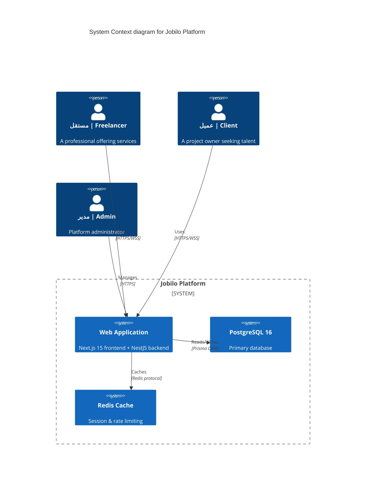

# Jobilo — سوق العمل الحر بالعربية
### The Arabic Freelancing Marketplace

> **ربط المواهب العربية بفرص العمل الحر** | Connecting Arabic talent with freelancing opportunities


---

## 📋 جدول المحتويات | Table of Contents
- [عن المشروع | About](#about)
- [المميزات | Features](#features)
- [مجموعة التقنيات | Tech Stack](#tech-stack)
- [معمارية النظام | Architecture](#architecture)
- [بداية الاستخدام | Getting Started](#getting-started)
- [هيكل المشروع | Project Structure](#project-structure)
- [التوثيق | Documentation](#documentation)
- [الترخيص | License](#license)
- [المساهمة | Contributing](#contributing)

---

<a name="about"></a>
## 🌟 عن المشروع | About

**Jobilo** is a modern freelancing marketplace built specifically for Arabic-speaking professionals and clients. The platform bridges the gap between talented freelancers across the Arab world and project owners seeking quality work — with a fully Arabic-first experience, AI-powered skill matching, and a commission-free MVP phase.

**Jobilo** هو سوق عمل حر متكامل صُمم خصيصًا للناطقين بالعربية. يهدف المشروع إلى ربط المستقلين الموهوبين في جميع أنحاء العالم العربي بأصحاب المشاريع الذين يبحثون عن عمل عالي الجودة، مع تجربة عربية كاملة وذكاء اصطناعي لمطابقة المهارات، ومرحلة أولية بدون عمولات.

---

<a name="features"></a>
## ✨ المميزات | Features

| الميزة | Feature | الوصف | Description |
|--------|---------|-------|-------------|
| 🔍 | **Matching Marketplace** | Intelligent project-to-freelancer matching using AI algorithms |
| 💡 | **Skill Suggestions AI** | AI-powered skill recommendations based on profile and market trends |
| 👤 | **Profile Management** | Rich freelancer profiles with portfolio, skills, certifications, and ratings |
| 💬 | **Messaging System** | Real-time chat using WebSockets with Arabic RTL support |
| 💳 | **Subscription Plans** | Tiered subscription model for freelancers (Basic, Pro, Enterprise) |
| 🛡️ | **Admin Dashboard** | Comprehensive admin panel for user management, disputes, and analytics |
| 🔐 | **Role-Based Access** | RBAC with granular permissions for freelancers, clients, admins, and moderators |
| 🌐 | **Multi-Language** | Full Arabic (RTL) and English (LTR) support with i18n |
| 📊 | **Analytics & Reports** | Detailed statistics for users and platform admins |

---

<a name="tech-stack"></a>
## 🛠️ مجموعة التقنيات | Tech Stack

| الطبقة | Layer | التقنية | Technology |
|--------|-------|---------|------------|
| **Frontend** | Presentation | [Next.js 15](https://nextjs.org/) (App Router, Server Components) |
| **Frontend** | Styling | [Tailwind CSS](https://tailwindcss.com/) v3 with RTL support |
| **Frontend** | Fonts | [Cairo](https://fonts.google.com/specimen/Cairo) (Arabic) & [Inter](https://fonts.google.com/specimen/Inter) (English) |
| **Backend** | API | [NestJS](https://nestjs.com/) (Monolithic with module separation) |
| **Backend** | Language | [TypeScript](https://www.typescriptlang.org/) (strict mode) |
| **Backend** | ORM | [Prisma](https://www.prisma.io/) v5 |
| **Database** | Storage | [PostgreSQL 16](https://www.postgresql.org/) |
| **Auth** | Security | [JWT](https://jwt.io/) (Access + Refresh tokens) |
| **Realtime** | Communication | [WebSocket](https://socket.io/) (Socket.IO) |
| **Infrastructure** | Containerization | [Docker](https://www.docker.com/) + Docker Compose |
| **Infrastructure** | Reverse Proxy | Nginx |
| **Testing** | E2E | Playwright |
| **Testing** | Unit/Integration | Jest |

---

<a name="architecture"></a>
## 🏗️ معمارية النظام | Architecture



### نظرة عامة على المعمارية | Architecture Highlights

| المكون | Component | الدور | Role |
|--------|-----------|------|------|
| **Frontend** | Next.js 15 App Router | SSR, ISR, client components for interactive UI |
| **API Layer** | NestJS Controllers | RESTful endpoints with validation, guards, interceptors |
| **Service Layer** | NestJS Services | Business logic, DTOs, domain rules |
| **Persistence** | Prisma + PostgreSQL 16 | Type-safe queries, migrations, relations |
| **Auth** | Passport + JWT | Local strategy, JWT strategy, refresh token rotation |
| **Realtime** | Socket.IO Gateway | Live messaging, notifications, status updates |
| **Storage** | AWS S3 / MinIO | File uploads, profile images, portfolio assets |

---

<a name="getting-started"></a>
## 🚀 بداية الاستخدام | Getting Started

### المتطلبات الأساسية | Prerequisites

| المتطلب | Prerequisite | الإصدار | Version |
|----------|-------------|---------|---------|
| Node.js | [Node.js](https://nodejs.org/) | 18.x or higher |
| Docker | [Docker Desktop](https://www.docker.com/products/docker-desktop/) | Latest |
| PostgreSQL | [PostgreSQL](https://www.postgresql.org/) | 16 |
| npm/pnpm | Package Manager | 9+ / 8+ |
| Git | [Git](https://git-scm.com/) | 2.40+ |

### خطوات التشغيل | Setup Steps

```bash
# 1. استنساخ المشروع | Clone the repository
git clone https://github.com/jobilo/jobilo.git
cd jobilo

# 2. إعداد متغيرات البيئة | Setup environment variables
cp .env.example .env
# قم بتعديل ملف .env بإعدادات قاعدة البيانات و JWT
# Edit .env with your database and JWT settings

# 3. تشغيل الحاويات | Start Docker containers
docker compose up -d

# 4. تثبيت الاعتماديات | Install dependencies
npm install

# 5. مزامنة قاعدة البيانات | Push database schema
npx prisma db push

# 6. تعبئة البيانات الأولية | Seed the database
npx prisma db seed

# 7. تشغيل التطبيق | Start the application
npm run dev
```

The application will be available at:
- **Frontend**: http://localhost:3000
- **API**: http://localhost:4000/api
- **API Documentation**: http://localhost:4000/api/docs

---

<a name="project-structure"></a>
## 📁 هيكل المشروع | Project Structure

```
jobilo/
├── apps/
│   ├── web/                    # Next.js 15 Frontend
│   │   ├── app/               # App Router pages
│   │   ├── components/        # Shared components
│   │   ├── lib/               # Utilities, API client
│   │   ├── hooks/             # Custom React hooks
│   │   └── public/            # Static assets
│   └── api/                   # NestJS Backend
│       ├── src/
│       │   ├── modules/       # Feature modules
│       │   ├── common/        # Shared decorators, guards
│       │   ├── config/        # Configuration
│       │   └── database/      # Prisma service
│       └── prisma/            # Schema, migrations, seeds
├── packages/
│   ├── shared/                # Shared types & utilities
│   ├── ui/                    # UI component library
│   └── config/                # Shared configuration
├── docker/                    # Docker files
├── docs/                      # Documentation
├── scripts/                   # Development scripts
└── tests/                     # E2E tests
```

---

<a name="documentation"></a>
## 📚 التوثيق | Documentation

| المستند | Document | الوصف | Description |
|---------|----------|-------|-------------|
| [Project Overview](docs/PROJECT_OVERVIEW.md) | نظرة عامة على المشروع | Overview, mission, target audience |
| [Vision](docs/VISION.md) | الرؤية | 10-year vision, strategic goals |
| [Mission](docs/MISSION.md) | الرسالة | Detailed mission breakdown |
| [Roadmap](docs/ROADMAP.md) | خريطة الطريق | Development phases and milestones |
| [Architecture](docs/ARCHITECTURE.md) | المعمارية | Detailed system architecture |
| [System Design](docs/SYSTEM_DESIGN.md) | تصميم النظام | Component interactions, data flow |
| [Security](docs/SECURITY.md) | الأمان | Security architecture and policies |
| [Deployment Guide](docs/DEPLOYMENT_GUIDE.md) | دليل النشر | Deployment instructions |
| [Versioning](docs/VERSIONING.md) | إدارة الإصدارات | Semantic versioning strategy |
| [Changelog](docs/CHANGELOG.md) | سجل التغييرات | Release history |

---

<a name="license"></a>
## 📄 الترخيص | License

This project is licensed under the **MIT License** — see the [LICENSE](LICENSE) file for details.

هذا المشروع مرخص بموجب **رخصة MIT**.

---

<a name="contributing"></a>
## 🤝 المساهمة | Contributing

We welcome contributions from the community! Please see our [Contributing Guide](CONTRIBUTING.md) for details on:

- Code of Conduct
- Development setup
- Coding standards
- Pull request process
- Commit conventions

نرحب بمساهماتكم! يرجى الاطلاع على [دليل المساهمة](CONTRIBUTING.md) للتفاصيل.

---

## 👥 فريق المشروع | Core Team

- **Product Owner** — Ahmed Hassan
- **Tech Lead** — Mustafa Mohamed
- **Full Stack Developers** — Jobilo Team
- **UI/UX Designer** — Jobilo Design Team

---

<div align="center">
  <p>Made with ❤️ for the Arabic-speaking freelancing community</p>
  <p>تم التطوير بكل ❤️ لمجتمع العمل الحر العربي</p>
</div>
