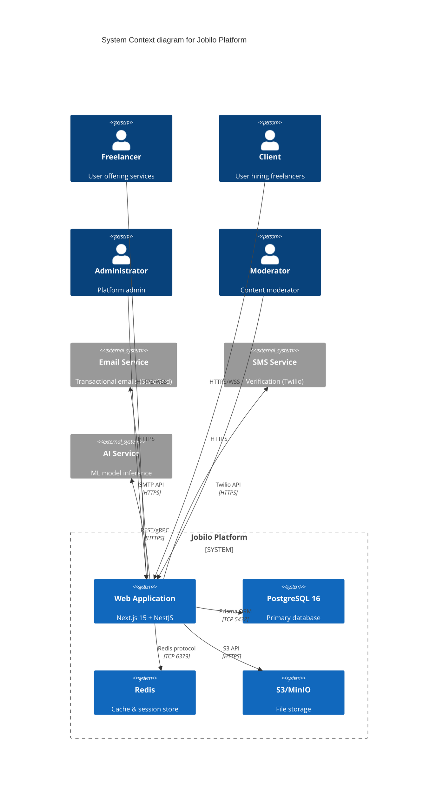
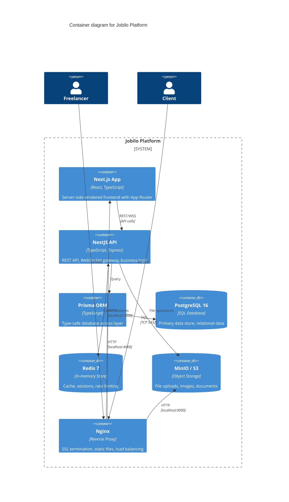
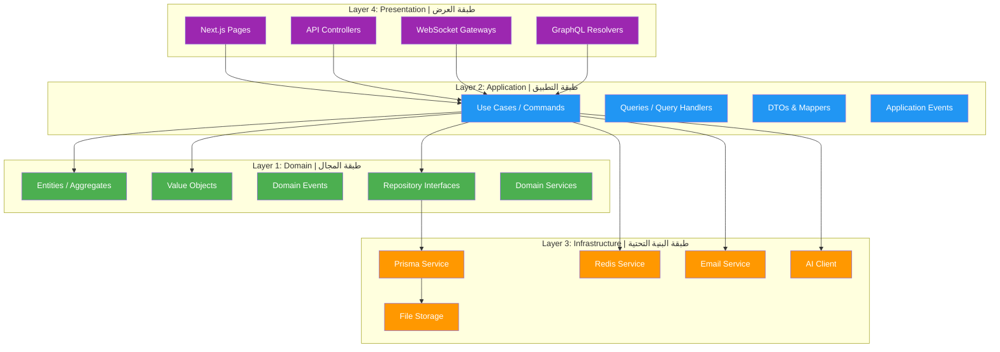
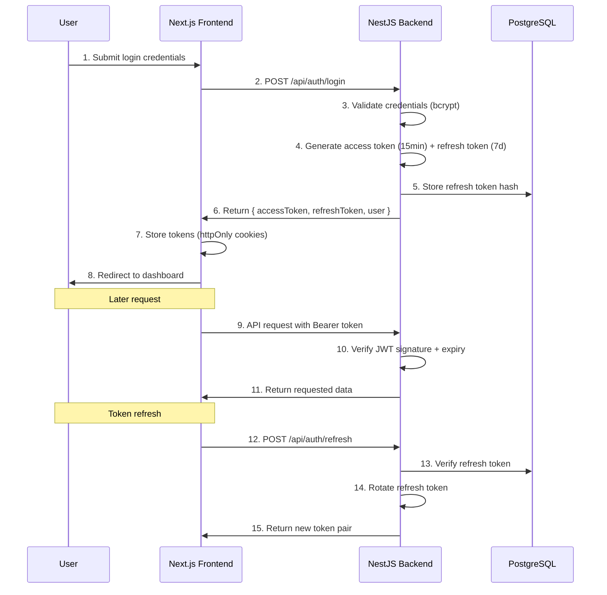
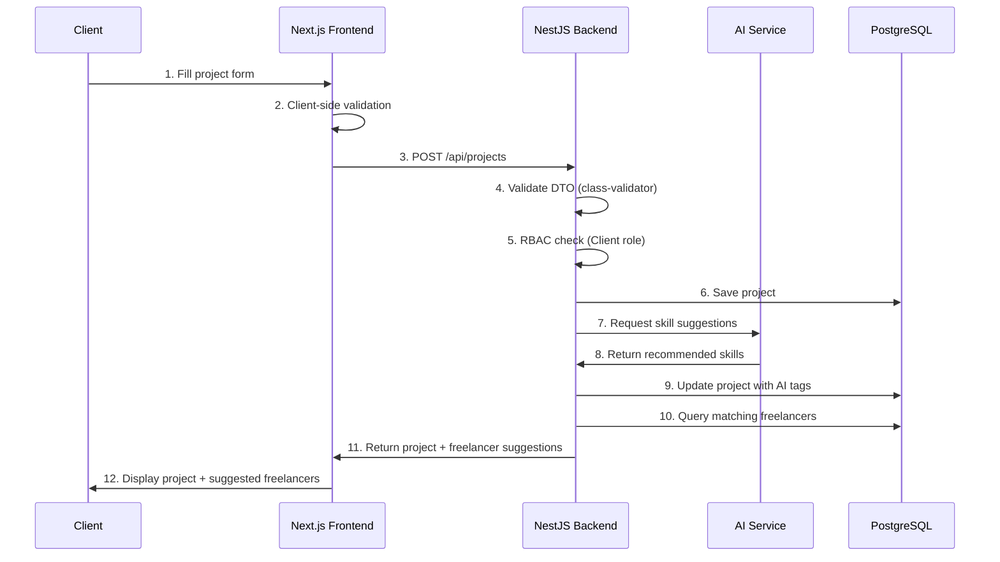
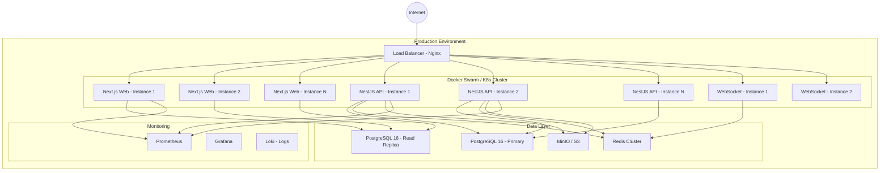

# Architecture Document — وثيقة المعمارية

> **Jobilo System Architecture**: Clean Architecture with Domain-Driven Design patterns, built for scalability and maintainability.

---

## System Architecture Overview | نظرة عامة على معمارية النظام

### Context Diagram (C4 Model Level 1)



### Container Diagram (C4 Model Level 2)



---

## Clean Architecture Layers | طبقات المعمارية النظيفة

Jobilo follows **Clean Architecture** principles with strict dependency inversion. Inner layers never depend on outer layers.



### Layer 1: Domain Layer | طبقة المجال

The innermost layer containing enterprise business rules and domain entities.

| Component | الدور | Role | Examples |
|-----------|-------|------|----------|
| **Entities** | الكيانات | Core business objects with identity | User, Project, Proposal, Contract |
| **Value Objects** | كائنات القيمة | Immutable objects representing concepts | Money, EmailAddress, PhoneNumber, SkillLevel |
| **Domain Events** | أحداث المجال | Events that domain experts care about | ProjectAssigned, PaymentReleased, ProfileVerified |
| **Repository Interfaces** | واجهات المستودع | Abstract data access contracts | IUserRepository, IProjectRepository |
| **Domain Services** | خدمات المجال | Stateless services for domain logic | SkillMatchingService, ProposalScoringService |

**Key Rule**: Domain layer has **zero dependencies** on external frameworks or infrastructure.

### Layer 2: Application Layer | طبقة التطبيق

Orchestrates use cases, applies domain rules, and manages transactions.

| Component | الدور | Role | Examples |
|-----------|-------|------|----------|
| **Commands** | الأوامر | Write operations (CQRS commands) | CreateProjectCommand, SubmitProposalCommand |
| **Queries** | الاستعلامات | Read operations (CQRS queries) | GetUserProfileQuery, SearchProjectsQuery |
| **Command/Query Handlers** | معالجات الأوامر | Execute use cases with domain services | CreateProjectHandler, SubmitProposalHandler |
| **DTOs** | كائنات نقل البيانات | Data transfer objects for API contracts | CreateProjectDto, ProjectResponseDto |
| **Application Events** | أحداث التطبيق | Cross-cutting concerns events | UserRegisteredEvent, ProjectCreatedEvent |

### Layer 3: Infrastructure Layer | طبقة البنية التحتية

Implements interfaces defined by inner layers. Contains framework-specific code.

| Component | الدور | Role | Technology |
|-----------|-------|------|------------|
| **Database Access** | الوصول إلى قاعدة البيانات | Prisma repository implementations | Prisma ORM |
| **Caching** | التخزين المؤقت | Redis cache service | ioredis |
| **File Storage** | تخزين الملفات | S3/MinIO file operations | @aws-sdk/client-s3 |
| **Email** | البريد الإلكتروني | Transactional email sending | SendGrid / Nodemailer |
| **AI/ML** | الذكاء الاصطناعي | ML model inference client | TensorFlow Serving / ONNX |
| **Authentication** | المصادقة | Passport strategies, JWT | @nestjs/passport, @nestjs/jwt |
| **Validation** | التحقق من الصحة | Input validation pipes | class-validator, class-transformer |

### Layer 4: Presentation Layer | طبقة العرض

Handles HTTP requests, WebSocket connections, and server-side rendering.

| Component | الدور | Role | Technology |
|-----------|-------|------|------------|
| **Next.js Pages** | صفحات الواجهة | SSR pages, API routes | Next.js 15 App Router |
| **NestJS Controllers** | وحدات التحكم | RESTful API endpoints | @nestjs/common |
| **WebSocket Gateways** | بوابات WebSocket | Real-time event handling | @nestjs/websockets + Socket.IO |
| **Guards** | الحراس | Authentication & authorization | @nestjs/passport, custom RBAC guards |
| **Interceptors** | المعترضات | Request/response transformation | NestJS interceptors |
| **Filters** | المرشحات | Exception handling | NestJS exception filters |

---

## Module Dependency Graph

```mermaid
flowchart TD
    Auth[Auth Module] --> User[User Module]
    Auth --> RBAC[RBAC Module]
    User --> Profile[Profile Module]
    Profile --> Skill[Skill Module]
    Skill --> AI[AI Suggestions Module]
    User --> Project[Project Module]
    Project --> Proposal[Proposal Module]
    Project --> Contract[Contract Module]
    User --> Message[Message Module]
    Message --> Notification[Notification Module]
    Profile --> Review[Review Module]
    Contract --> Payment[Payment Module]
    Payment --> Subscription[Subscription Module]
    Admin[Admin Module] --> User
    Admin --> Project
    Admin --> Review
    Admin --> Payment
    AI --> Project
    Config[Config Module] --> All Modules
    Database[Database Module] --> All Modules

    style Auth fill:#E91E63,color:#fff
    style Project fill:#2196F3,color:#fff
    style Payment fill:#4CAF50,color:#fff
    style AI fill:#FF9800,color:#fff
    style Admin fill:#9C27B0,color:#fff
```

### Module Descriptions

| Module | المسؤولية | Responsibility | Status |
|--------|-----------|---------------|--------|
| **Auth** | Registration, login, token management, social auth | ✅ Active |
| **User** | User CRUD, preferences, settings | ✅ Active |
| **RBAC** | Role definitions, permission checks, role assignment | ✅ Active |
| **Profile** | Freelancer/client profiles, portfolio, experience | 🏗️ In Progress |
| **Skill** | Skill definitions, categories, skill associations | 🏗️ In Progress |
| **AI Suggestions** | ML-powered skill recommendations | 📋 Planned |
| **Project** | Project CRUD, search, filtering, status management | 🏗️ In Progress |
| **Proposal** | Proposal submission, bidding, acceptance | 📋 Planned |
| **Contract** | Contract templates, e-signatures, milestone tracking | 📋 Planned |
| **Message** | Real-time chat, file sharing, conversation management | 📋 Planned |
| **Notification** | Email + in-app notifications, preferences | 📋 Planned |
| **Review** | Star ratings, written reviews, review verification | 📋 Planned |
| **Payment** | Escrow, milestone payments, payout processing | 📋 Planned |
| **Subscription** | Plan management, billing, feature gating | 📋 Planned |
| **Admin** | User management, moderation, platform analytics | 🏗️ In Progress |
| **Config** | Centralized configuration, environment validation | ✅ Active |
| **Database** | Prisma service, connection management, migrations | ✅ Active |

---

## Data Flow Diagrams | مخططات تدفق البيانات

### Authentication Flow



### Project Creation Flow



---

## Deployment Architecture | معمارية النشر



### Container Configuration

| Service | Image | Ports | Replicas | Resource Limits |
|---------|-------|-------|----------|-----------------|
| **Next.js** | jobilo-web | 3000 | 2–5 | 512MB RAM, 1 CPU |
| **NestJS API** | jobilo-api | 4000 | 2–5 | 1GB RAM, 2 CPU |
| **PostgreSQL** | postgres:16-alpine | 5432 | 1 primary + 1 replica | 4GB RAM, 4 CPU |
| **Redis** | redis:7-alpine | 6379 | 3 (cluster) | 512MB RAM, 1 CPU |
| **MinIO** | minio/minio | 9000, 9001 | 1 | 2GB RAM, 2 CPU |
| **Nginx** | nginx:alpine | 80, 443 | 2 | 256MB RAM, 1 CPU |

---

## Scalability Strategy | استراتيجية قابلية التوسع

### Horizontal Scaling

| Component | Strategy | Notes |
|-----------|----------|-------|
| **Next.js** | Multiple instances behind Nginx load balancer | Stateless, session stored in Redis |
| **NestJS API** | Multiple instances, horizontal pod autoscaling | Stateless, no server-side sessions |
| **PostgreSQL** | Read replicas for queries, primary for writes | Connection pooling with PgBouncer |
| **Redis** | Redis Cluster with sharding | Data automatically distributed |
| **WebSocket** | Socket.IO with Redis adapter for multi-instance | Sticky sessions via Nginx ip_hash |

### Vertical Scaling (Short-term)

- Increase container resource limits as traffic grows
- Optimize database queries with indexes and query optimization
- Implement caching layers (Redis) for frequently accessed data

### Performance Targets

| Metric | Target (MVP) | Target (Scale) |
|--------|-------------|----------------|
| API Response Time (P95) | <500ms | <100ms |
| Page Load Time (P95) | <2s | <1s |
| Concurrent Users | 1,000 | 100,000+ |
| Database Queries/sec | 100 | 10,000+ |
| Uptime SLA | 99.5% | 99.99% |

---

## Technology Decisions & Rationale | القرارات التقنية والأسباب

| Decision | القرار | Rationale | Alternatives Considered |
|----------|--------|-----------|------------------------|
| **NestJS** | إطار العمل الخلفي | TypeScript-native, modular, built-in DI, WebSocket, similar to Angular patterns | Express.js (too minimal), Fastify (less ecosystem), Django (Python, not TS) |
| **Next.js 15** | إطار العمل الأمامي | Best SSR for SEO, App Router, React Server Components, great DX | Remix (smaller ecosystem), Gatsby (not ideal for dynamic apps) |
| **PostgreSQL 16** | قاعدة البيانات | JSONB for flexible profiles, full-text search, ACID, strong ecosystem | MySQL (less features), MongoDB (no relations, data integrity risk) |
| **Prisma** | ORM | Type-safe, auto-generated types, great migrations, intuitive API | TypeORM (less type-safe), Drizzle (newer, less mature) |
| **JWT** | المصادقة | Stateless, scalable, works with microservices | Sessions (stateful, scaling complexity) |
| **Tailwind CSS** | إطار التنسيق | Utility-first, RTL support, rapid development, small bundle | Material UI (heavy, customization pain), Chakra UI (smaller ecosystem) |
| **Docker** | الحاويات | Consistent environments, CI/CD, easy scaling | Manual deployment (error-prone) |
| **Socket.IO** | الاتصال الفوري | Auto-reconnection, rooms, fallback to long-polling | Raw WebSocket (no fallback), SSE (unidirectional) |

---

## Cross-Cutting Concerns | الاهتمامات الشاملة

### Logging

| Level | Usage | Implementation |
|-------|-------|---------------|
| **ERROR** | Unhandled exceptions, database errors, auth failures | NestJS Logger + Winston + Loki |
| **WARN** | Validation failures, rate limit hits, suspicious activity | Winston structured logging |
| **INFO** | User actions (create project, submit proposal, login) | Structured JSON logs |
| **DEBUG** | Development-only verbose logging | Conditional based on NODE_ENV |

### Error Handling Strategy

```typescript
// Standard error response structure
interface ApiErrorResponse {
  statusCode: number;       // HTTP status code
  error: string;           // Error code (e.g., "VALIDATION_ERROR")
  message: string;         // Human-readable message (Arabic/English)
  timestamp: string;       // ISO 8601 timestamp
  path: string;            // Request path
  details?: unknown[];     // Validation errors, stack trace (dev only)
}
```

| Error Type | HTTP Status | Handling |
|------------|-------------|----------|
| Validation error | 400 | class-validator pipe |
| Authentication | 401 | Passport + JWT guard |
| Authorization | 403 | RBAC guard |
| Not found | 404 | Global exception filter |
| Rate limit | 429 | express-rate-limit |
| Server error | 500 | Global exception filter |
| Database error | 500 | Prisma error filter |

### Monitoring & Observability

| Aspect | Tool | Metrics |
|--------|------|---------|
| **Metrics** | Prometheus + Grafana | Request rate, error rate, latency (p50/p95/p99), CPU/memory |
| **Logging** | Winston + Loki | Structured logs, error tracking |
| **Tracing** | OpenTelemetry (future) | Distributed tracing across services |
| **Health Checks** | NestJS Terminus | Database, Redis, MinIO connectivity |
| **APM** | Sentry (future) | Real-time error tracking, performance monitoring |
| **Uptime** | UptimeRobot / Better Uptime | External monitoring, status page |

---

## Links | روابط ذات صلة

- [System Design](SYSTEM_DESIGN.md) — Component interactions and data flow
- [Security Architecture](SECURITY.md) — Authentication, authorization, data protection
- [Deployment Guide](DEPLOYMENT_GUIDE.md) — Deployment instructions and configuration
- [README.md](../README.md) — Main project readme
