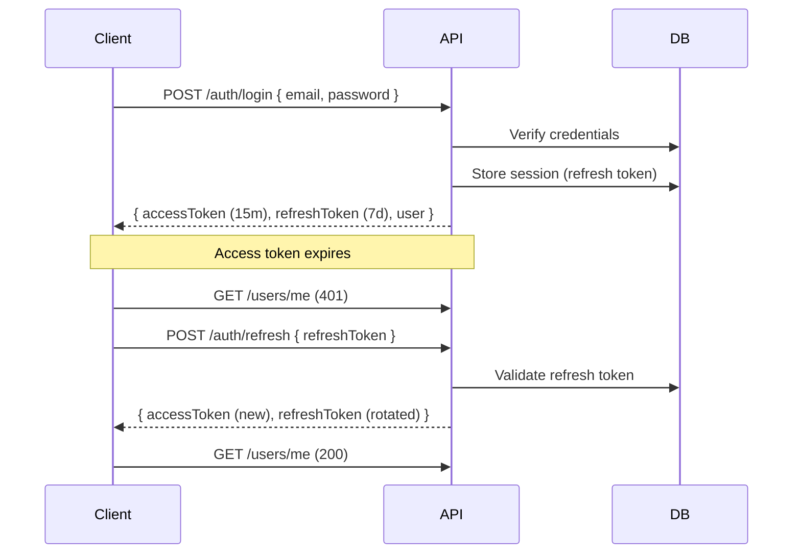
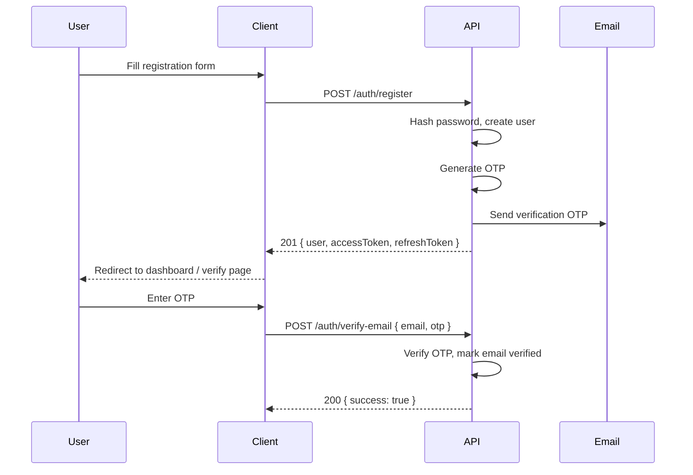

# Authentication

Jobilo uses **JWT-based authentication** with an access token + refresh token strategy.

## Token Flow



## Token Details

| Token | TTL | Storage | Usage |
|-------|-----|---------|-------|
| Access Token | 15 minutes | Memory / localStorage | `Authorization: Bearer <token>` |
| Refresh Token | 7 days | localStorage | `POST /auth/refresh` |

### Token Payload

```json
{
  "sub": "user-uuid",
  "email": "user@example.com",
  "role": "FREELANCER",
  "iat": 1700000000,
  "exp": 1700000900
}
```

## Registration Flow



Registration creates a `User` with `status: PENDING` until email is verified.

## Login Flow

1. User submits `{ email, password }` to `POST /auth/login`
2. Server verifies bcrypt hash
3. Checks account status (banned/suspended → 403)
4. Checks `loginAttempts` — locks account after 5 failures
5. Creates `UserSession` with refresh token in database
6. Returns `{ accessToken, refreshToken, user }`

### Login Attempts & Lockout

| Failed Attempts | Action |
|:---------------:|--------|
| 1-4 | Increment counter |
| 5 | Lock account for 15 minutes (`lockedUntil`) |
| 6+ | Extend lock duration |

## Token Refresh Flow

1. Client detects 401 response
2. Axios interceptor sends `POST /auth/refresh { refreshToken }`
3. Server validates refresh token against `UserSession` table
4. Checks session is active and not expired
5. Revokes old refresh token (rotation)
6. Issues new `{ accessToken, refreshToken }` pair
7. Original failed request is retried with new access token

```typescript
// Frontend interceptor (src/lib/api/client.ts)
apiClient.interceptors.response.use(
  (response) => response,
  async (error) => {
    if (error.response?.status === 401 && !originalRequest._retry) {
      originalRequest._retry = true;
      const { data } = await axios.post('/auth/refresh', { refreshToken });
      localStorage.setItem('accessToken', data.accessToken);
      originalRequest.headers.Authorization = `Bearer ${data.accessToken}`;
      return apiClient(originalRequest);
    }
    return Promise.reject(error);
  },
);
```

## Logout Flow

1. Client calls `POST /auth/logout` with valid access token
2. Server deactivates all sessions for the user
3. Client removes tokens from localStorage
4. Auth store resets state

## Email Verification

- 6-digit OTP sent via **Resend** email service
- OTP expires in **10 minutes**
- Max 5 verification attempts per OTP
- Resend available via `POST /auth/resend-verification`

**Table:** `email_verifications`
| Column | Description |
|--------|-------------|
| `email` | Target email |
| `otp` | Hashed OTP |
| `type` | `VERIFY_EMAIL` or `RESET_PASSWORD` |
| `expiresAt` | Expiry timestamp |
| `usedAt` | When consumed (null if unused) |
| `attempts` | Failed attempt counter |

## Password Reset Flow

1. User requests reset: `POST /auth/forgot-password { email }`
2. OTP sent to email
3. User submits: `POST /auth/reset-password { email, otp, password }`
4. Server verifies OTP, updates password hash
5. All sessions terminated (forced logout on other devices)

## Session Management

- `UserSession` tracks each login session
- Sessions identified by device info + IP address
- Users can view active sessions via `GET /auth/sessions`
- Sessions can be terminated individually or all at once
- When password is changed, all sessions except current are invalidated

## Security Considerations

| Measure | Implementation |
|---------|----------------|
| Password hashing | bcrypt (auto salt rounds) |
| Token signing | HS256 with secrets from env |
| Token rotation | Refresh token invalidated on use |
| Brute force protection | Rate limiting + account lockout |
| Session invalidation | On logout, password change |
| OTP expiry | 10 minutes |
| OTP attempt limit | 5 attempts per OTP |
| HTTP-only cookies | Available for cookie-based auth |
| Helmet headers | Enabled globally |
| CORS whitelist | Configured origins only |

**See:** [AUTHORIZATION.md](./AUTHORIZATION.md) for role/permission model, [ENDPOINTS.md](./ENDPOINTS.md) for auth endpoints.
