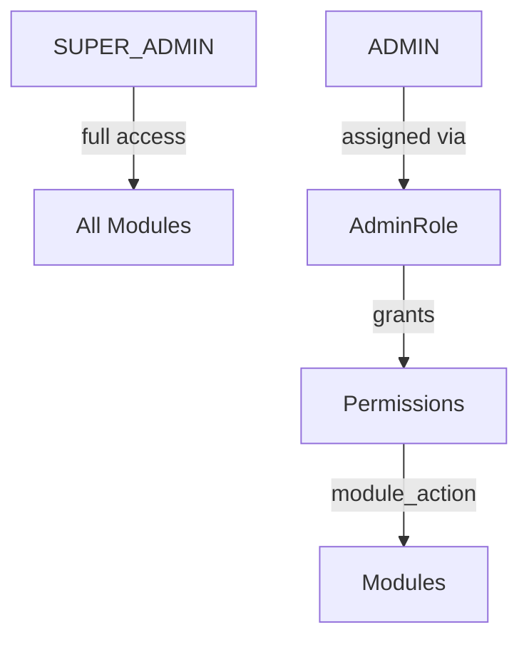

# Authorization

Jobilo uses **Role-Based Access Control (RBAC)** for user authorization and a **permission-based system** for admin authorization.

## User Roles

| Role | Name (Arabic) | Description |
|------|:--------------|-------------|
| `FREELANCER` | مستقل | Can submit proposals, work on contracts, earn reviews |
| `CLIENT` | صاحب مشروع | Can post projects, review proposals, hire freelancers |
| `ADMIN` | مشرف | Can manage users, projects, featured content |
| `SUPER_ADMIN` | مدير النظام | Full access to all platform features |

A user's role is set at registration and can only be changed by a `SUPER_ADMIN`.

## RolesGuard

The `RolesGuard` (global guard) checks the `@Roles()` decorator on routes:

```typescript
// Usage
@Roles('CLIENT')
@UseGuards(AuthGuard('jwt'), RolesGuard)
@Post()
async create(@CurrentUser('id') userId: string, @Body() dto: CreateProjectDto) {
  return this.projectsService.create(userId, dto);
}
```

### Implementation

```typescript
// src/common/guards/roles.guard.ts
@Injectable()
export class RolesGuard implements CanActivate {
  constructor(private reflector: Reflector) {}

  canActivate(context: ExecutionContext): boolean {
    const requiredRoles = this.reflector.getAllAndOverride<string[]>(ROLES_KEY, [
      context.getHandler(),
      context.getClass(),
    ]);

    if (!requiredRoles || requiredRoles.length === 0) {
      return true; // No roles required — public or JWT-only
    }

    const { user } = context.switchToHttp().getRequest();
    return requiredRoles.includes(user.role);
  }
}
```

If no `@Roles()` decorator is present, the guard allows access (deferring to `@Public()` or `AuthGuard`).

## @Roles() Decorator

```typescript
// src/common/decorators/roles.decorator.ts
export const ROLES_KEY = 'roles';
export const Roles = (...roles: string[]) => SetMetadata(ROLES_KEY, roles);
```

### Route-Level Examples

| Route | Decorator | Allowed |
|-------|-----------|---------|
| `POST /auth/register` | `@Public()` | Everyone |
| `POST /projects` | `@Roles('CLIENT')` | Clients only |
| `POST /proposals/projects/:id` | `@Roles('FREELANCER')` | Freelancers only |
| `PATCH /users/:id/role` | `@Roles('SUPER_ADMIN')` | Super admins only |
| `GET /users` | `@Roles('ADMIN', 'SUPER_ADMIN')` | Admins + Super admins |
| `POST /projects/:id/feature` | `@Roles('ADMIN', 'SUPER_ADMIN')` | Admins + Super admins |

## Public Decorator

The `@Public()` decorator marks routes that do not require authentication:

```typescript
@Public()
@Post('login')
async login(@Body() dto: LoginDto) { ... }
```

## Admin Permission System

Super Admin uses a granular permission system separate from user roles.

### Admin Modules

| Module | Description |
|--------|-------------|
| `DASHBOARD` | Dashboard access |
| `USERS` | User management |
| `PROJECTS` | Project management |
| `PROPOSALS` | Proposal oversight |
| `CONTRACTS` | Contract management |
| `DISPUTES` | Dispute resolution |
| `REPORTS` | Report management |
| `SUBSCRIPTIONS` | Subscription plans |
| `CONTENT` | Content pages |
| `BLOG` | Blog management |
| `FAQ` | FAQ management |
| `BANNERS` | Banner management |
| `SETTINGS` | Platform settings |
| `ROLES` | Admin role management |
| `AUDIT_LOGS` | Audit log access |
| `ANALYTICS` | Analytics access |
| `SECURITY` | Security settings |

### Admin Actions

`CREATE`, `READ`, `UPDATE`, `DELETE`, `APPROVE`, `REJECT`, `BLOCK`, `UNBLOCK`, `BAN`, `WARN`

### Permission Format

Permissions use the `module_action` pattern: `USERS_CREATE`, `PROJECTS_DELETE`, `DISPUTES_RESOLVE`.

### Admin Guards

```typescript
// Admin JWT authentication
@UseGuards(AdminAuthGuard)
@Get('/dashboard/stats')
async getStats() { ... }

// Admin permission check
@UseGuards(AdminAuthGuard, AdminPermissionsGuard)
@AdminPermissions('USERS', 'UPDATE')
@Patch('/users/:id')
async updateUser() { ... }
```

### Permission Inheritance

| Role | Inherits From | Effect |
|------|---------------|--------|
| `SUPER_ADMIN` | — | All permissions automatically granted |
| `ADMIN` | Configurable | Permission set defined by admin role assignment |

Permission check logic:

```typescript
hasPermission(module: string, action: string): boolean {
  if (this.admin.role === 'SUPER_ADMIN') return true;
  return this.admin.permissions.includes(`${module}_${action}`);
}
```

### Admin Role Hierarchy



### Admin Role Assignment

- Admin roles are created via `AdminRole` model
- Permissions are assigned via `AdminRolePermission` (M2M)
- Users are linked to roles via `AdminUserRole` (M2M)
- Admins can have multiple roles (union of permissions)

## Audit Trail

All authorization-sensitive actions are logged in `AuditLog`:

| Field | Description |
|-------|-------------|
| `userId` | Who performed the action |
| `action` | What was done |
| `entityType` | What entity was affected |
| `entityId` | Which record |
| `oldValues` / `newValues` | Before/after snapshots |
| `ipAddress` | Request origin |
| `userAgent` | Client information |

**See:** [AUTHENTICATION.md](./AUTHENTICATION.md) for token/auth flow, [MODULES.md](./MODULES.md) for module-specific guards.
