# Entity Relationship Diagram

Below is a comprehensive Mermaid ER diagram covering all major entities in the Jobilo platform.

```mermaid
erDiagram
    User ||--o| FreelancerProfile : has
    User ||--o| ClientProfile : has
    User ||--o{ Portfolio : owns
    User ||--o{ Project : posts
    User ||--o{ Proposal : submits
    User ||--o{ Contract : "freelancer"
    User ||--o{ Contract : "client"
    User ||--o{ Message : sends
    User ||--o{ Message : receives
    User ||--o{ Review : gives
    User ||--o{ Review : receives
    User ||--o{ Notification : has
    User ||--o{ UserSession : has
    User ||--o{ SocialLink : has
    User ||--o{ ProjectBookmark : saves
    User ||--o{ UserBadge : earns
    User ||--o{ SavedSearch : saves
    User ||--o{ Dispute : opens
    User ||--o{ Subscription : subscribes
    User ||--o{ UserReport : reports
    User ||--o{ UserReport : reported
    User ||--o{ UserDevice : uses
    User ||--o{ ContentPage : authors
    User ||--o{ BlogPost : authors
    User ||--o| AdminProfile : has
    User ||--o{ AdminUserRole : assigned
    User ||--o{ AdminLoginHistory : logs
    User ||--o{ AdminNotification : receives
    User ||--o{ AdminActivityLog : performs

    FreelancerProfile ||--o{ FreelancerSkill : has
    FreelancerProfile ||--o{ Portfolio : "featured"

    Category ||--o{ Category : parent
    Category ||--o{ Skill : contains
    Category ||--o{ Project : categorizes
    Category ||--o{ Portfolio : categorizes

    Skill ||--o{ FreelancerSkill : "linked to freelancers"
    Skill ||--o{ ProjectSkill : "required in projects"

    Project ||--o{ ProjectSkill : requires
    Project ||--o{ ProjectAttachment : attaches
    Project ||--o{ Proposal : receives
    Project ||--o{ Contract : generates
    Project ||--o{ ProjectBookmark : bookmarked
    Project ||--o{ Dispute : related
    Project ||--o{ Message : "project chat"
    Project ||--o{ UserReport : reported

    Proposal ||--o{ ProposalAttachment : attaches
    Proposal ||--o{ Contract : "accepted into"

    Contract ||--o{ Milestone : has
    Contract ||--o{ Review : receives
    Contract ||--o{ Dispute : "may dispute"

    Milestone ||--o{ Deliverable : produces

    Message ||--o{ MessageAttachment : has
    Message ||--o{ Message : replies
    Message ||--o{ UserReport : reported

    Dispute ||--o{ DisputeParticipant : includes
    Dispute ||--o{ DisputeMessage : has

    Badge ||--o{ UserBadge : "earned by users"

    SubscriptionPlan ||--o{ Subscription : "plan for"

    AdminRole ||--o{ AdminRolePermission : grants
    AdminRole ||--o{ AdminUserRole : assigned

    AdminPermission ||--o{ AdminRolePermission : "included in"

    FaqCategory ||--o{ Faq : contains

    Subscription ||--o| User : "subscribed user"
    Subscription ||--o| SubscriptionPlan : "subscribed plan"
```



## Entity Relationships Summary

### Core User → Profile
- `User` (1) → `FreelancerProfile` (0..1)
- `User` (1) → `ClientProfile` (0..1)
- A user can be both a freelancer and a client

### Project Lifecycle
```
Client creates → Project (OPEN) → Freelancer submits Proposal (PENDING)
→ Client accepts (ACCEPTED) → Contract created (DRAFT) → Signed (SIGNED)
→ Work (IN_PROGRESS) via Milestones → Client completes (COMPLETED)
→ Reviews exchanged
```

### Messaging
```
User sends Message → stored with sender/receiver → WebSocket broadcasts
→ Notifications created for offline users
```

### Dispute Resolution
```
Dispute opened on Contract → participants added → messages exchanged
→ Admin resolves or escalates
```

### Authorization Chain
```
AdminRole ← AdminRolePermission → AdminPermission (module + action)
AdminUserRole links User ↔ AdminRole
```

**See also:**
- [DATABASE.md](./DATABASE.md) for schema details
- [TABLES.md](./TABLES.md) for column definitions
- [MODULES.md](./MODULES.md) for business logic flows
