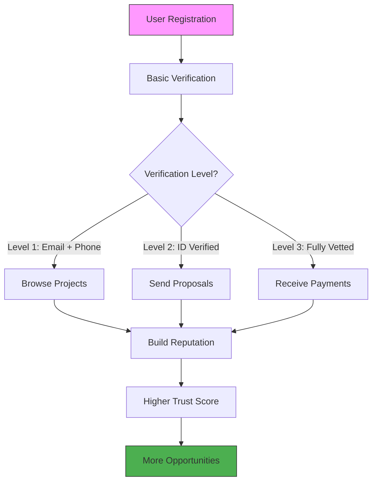
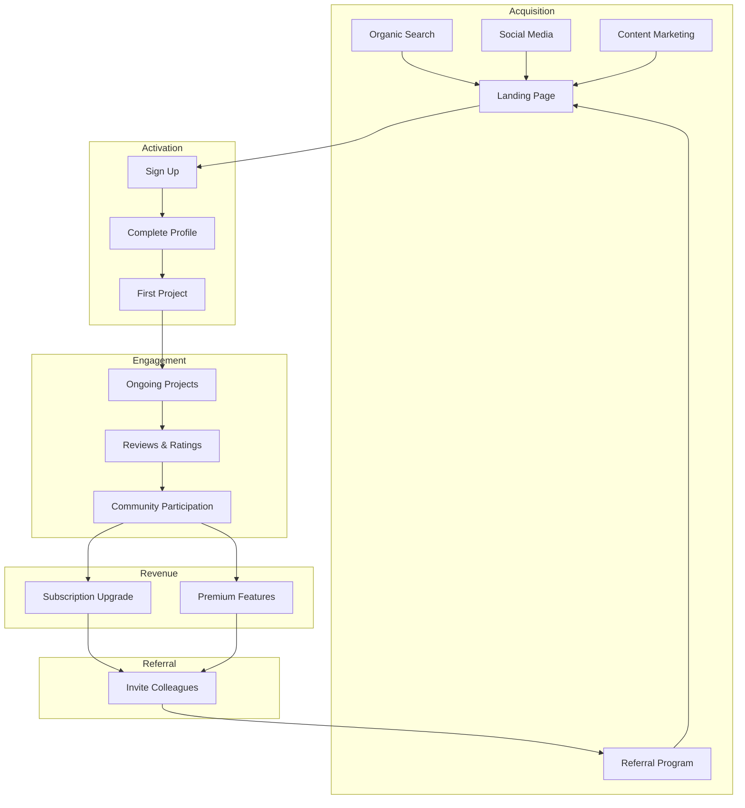

# Mission Document — وثيقة الرسالة

> **"Empower every Arabic-speaking professional to build a sustainable freelancing career by providing an intuitive, secure, and culturally-aware platform that removes barriers between talent and opportunity."**
>
> **"تمكين كل محترف ناطق بالعربية من بناء مسيرة عمل حر مستدامة من خلال توفير منصة بديهية وآمنة ومراعية للثقافة تزيل الحواجز بين الموهبة والفرصة."**

---

## Mission Breakdown | تفصيل الرسالة

Our mission consists of four key pillars, each with specific objectives and measurable outcomes.

---

## Pillar 1: Empowerment | التمكين

### Objective
Enable freelancers to achieve financial independence and professional growth through access to quality opportunities and skill development resources.

### Strategic Initiatives

| Initiative | المبادرة | Description | Timeline |
|------------|----------|-------------|----------|
| **AI Skill Suggestions** | اقتراحات المهارات بالذكاء الاصطناعي | Analyze freelancer profiles and market demand to recommend skills that increase project win rates | Q4 2026 |
| **Skill Development Paths** | مسارات تطوير المهارات | Curated learning resources and courses for in-demand skills | Q2 2027 |
| **Portfolio Builder** | بناء المحفظة الأعمال | Rich portfolio creation with project showcases, testimonials, and work samples | Q1 2027 |
| **Freelancer Analytics** | تحليلات المستقل | Personalized insights on profile performance, proposal success rates, and market positioning | Q3 2027 |
| **Freelancer Academy** | أكاديمية المستقل | Free educational content on freelancing best practices, pricing, client management | Q2 2027 |

### Success Metrics for Empowerment

| Metric | المقياس | Target |
|--------|---------|--------|
| Freelancers with completed profiles | المستقلون ذوو الملفات الكاملة | 80% of registered freelancers |
| Average projects per freelancer (6mo) | متوسط المشاريع لكل مستقل (6 أشهر) | 5+ projects |
| Freelancer income growth (YoY) | نمو دخل المستقل سنويًا | 25%+ increase |
| Skill suggestion acceptance rate | معدل قبول اقتراحات المهارات | 40%+ |
| Freelancer NPS | صافي نقاط الترويج للمستقلين | 50+ |

---

## Pillar 2: Trust & Safety | الثقة والأمان

### Objective
Create a secure, transparent environment where all users can transact with confidence, knowing their interests are protected.

### Strategic Initiatives

| Initiative | المبادرة | Description | Timeline |
|------------|----------|-------------|----------|
| **Identity Verification** | التحقق من الهوية | Multi-level verification with government ID, phone, email, and social proof | Q1 2027 |
| **Escrow Payment System** | نظام الدفع بالضمان | Milestone-based payment release with dispute resolution | Q3 2028 |
| **Dispute Resolution** | حل النزاعات | Structured mediation process tailored to Arab business culture | Q3 2028 |
| **Verified Reviews** | المراجعات الموثقة | Review system that only allows reviews from actual project participants | Q4 2027 |
| **Fraud Detection** | اكتشاف الاحتيال | ML-based detection of suspicious activity, fake profiles, and scam attempts | Q2 2028 |

### Trust Framework | إطار الثقة

### Trust Levels | مستويات الثقة

| Level | المستوى | Requirements | Privileges |
|-------|---------|--------------|------------|
| **Basic** | أساسي | Email + Phone verification | Browse, search, view profiles |
| **Verified** | موثق | Government ID upload + selfie | Send proposals, create projects |
| **Trusted** | موثوق | 5+ completed projects, 4.5+ rating | Priority matching, badge |
| **Expert** | خبير | 20+ projects, portfolio review | Featured profile, lower fees |

---

## Pillar 3: Arabic-First Experience | التجربة العربية أولاً

### Objective
Deliver a platform where Arabic users feel genuinely at home — not as an afterthought but as the primary design consideration.

### Strategic Initiatives

| Initiative | المبادرة | Description | Timeline |
|------------|----------|-------------|----------|
| **Full RTL Support** | دعم كامل للكتابة من اليمين | Complete right-to-left layout with Cairo font optimization | MVP |
| **Arabic UI Default** | واجهة عربية افتراضية | Arabic as the default interface language with English as alternative | MVP |
| **Arabic Content Library** | مكتبة المحتوى العربي | Templates, guides, contracts, and help articles in Arabic | Q2 2027 |
| **Arabic Search** | البحث بالعربية | Full-text search optimized for Arabic morphology and stemming | Q1 2027 |
| **Local Date/Currency** | التاريخ والعملة المحلية | Hijri calendar option, local currency support (EGP, SAR, AED, etc.) | Q2 2027 |

### Arabic NLP Considerations | اعتبارات المعالجة اللغوية العربية

| Feature | الميزة | Challenge | Solution |
|---------|--------|-----------|----------|
| Search | البحث | Arabic stemming, root words | PostgreSQL Arabic text search configuration |
| Skill Parsing | تحليل المهارات | Dialect variations, transliterations | Custom NLP pipeline with Arabic-specific tokenizer |
| Content Moderation | مراقبة المحتوى | Arabic profanity, context sensitivity | ML model trained on Arabic content |
| Translation | الترجمة | Idiomatic expressions | Professional translators + AI-assisted translation |
| Voice Input | الإدخال الصوتي | Arabic dialect recognition | Integration with Arabic speech-to-text APIs |

---

## Pillar 4: Community & Sustainability | المجتمع والاستدامة

### Objective
Build a self-sustaining ecosystem where the community contributes to platform growth, quality, and governance.

### Strategic Initiatives

| Initiative | المبادرة | Description | Timeline |
|------------|----------|-------------|----------|
| **Open Source** | مفتوح المصدر | Core platform code available on GitHub with community contribution guidelines | Q3 2026 |
| **Community Forum** | منتدى المجتمع | Discussion platform for freelancers to share tips, find partners, and give feedback | Q2 2027 |
| **Feature Voting** | التصويت على الميزات | Community-driven prioritization of new features | Q1 2027 |
| **Freelancer Guilds** | نقابات المستقلين | Skill-specific groups with peer review and mentorship | Q3 2027 |
| **Revenue Reinvestment** | إعادة استثمار الإيرادات | 30% of profits reinvested into community programs and platform improvement | 2028+ |

### Community Growth Model | نموذج نمو المجتمع

---

## Mission Alignment with Product Features

| Mission Pillar | الركن | Key Features | Priority |
|----------------|-------|-------------|----------|
| **Empowerment** | التمكين | AI skill suggestions, portfolio builder, analytics | P0 |
| **Trust & Safety** | الثقة والأمان | Identity verification, escrow, reviews | P0 |
| **Arabic-First** | العربية أولاً | RTL UI, Arabic content, Arabic search | P0 |
| **Community** | المجتمع | Open source, forums, feature voting | P1 |

---

## Measuring Mission Success

We track mission success through both quantitative metrics and qualitative feedback:

### Quarterly Mission Review | المراجعة الربع سنوية

Each quarter, the team reviews:

1. **Mission Progress Dashboard**: Key metrics for each pillar
2. **User Sentiment Analysis**: NPS surveys, support tickets, social media mentions
3. **Community Feedback**: Forum discussions, feature requests, bug reports
4. **Competitive Analysis**: Market position changes
5. **OKR Achievement**: Objectives and Key Results progress

### Annual Mission Impact Report | تقرير الأثر السنوي

An annual public report covering:
- Total economic value generated for freelancers
- Number of successful projects facilitated
- Community growth and engagement statistics
- Platform improvements and new features
- Financial sustainability metrics

---

## Links | روابط ذات صلة

- [Project Overview](PROJECT_OVERVIEW.md) — Detailed project overview
- [Vision Document](VISION.md) — 10-year vision and strategic goals
- [Roadmap](ROADMAP.md) — Development phases and timeline
- [README.md](../README.md) — Main project readme
