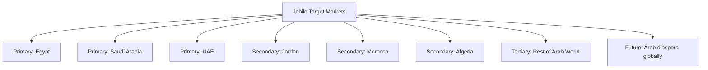

# Project Overview — نظرة عامة على المشروع

> **Jobilo**: The first Arabic-first freelancing marketplace connecting talented freelancers across the Arab world with project owners seeking quality work.

---

## What is Jobilo? | ما هو Jobilo؟

Jobilo is a comprehensive freelancing platform designed from the ground up for Arabic-speaking users. Unlike existing global platforms (Upwork, Freelancer, Fiverr) that treat Arabic as an afterthought with poor RTL support and limited Arabic content, Jobilo places the Arabic language and Middle Eastern business culture at the center of the experience.

**Jobilo** هو منصة عمل حر متكاملة صُممت بالكامل من البداية للمستخدمين الناطقين بالعربية. على عكس المنصات العالمية الحالية التي تتعامل مع اللغة العربية كلغة ثانوية مع دعم ضعيف للكتابة من اليمين إلى اليسار ومحتوى عربي محدود، يضع Jobilo اللغة العربية وثقافة الأعمال في الشرق الأوسط في صميم التجربة.

### Core Concept | المفهوم الأساسي

The platform serves two primary user groups:

| المجموعة | Group | الوصف | Description |
|----------|-------|-------|-------------|
| **المستقلون** | **Freelancers** | Professionals offering services — developers, designers, writers, marketers, translators, and more |
| **أصحاب المشاريع** | **Clients** | Individuals or businesses seeking to hire talent for projects |

Jobilo facilitates the connection between these groups through an intelligent matching system, secure communication channels, and a transparent work management process.

---

## Core Mission | المهمة الأساسية

> **"Empower every Arabic-speaking professional to build a sustainable freelancing career on their own terms, using their own language."**
>
> **"تمكين كل محترف ناطق بالعربية من بناء مسيرة عمل حر مستدامة بشروطه الخاصة، بلغته الأم."**

---

## Target Audience | الجمهور المستهدف

### Primary Audience | الجمهور الأساسي

| الفئة | Segment | الخصائص | Characteristics |
|-------|---------|----------|----------------|
| **المستقلون العرب** | Arab Freelancers | Tech-savvy professionals aged 20–40 seeking remote work opportunities |
| **أصحاب المشاريع الصغيرة** | Small Business Owners | SMEs in Egypt, Saudi Arabia, UAE, Jordan, and other Arab nations |
| **الشركات الناشئة** | Startups | Early-stage companies needing affordable freelance talent |

### Geographic Focus | التركيز الجغرافي

1. **Egypt** (الجمهور الأساسي) — Largest Arabic-speaking population, massive youth demographic, growing freelance economy
2. **Saudi Arabia** (المملكة العربية السعودية) — Vision 2030 driving digital transformation and remote work adoption
3. **UAE** (الإمارات) — Regional business hub with high concentration of project owners
4. **Jordan, Morocco, Algeria** — Growing freelance communities with strong English/French bilingual talent

### User Personas | شخصيات المستخدمين

#### شخصية 1: المستقل أحمد | Freelancer Ahmed
- **Age**: 26
- **Location**: Cairo, Egypt
- **Occupation**: Full-stack web developer
- **Pain Points**: Existing platforms charge 20% commission; poor Arabic UI; hard to compete with lower-cost regions
- **Needs**: Arabic-first platform, fair pricing, skill visibility, consistent project flow

#### شخصية 2: العميلة سارة | Client Sara
- **Age**: 34
- **Location**: Riyadh, Saudi Arabia
- **Occupation**: Marketing manager at a mid-size company
- **Pain Points**: Hard to find Arabic-speaking freelancers; timezone differences with global platforms; cultural misalignment
- **Needs**: Vetted Arabic-speaking talent, local payment methods, Arabic contracts

#### شخصية 3: الشركة الناشئة | Startup "BuildTech"
- **Size**: 12 employees
- **Location**: Dubai, UAE
- **Need**: Occasional UI/UX designers, content writers, and mobile developers
- **Pain Points**: Global platforms too expensive for small budgets; need quick matching
- **Needs**: Affordable talent pool, project-based engagement, easy communication

---

## Key Differentiators | عوامل التميز

### 1. 🌐 Arabic-First Experience | تجربة عربية أصيلة
- Full RTL support with proper typography using Cairo font
- Arabic user interface as the default language
- Arabic content, contracts, and dispute resolution
- Culturally appropriate design patterns

### 2. 🤖 AI-Powered Skill Suggestions | اقتراحات المهارات بالذكاء الاصطناعي
- Machine learning model analyzes freelancer profiles and suggests missing high-demand skills
- Market trend analysis to recommend skill development paths
- Automated skill verification through project history
- Reduces the "cold start" problem for new freelancers

### 3. 💰 No-Commission MVP | بدون عمولات في المرحلة الأولى
- Zero platform fees during the MVP phase
- Freelancers keep 100% of their earnings
- Revenue model: optional subscription plans (Basic, Pro, Enterprise)
- Transparent pricing with no hidden fees

### 4. 🔒 Trust & Safety | الثقة والأمان
- Identity verification for both freelancers and clients
- Escrow system (Phase 3) for secure payments
- Rating and review system with verified transactions only
- Dispute resolution tailored to Arab business culture

### 5. 🏗️ Built for Scale | مبني للتوسع
- Clean Architecture with Domain-Driven Design
- Microservices-ready modular monolith
- PostgreSQL 16 with optimized queries
- Docker containerization from day one

---

## Platform Principles | مبادئ المنصة

| # | Principle | المبدأ | Description |
|---|-----------|--------|-------------|
| 1 | **Privacy by Design** | الخصوصية في التصميم | User data protection is built into every layer |
| 2 | **Accessibility First** | الوصولية أولاً | WCAG 2.1 AA compliance, screen-reader friendly |
| 3 | **Performance Matters** | الأداء مهم | <2s page load, <100ms API response P95 |
| 4 | **Simplicity** | البساطة | Intuitive UX that doesn't require tutorials |
| 5 | **Transparency** | الشفافية | Clear pricing, open-source development, public roadmap |
| 6 | **Community-Driven** | يقوده المجتمع | Features prioritized by user feedback |
| 7 | **Security** | الأمان | OWASP Top 10 compliance, regular audits |

---

## Technical Decisions Overview | نظرة عامة على القرارات التقنية

| القرار | Decision | المبرر | Rationale |
|--------|----------|--------|-----------|
| **Next.js 15** | Frontend framework | SSR for SEO, App Router for nested layouts, React Server Components for performance |
| **NestJS** | Backend framework | TypeScript-native, modular architecture, built-in DI, WebSocket support |
| **PostgreSQL 16** | Database | JSONB for flexible profiles, full-text search for Arabic, strong ACID compliance |
| **Prisma** | ORM | Type-safe queries, auto-generated types, migration management |
| **JWT** | Authentication | Stateless auth suitable for distributed deployment, refresh token rotation |
| **Docker** | Containerization | Consistent dev/prod environments, easy scaling |
| **WebSocket** | Real-time | Low-latency messaging, typing indicators, online status |
| **Tailwind CSS** | Styling | Utility-first, RTL support via `rtl` variant, rapid development |

---

## Stakeholders | أصحاب المصلحة

| Stakeholder | صاحب المصلحة | Interest | الاهتمام |
|-------------|--------------|----------|----------|
| **Freelancers** | المستقلون | Fair earnings, consistent work, professional growth | دخل عادل، عمل مستمر، نمو مهني |
| **Clients** | العملاء | Quality talent, transparent process, value for money | مواهب عالية الجودة، عملية شفافة |
| **Investors** | المستثمرون | ROI, market growth, competitive advantage | عائد على الاستثمار، نمو السوق |
| **Platform Team** | فريق المنصة | Product quality, user satisfaction, technical excellence | جودة المنتج، رضا المستخدم |
| **Arabic Tech Community** | المجتمع التقني العربي | Open-source contribution, knowledge sharing | مساهمة مفتوحة المصدر، مشاركة المعرفة |

---

## Links | روابط ذات صلة

- [README.md](../README.md) — Main project readme
- [Vision Document](VISION.md) — 10-year vision and strategic goals
- [Roadmap](ROADMAP.md) — Development phases and timeline
- [Architecture](ARCHITECTURE.md) — Technical architecture details
- [System Design](SYSTEM_DESIGN.md) — Component design and data flow
