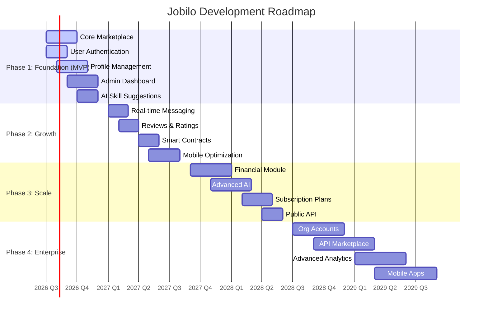

# Development Roadmap — خريطة طريق التطوير

> **Jobilo Development Phases**: From MVP to Enterprise-scale freelancing platform.

---

## Overview | نظرة عامة

This roadmap outlines the planned development phases for Jobilo, from the initial MVP launch through enterprise-scale features. Each phase builds upon the previous one, with clear deliverables, timelines, and success criteria.

---

## Phase 1: Foundation (MVP) — التأسيس: الحد الأدنى القابل للتطبيق

**Timeline**: July 2026 – December 2026
**Status**: 🏗️ In Progress
**Version**: v0.1.0 → v1.0.0

### Objective
Build and launch a functional MVP that validates the core marketplace concept with real users in the Arabic freelancing community.

### Features

| Feature | الوصف | Priority | Status | Dependencies |
|---------|-------|----------|--------|-------------|
| **User Authentication** | Registration, login, logout, password reset, email verification | P0 | ✅ Done | None |
| **Role-Based Access Control** | Freelancer, Client, Admin, Moderator roles with granular permissions | P0 | 🏗️ In Progress | Auth |
| **Profile Management** | Create/edit profiles, skills, portfolio, experience, education | P0 | 🏗️ In Progress | Auth |
| **Project Listings** | Create, search, filter, and browse freelance projects | P0 | 📋 Planned | Auth, Profiles |
| **Proposal System** | Freelancers submit proposals with bid amounts and cover letters | P0 | 📋 Planned | Projects |
| **Project Assignment** | Client selects freelancer, project status management | P0 | 📋 Planned | Proposals |
| **Admin Dashboard** | User management, project moderation, platform analytics | P1 | 📋 Planned | All above |
| **AI Skill Suggestions** | ML-powered skill recommendations based on profile analysis | P1 | 📋 Planned | Profiles |
| **Multi-Language Support** | Arabic (RTL) + English (LTR) with i18n framework | P0 | 🏗️ In Progress | None |
| **Responsive Design** | Mobile-friendly UI with Tailwind CSS RTL support | P0 | 🏗️ In Progress | None |

### Technical Milestones

| Milestone | التاريخ المستهدف | Target Date | Deliverable |
|-----------|-----------------|-------------|-------------|
| M1: Database schema + Prisma setup | 2026-07-15 | Complete data model with all entities | ✅ Done |
| M2: NestJS backend core | 2026-08-15 | Auth module, user module, project module | 🏗️ In Progress |
| M3: Next.js frontend foundation | 2026-09-01 | App Router layout, i18n setup, auth pages | 📋 Planned |
| M4: MVP feature complete | 2026-10-15 | All P0 features implemented and tested | 📋 Planned |
| M5: Internal beta | 2026-11-01 | 50 beta testers, bug fixing | 📋 Planned |
| M6: Public launch v1.0.0 | 2026-12-01 | Production deployment, public access | 📋 Planned |

### Success Criteria

| Criterion | المعيار | Target |
|-----------|---------|--------|
| User registration completion rate | معدل إتمام التسجيل | ≥ 70% |
| Profile completion rate | معدل إتمام الملف الشخصي | ≥ 60% |
| Projects created (first 3 months) | المشاريع المنشأة | ≥ 500 |
| Proposals per project | المقترحات لكل مشروع | ≥ 3 |
| Platform uptime | وقت تشغيل المنصة | ≥ 99.5% |
| Page load time (P95) | وقت تحميل الصفحة | ≤ 2s |

---

## Phase 2: Growth — النمو

**Timeline**: January 2027 – August 2027
**Status**: 📋 Planned
**Version**: v2.0.0 → v2.5.0

### Objective
Enhance the platform with communication tools, trust-building features, and mobile optimization to drive user engagement and retention.

### Features

| Feature | الوصف | Priority | Status | Dependencies |
|---------|-------|----------|--------|-------------|
| **Real-time Messaging** | WebSocket-based chat with typing indicators, file sharing, read receipts | P0 | 📋 Planned | WebSocket Gateway |
| **Reviews & Ratings** | Post-project reviews, star ratings, review verification | P0 | 📋 Planned | Project Assignment |
| **Smart Contract Templates** | Pre-built Arabic/English contract templates with e-signature | P1 | 📋 Planned | Messaging |
| **Notification System** | Email + in-app notifications for proposals, messages, project updates | P1 | 📋 Planned | Messaging |
| **Mobile Responsive v2** | Optimized mobile experience with touch-friendly interactions | P1 | 📋 Planned | Phase 1 UI |
| **Search Enhancements** | Arabic full-text search with filters, saved searches, alerts | P1 | 📋 Planned | Projects |
| **Freelancer Portfolio Builder** | Rich portfolio with work samples, case studies, testimonials | P1 | 📋 Planned | Profiles |
| **Dispute Reporting** | Report system for conflicts, policy violations, spam | P1 | 📋 Planned | Reviews |

### Success Criteria

| Criterion | المعيار | Target |
|-----------|---------|--------|
| Messages sent daily | الرسائل المرسلة يوميًا | ≥ 1,000 |
| Review completion rate | معدل إكمال المراجعات | ≥ 50% |
| User retention (6-month) | الاحتفاظ بالمستخدمين (6 أشهر) | ≥ 40% |
| Mobile traffic share | حصة حركة المرور عبر الجوال | ≥ 40% |
| NPS score | صافي نقاط الترويج | ≥ 35 |

---

## Phase 3: Scale — التوسع

**Timeline**: September 2027 – June 2028
**Status**: 📋 Planned
**Version**: v3.0.0 → v3.5.0

### Objective
Monetize the platform through subscription plans, introduce financial infrastructure, and leverage advanced AI to improve matching quality.

### Features

| Feature | الوصف | Priority | Status | Dependencies |
|---------|-------|----------|--------|-------------|
| **Escrow Payment System** | Milestone-based payment protection with dispute resolution | P0 | 📋 Planned | Phase 2 Contracts |
| **Subscription Plans** | Basic (Free), Pro ($9.99/mo), Enterprise ($29.99/mo) tiers | P0 | 📋 Planned | Payments |
| **Advanced AI Matching** | ML-based freelancer-project matching with satisfaction prediction | P0 | 📋 Planned | Phase 1 AI |
| **Skill Verification Tests** | Online assessments to verify claimed skills | P1 | 📋 Planned | AI Module |
| **Public REST API** | Developer API for third-party integrations and automation | P1 | 📋 Planned | All modules |
| **Analytics Dashboard (User)** | Personalized stats, earnings reports, proposal analytics | P1 | 📋 Planned | Subscriptions |
| **Local Payment Gateways** | Paymob, Fawry, Mada, STC Pay integration | P0 | 📋 Planned | Escrow |

### Subscription Tiers | خطط الاشتراك

| Tier | المستوى | Price | Key Features |
|------|---------|-------|-------------|
| **Basic** | أساسي | Free | 5 proposals/month, basic profile, standard matching |
| **Pro** | محترف | $9.99/mo | Unlimited proposals, AI suggestions, analytics, priority support |
| **Enterprise** | مؤسسة | $29.99/mo | Everything in Pro + featured profile, contract templates, API access |

### Success Criteria

| Criterion | المعيار | Target |
|-----------|---------|--------|
| Subscription conversion rate | معدل تحويل الاشتراك | ≥ 10% |
| Monthly recurring revenue (MRR) | الإيرادات الشهرية المتكررة | ≥ $50K |
| Average match satisfaction | متوسط رضا المطابقة | ≥ 4.0/5.0 |
| Escrow dispute rate | معدل نزاعات الضمان | ≤ 2% |
| API adoption | اعتماد واجهة برمجة التطبيقات | ≥ 100 developers |

---

## Phase 4: Enterprise — المؤسسات

**Timeline**: July 2028 – September 2029
**Status**: 🔮 Future
**Version**: v4.0.0+

### Objective
Establish Jobilo as the enterprise-standard freelancing platform for organizations across the Middle East, with advanced tools for team management and integration.

### Features

| Feature | الوصف | Priority | Status | Dependencies |
|---------|-------|----------|--------|-------------|
| **Organization Accounts** | Company profiles with team management, billing, admin controls | P0 | 🔮 Future | Subscriptions |
| **API Marketplace** | Third-party app integrations, plugin system, webhook ecosystem | P1 | 🔮 Future | Public API |
| **Advanced Platform Analytics** | Custom reports, trend analysis, demand forecasting | P1 | 🔮 Future | All data |
| **Native Mobile Apps** | iOS (Swift) and Android (Kotlin) applications | P1 | 🔮 Future | Phase 2 Mobile |
| **AI Contract Generator** | Automated contract creation based on project type and requirements | P1 | 🔮 Future | Phase 2 Contracts |
| **Team Collaboration** | Shared workspaces, multi-freelancer projects, team messaging | P1 | 🔮 Future | Orgs |
| **Compliance & Tax Tools** | Invoice generation, tax reporting, regulatory compliance | P1 | 🔮 Future | Financial Module |

### Success Criteria

| Criterion | المعيار | Target |
|-----------|---------|--------|
| Enterprise accounts | حسابات المؤسسات | ≥ 500 |
| API marketplace apps | تطبيقات سوق واجهات البرمجة | ≥ 50 |
| Mobile app users | مستخدمو التطبيق | ≥ 100K |
| Total platform GMV | إجمالي قيمة البضائع | ≥ $10M/year |

---

## Release Cadence | إيقاع الإصدارات

| Release Type | التكرار | Frequency | Examples |
|-------------|---------|-----------|----------|
| **Major (x.0.0)** | Major | Every 6–9 months | v1.0.0, v2.0.0 |
| **Minor (0.x.0)** | Minor | Every 4–6 weeks | v1.1.0, v1.2.0 |
| **Patch (0.0.x)** | Patch | As needed (hotfixes) | v1.1.1, v1.1.2 |
| **Pre-release** | Pre-release | Before major launches | v1.0.0-beta.1 |

See [Versioning Strategy](VERSIONING.md) for detailed versioning conventions.

---

## Risk Management | إدارة المخاطر

| Risk | المخاطرة | Probability | Impact | Mitigation |
|------|----------|-------------|--------|------------|
| Low user adoption | ضعف تبنّي المستخدمين | Medium | High | Community beta, targeted marketing, referral program |
| Technical debt | الديون التقنية | High | Medium | Code reviews, automated testing, refactoring sprints |
| Security breach | الاختراق الأمني | Low | Critical | OWASP compliance, regular audits, penetration testing |
| Regulatory changes | التغييرات التنظيمية | Medium | Medium | Legal consultation, flexible compliance module |
| Competition | المنافسة | High | Medium | Arabic-first differentiation, community focus, open source |
| Funding constraints | قيود التمويل | Medium | High | Lean operations, MVP focus, revenue from Phase 3 |

---

## Links | روابط ذات صلة

- [Project Overview](PROJECT_OVERVIEW.md) — Detailed project overview
- [Vision Document](VISION.md) — 10-year vision and strategic goals
- [Changelog](CHANGELOG.md) — Release history and version details
- [Versioning Strategy](VERSIONING.md) — Semantic versioning conventions
- [Architecture](ARCHITECTURE.md) — Technical architecture
