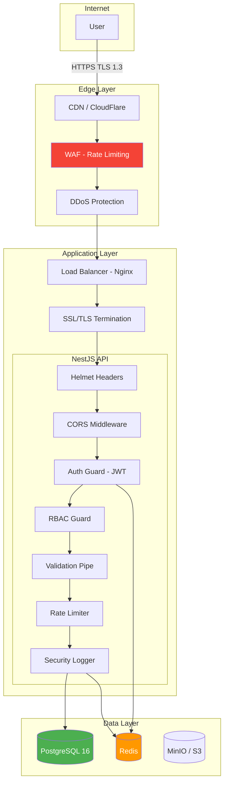
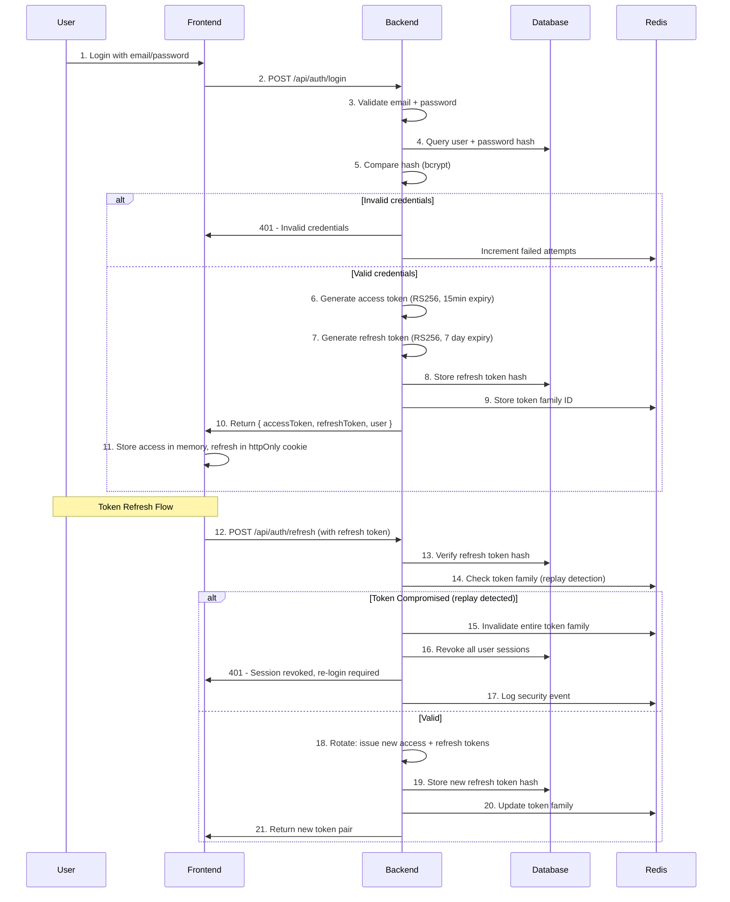
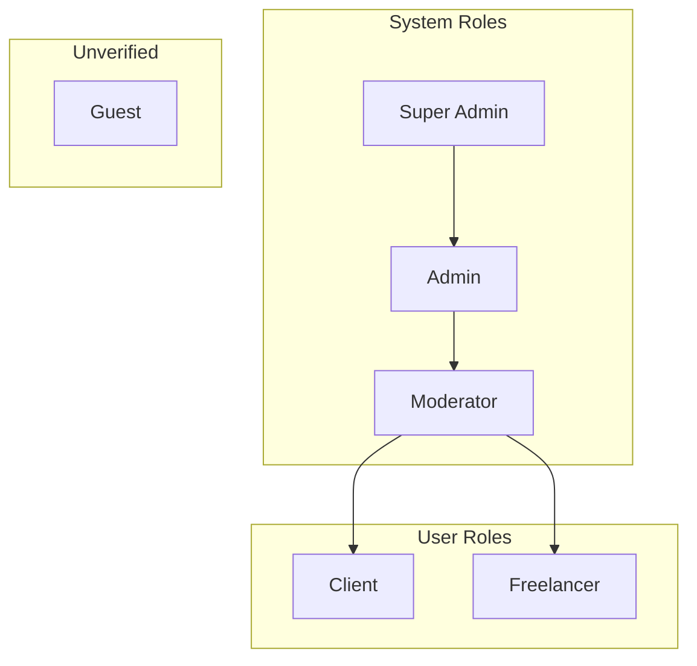
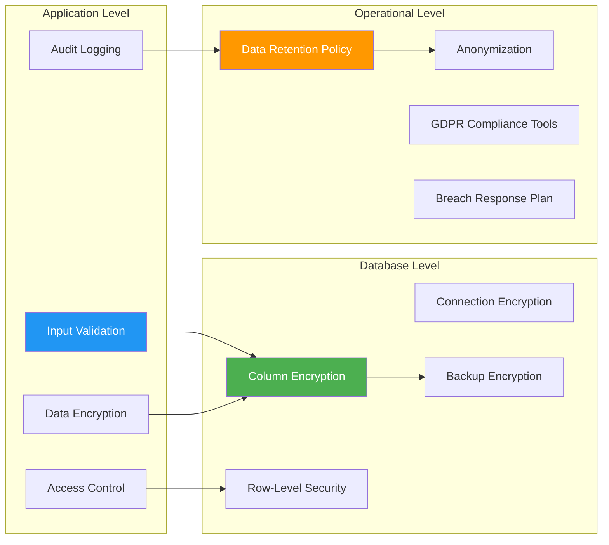
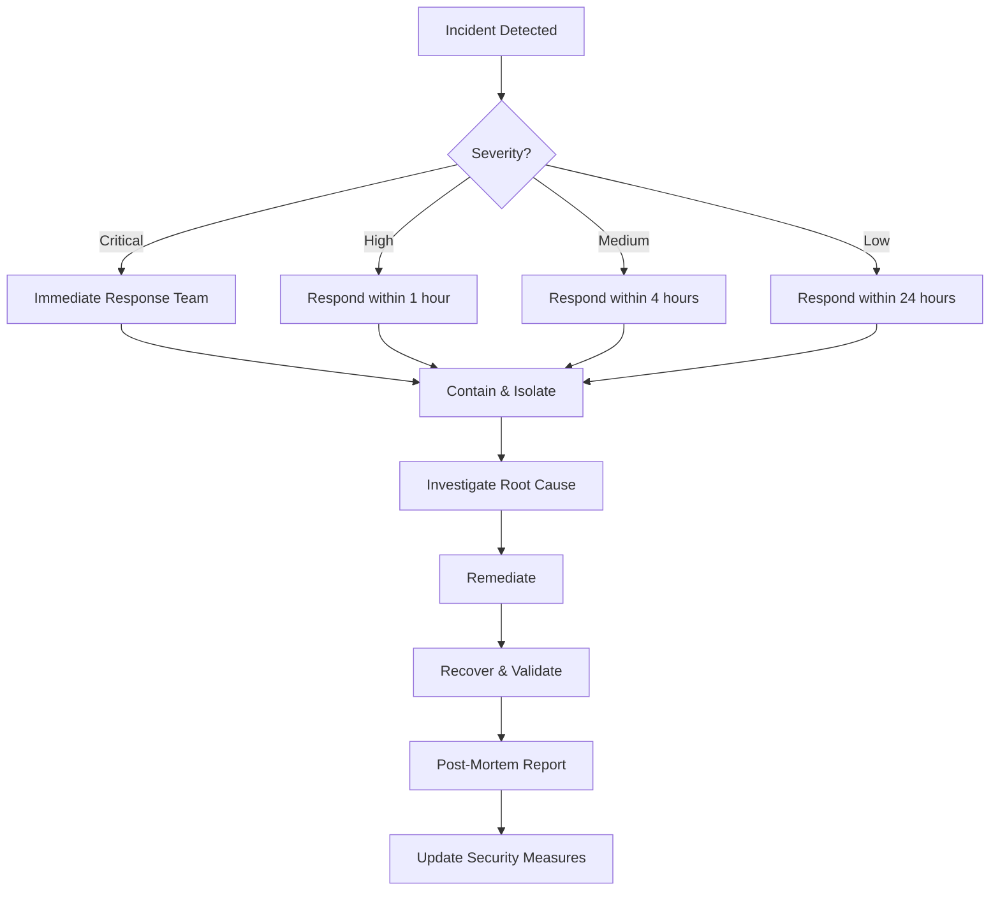

# Security Document — وثيقة الأمان

> **Jobilo Security Architecture**: Comprehensive security measures covering authentication, authorization, data protection, and API security.

---

## Security Architecture Overview | نظرة عامة على معمارية الأمان



### Security Principles | مبادئ الأمان

| # | Principle | المبدأ | Application |
|---|-----------|--------|-------------|
| 1 | **Defense in Depth** | الدفاع في العمق | Multiple security layers: WAF → SSL → Auth → RBAC → Validation |
| 2 | **Least Privilege** | أقل امتياز | Users have minimum permissions needed; API tokens scoped |
| 3 | **Secure by Default** | آمن افتراضيًا | All endpoints protected by default; explicit opt-in for public access |
| 4 | **Fail Secure** | الفشل الآمن | Errors don't leak information; default-deny for access control |
| 5 | **Data Minimization** | تقليل البيانات | Collect only necessary data; encrypt sensitive fields |
| 6 | **Separation of Duties** | فصل المهام | Admin actions require multiple approvals; audit trail for all admin ops |

---

## Authentication Flow | تدفق المصادقة

### JWT Token Strategy | استراتيجية توكن JWT

Jobilo uses a **dual-token authentication system** with short-lived access tokens and long-lived refresh tokens.



### Token Configuration | إعدادات التوكن

| Parameter | Access Token | Refresh Token |
|-----------|--------------|---------------|
| **Algorithm** | RS256 | RS256 |
| **Expiry** | 15 minutes | 7 days |
| **Storage** | Memory (not localStorage) | httpOnly, Secure, SameSite=Strict cookie |
| **Rotation** | N/A (new one issued with refresh) | Yes, every refresh |
| **Revocation** | Via short expiry (stateless) | Database + Redis blacklist |
| **Payload** | userId, roles, iat, exp | tokenId, userId, iat, exp |

### Password Policy | سياسة كلمة المرور

| Requirement | المتطلب | Specification |
|-------------|---------|---------------|
| Minimum length | الحد الأدنى للطول | 8 characters |
| Maximum length | الحد الأقصى للطول | 128 characters |
| Character mix | مزيج الأحرف | At least 1 uppercase, 1 lowercase, 1 digit, 1 special character |
| Common password check | فحص كلمات المرور الشائعة | Check against HaveIBeenPwned API via k-anonymity model |
| History | تاريخ كلمات المرور | Cannot reuse last 3 passwords |
| Expiry | صلاحية كلمة المرور | 90 days (configurable) |
| Hashing | التشفير | bcrypt with 12 salt rounds |
| Failed attempts | محاولات فاشلة | Account locked after 5 failed attempts (30 min lockout) |

---

## Authorization (RBAC) | التفويض (التحكم في الوصول)

### Role Hierarchy | التسلسل الهرمي للأدوار



### Permission Matrix | مصفوفة الصلاحيات

| Permission | الصلاحية | Guest | Freelancer | Client | Moderator | Admin | Super Admin |
|-----------|---------|-------|------------|--------|-----------|-------|-------------|
| Browse projects | تصفح المشاريع | ✅ | ✅ | ✅ | ✅ | ✅ | ✅ |
| View profiles | عرض الملفات الشخصية | ✅ | ✅ | ✅ | ✅ | ✅ | ✅ |
| Create account | إنشاء حساب | ✅ | ✅ | ✅ | ✅ | ✅ | ✅ |
| Create project | إنشاء مشروع | ❌ | ❌ | ✅ | ✅ | ✅ | ✅ |
| Submit proposal | تقديم عرض | ❌ | ✅ | ❌ | ✅ | ✅ | ✅ |
| Send messages | إرسال الرسائل | ❌ | ✅ | ✅ | ✅ | ✅ | ✅ |
| Create review | إنشاء مراجعة | ❌ | ✅ | ✅ | ❌ | ✅ | ✅ |
| Moderate content | مراقبة المحتوى | ❌ | ❌ | ❌ | ✅ | ✅ | ✅ |
| Manage users | إدارة المستخدمين | ❌ | ❌ | ❌ | ❌ | ✅ | ✅ |
| View analytics | عرض التحليلات | ❌ | ❌ | ❌ | ❌ | ✅ | ✅ |
| Manage roles | إدارة الأدوار | ❌ | ❌ | ❌ | ❌ | ❌ | ✅ |
| System config | إعدادات النظام | ❌ | ❌ | ❌ | ❌ | ❌ | ✅ |
| View audit logs | سجلات التدقيق | ❌ | ❌ | ❌ | ❌ | ❌ | ✅ |

### Permission Implementation | تنفيذ الصلاحيات

```typescript
// Permission decorator example
@SetMetadata('permissions', ['project:create'])
@UseGuards(JwtAuthGuard, RbacGuard)
@Post()
async createProject(@Body() dto: CreateProjectDto) {
  // Only users with 'project:create' permission can access
}

// RBAC Guard checks:
// 1. User is authenticated (JwtAuthGuard)
// 2. User has required role (RbacGuard)
// 3. User has specific permission (PermissionsGuard)
// 4. Rate limit check (ThrottlerGuard)
// 5. Resource ownership check (Optional)
```

---

## Data Protection Strategies | استراتيجيات حماية البيانات

### Data Classification | تصنيف البيانات

| Classification | التصنيف | Examples | Protection Required |
|---------------|---------|----------|-------------------|
| **Public** | عام | User names, skills, project titles | No special protection |
| **Internal** | داخلي | Project descriptions, proposal amounts | Authenticated access only |
| **Sensitive** | حساس | Email, phone number, address | Encrypted at rest, access logging |
| **Confidential** | سري | Payment info, ID documents, password hashes | Field-level encryption, strict access control |

### Encryption Standards | معايير التشفير

| Data State | Encryption | Standard |
|------------|------------|----------|
| **In Transit** | TLS 1.3 | All traffic encrypted between client and server |
| **At Rest (Database)** | AES-256-GCM | Sensitive fields encrypted at application level |
| **At Rest (Storage)** | AES-256 | S3/MinIO server-side encryption |
| **Passwords** | bcrypt | 12 salt rounds, salted before hashing |
| **JWT Tokens** | RS256 | RSA key pair: private for signing, public for verification |
| **API Keys** | SHA-256 | Hashed before storage, shown only once on creation |

### PII Protection | حماية المعلومات الشخصية



| PII Element | Storage | Encryption | Retention |
|------------|---------|------------|-----------|
| Email address | `users.email` | Column-level AES-256 | Account lifetime + 90 days |
| Phone number | `profiles.phone` | Column-level AES-256 | Account lifetime + 90 days |
| Government ID | MinIO/S3 | Server-side AES-256 | 90 days after verification |
| Payment info | External provider | Never stored | N/A (PCI-DSS via Stripe/Paymob) |
| IP addresses | Logs | Anonymized after 30 days | 90 days |
| Device fingerprints | Sessions | Hashed | Session lifetime |

---

## API Security | أمان واجهة برمجة التطبيقات

### Rate Limiting | تحديد المعدل

| Endpoint Group | Limit | Window | Response |
|---------------|-------|--------|----------|
| **Global** | 100 requests | 1 minute | 429 Too Many Requests |
| **Auth (login)** | 5 attempts | 15 minutes | 429 + account lockout |
| **Auth (register)** | 3 attempts | 1 hour | 429 |
| **Password reset** | 2 attempts | 1 hour | 429 |
| **API endpoints** | 60 requests | 1 minute | 429 |
| **File upload** | 10 uploads | 1 hour | 429 |

### CORS Configuration

```typescript
// CORS settings
{
  origin: [
    'https://jobilo.ai',
    'https://www.jobilo.ai',
    'https://admin.jobilo.ai',
    process.env.NODE_ENV === 'development' ? 'http://localhost:3000' : null,
  ].filter(Boolean),
  methods: ['GET', 'POST', 'PUT', 'PATCH', 'DELETE', 'OPTIONS'],
  allowedHeaders: ['Content-Type', 'Authorization', 'X-CSRF-Token', 'Accept-Language'],
  exposedHeaders: ['X-RateLimit-Limit', 'X-RateLimit-Remaining'],
  credentials: true,
  maxAge: 86400, // 24 hours
}
```

### Helmet Security Headers

| Header | Value | Purpose |
|--------|-------|---------|
| `Content-Security-Policy` | `default-src 'self'; script-src 'self'; style-src 'self' 'unsafe-inline'` | XSS prevention |
| `X-Content-Type-Options` | `nosniff` | MIME-type sniffing prevention |
| `X-Frame-Options` | `DENY` | Clickjacking prevention |
| `X-XSS-Protection` | `1; mode=block` | XSS filter (legacy browsers) |
| `Strict-Transport-Security` | `max-age=31536000; includeSubDomains` | HSTS, enforce HTTPS |
| `Referrer-Policy` | `strict-origin-when-cross-origin` | Referrer leakage prevention |
| `Permissions-Policy` | `camera=(), microphone=(), geolocation=()` | Feature restriction |

---

## Input Validation Strategy | استراتيجية التحقق من صحة المدخلات

| Layer | Validation | Technology |
|-------|------------|------------|
| **Client-side** | Form validation, type checking | Zod schemas, React Hook Form |
| **API Gateway** | Request structure, content-type | NestJS ValidationPipe |
| **Controller** | DTO validation, type coercion | class-validator decorators |
| **Service** | Business rules, domain constraints | Custom validation services |
| **Database** | Schema constraints, unique indexes | Prisma schema validation |

### Validation Rules

| Field Type | Rules |
|------------|-------|
| **Email** | Regex validation, max 254 chars, domain MX check |
| **Password** | 8-128 chars, complexity requirements |
| **Phone** | E.164 format, country code validation |
| **URL** | Valid URL format, protocol required |
| **Text (Arabic)** | Arabic script + common punctuation, max length |
| **File upload** | Type whitelist, size limit (5MB images, 20MB documents) |
| **Money** | Positive, 2 decimal places, currency code |

---

## Session Management | إدارة الجلسات

| Aspect | Implementation |
|--------|---------------|
| **Session storage** | httpOnly + Secure + SameSite=Strict cookies for refresh tokens |
| **Access token storage** | In-memory (not localStorage/sessionStorage) |
| **Session invalidation** | Logout → revoke refresh token in DB + Redis |
| **Force logout all devices** | Admin option → increment `tokenVersion` in user record |
| **Idle timeout** | 30 minutes of inactivity → soft logout |
| **Concurrent sessions** | Max 5 active sessions per user |
| **Device tracking** | Fingerprint + user agent + IP logging |

---

## Audit Logging | سجلات التدقيق

### Events Logged

| Category | Events | Retention |
|----------|--------|-----------|
| **Authentication** | Login, logout, failed login, password reset, token refresh | 1 year |
| **Authorization** | Access denied, role changes, permission changes | 1 year |
| **User Management** | Account creation, deletion, profile changes, verification status | 3 years |
| **Financial** | Payment initiation, completion, failure, refund, dispute | 5 years |
| **Admin Actions** | Moderation actions, user suspension, content removal | 3 years |
| **Security Events** | Suspicious activity, rate limit hits, token replay detection | 1 year |

### Audit Log Schema

```typescript
interface AuditLogEntry {
  id: string;           // UUID v4
  timestamp: string;    // ISO 8601
  actorId: string;      // User ID who performed action
  actorRole: Role;      // Role at time of action
  action: string;       // e.g., "user.login", "project.create"
  resourceType: string; // "user", "project", "proposal"
  resourceId: string;   // ID of affected resource
  details: Record<string, unknown>; // Action-specific metadata
  ipAddress: string;    // Source IP (anonymized after 30 days)
  userAgent: string;    // Browser/device information
  outcome: 'success' | 'failure';
  severity: 'info' | 'warning' | 'critical';
}
```

---

## Security Checklist | قائمة التحقق الأمني

### Pre-Launch Checklist

- [ ] **OWASP Top 10**: All vulnerabilities addressed (2021 edition)
- [ ] **Penetration Testing**: Third-party security audit completed
- [ ] **Dependency Scanning**: All dependencies scanned for CVEs (Snyk/npm audit)
- [ ] **Secret Scanning**: No secrets in codebase (gitLeaks/husky pre-commit)
- [ ] **SSL/TLS**: TLS 1.3 enforced, HSTS enabled, Qualys SSL rating A+
- [ ] **CORS**: Properly restricted origins
- [ ] **Rate Limiting**: Configured for all endpoints
- [ ] **Input Validation**: All user inputs validated and sanitized
- [ ] **Session Management**: Secure cookie configuration, token rotation
- [ ] **Data Encryption**: PII encrypted at rest, TLS in transit
- [ ] **Backup Strategy**: Encrypted daily backups with 30-day retention
- [ ] **Incident Response**: Documented IR plan with team contacts
- [ ] **Monitoring**: Security event monitoring and alerting configured
- [ ] **GDPR Compliance**: Data export/deletion tools ready
- [ ] **Terms of Service**: Privacy policy and ToS reviewed by legal

### Ongoing Checklist

- [ ] **Weekly**: Review security logs and failed auth attempts
- [ ] **Monthly**: Dependency updates and vulnerability scanning
- [ ] **Quarterly**: Access control review, permission audit
- [ ] **Bi-annually**: Penetration testing, security training for team
- [ ] **Annually**: Full security audit, compliance review, DR test

---

## Incident Response Plan | خطة الاستجابة للحوادث



### Incident Severity Levels

| Level | الوصف | Description | Examples | Response Time |
|-------|-------|-------------|----------|--------------|
| **Critical** | حرج | Data breach, system compromise, payment fraud | Unauthorized DB access, leaked credentials, payment manipulation | Immediate |
| **High** | عالي | Service disruption, significant vulnerability | DDoS, XSS exploit, auth bypass | 1 hour |
| **Medium** | متوسط | Limited impact, isolated vulnerability | CSRF on non-critical endpoint, rate limit bypass | 4 hours |
| **Low** | منخفض | Minor issue, no user data affected | Missing security header, minor info disclosure | 24 hours |

---

## Links | روابط ذات صلة

- [Architecture](ARCHITECTURE.md) — System architecture overview
- [System Design](SYSTEM_DESIGN.md) — Component interactions and data flow
- [Deployment Guide](DEPLOYMENT_GUIDE.md) — Deployment security configurations
- [Contributing Guide](../CONTRIBUTING.md) — Security contribution guidelines
