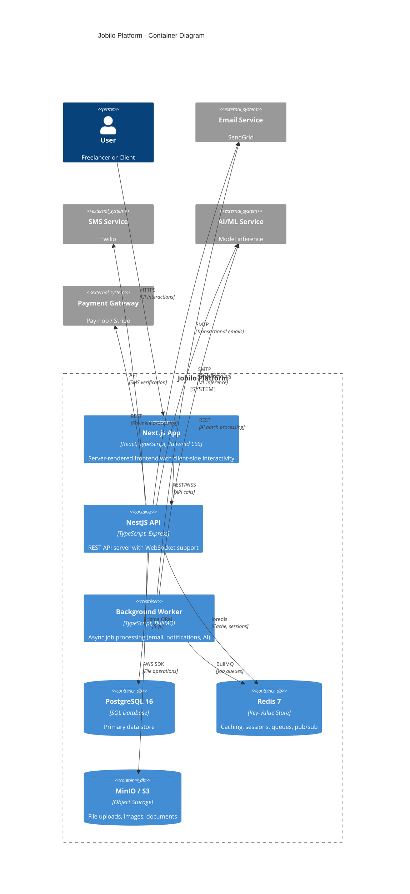
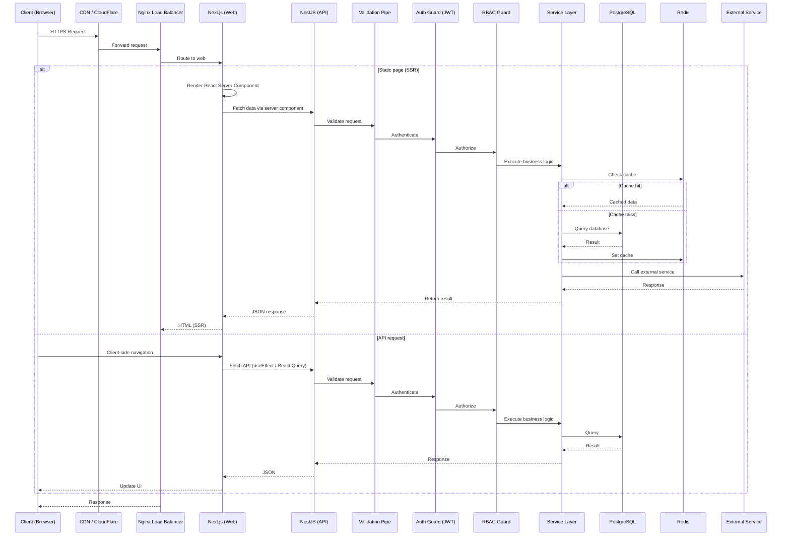
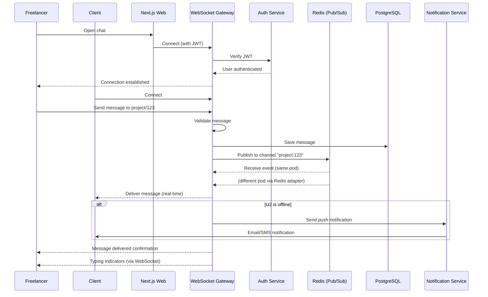
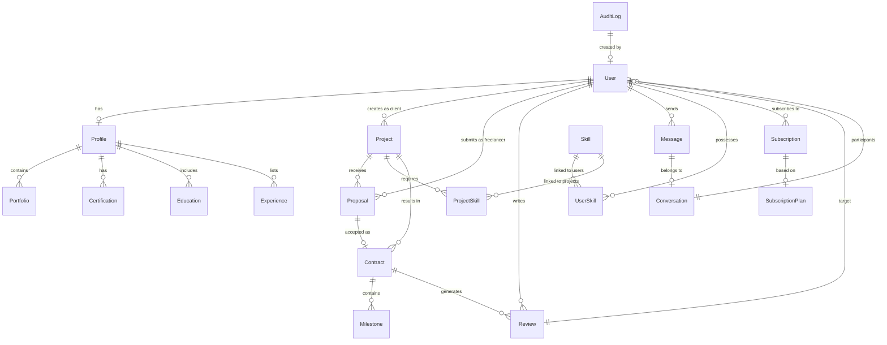
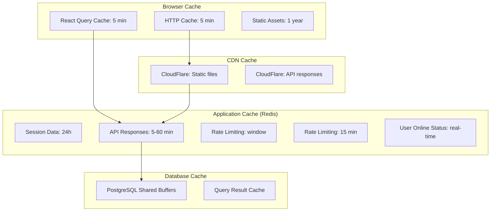
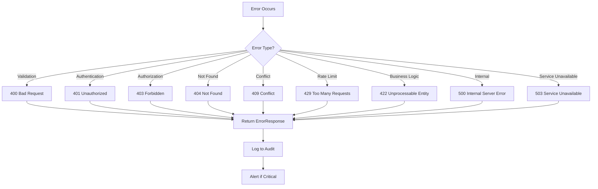
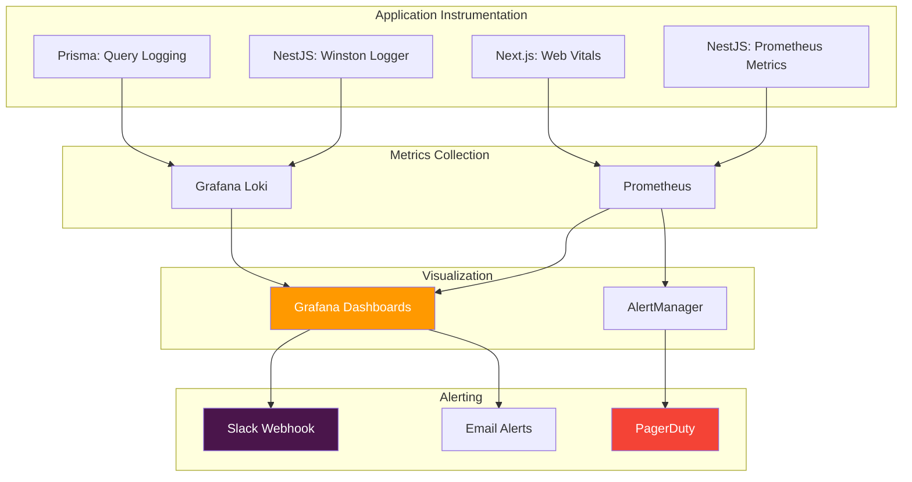

# System Design Document — وثيقة تصميم النظام

> **Jobilo System Design**: Component interactions, data flow, database design, caching, error handling, and observability.

---

## High-Level Architecture | المعمارية عالية المستوى



---

## Component Interactions | تفاعلات المكونات

### Request/Response Flow



### WebSocket Flow (Messaging)



---

## Database Design Overview | نظرة عامة على تصميم قاعدة البيانات

### Entity Relationship Diagram



### Core Tables

| Table | الجدول | Description | Key Relationships |
|-------|--------|-------------|-------------------|
| **User** | المستخدم | Core user account with auth credentials | 1:1 with Profile, 1:N with Project, Proposal |
| **Profile** | الملف الشخصي | Extended user information | 1:1 with User |
| **Skill** | المهارة | Skill catalog | M:N with User, M:N with Project |
| **Project** | المشروع | Freelance project listing | M:1 with Client, 1:N with Proposal |
| **Proposal** | العرض | Freelancer bid on project | M:1 with Project, M:1 with Freelancer |
| **Contract** | العقد | Formal agreement between parties | 1:1 with Proposal, 1:N with Milestone |
| **Message** | الرسالة | Chat message | M:1 with Conversation |
| **Conversation** | المحادثة | Chat conversation between users | M:N with User |
| **Review** | المراجعة | Post-project review | M:1 with Contract, M:1 with Reviewer |
| **Subscription** | الاشتراك | User subscription record | M:1 with User, M:1 with Plan |
| **AuditLog** | سجل التدقيق | Security audit trail | M:1 with User |

### Indexing Strategy

| Table | Indexes | Purpose |
|-------|---------|---------|
| **User** | email (unique), username (unique), role, createdAt | Auth lookups, sorting |
| **Profile** | userId (unique), fullName (GIN for full-text) | Profile search |
| **Project** | clientId, status, budget, createdAt, title (GIN) | Project search/filter |
| **Proposal** | projectId + freelancerId (unique), status, amount | Prevent duplicate proposals |
| **Message** | conversationId + createdAt, senderId | Chat history loading |
| **Conversation** | participantIds (GIN) | Find user conversations |
| **Skill** | name (unique), category | Skill autocomplete |
| **Review** | contractId (unique), targetId, rating | Prevent duplicate reviews |

### Arabic Full-Text Search

PostgreSQL 16 provides robust Arabic full-text search capabilities:

```sql
-- Create Arabic text search configuration
CREATE TEXT SEARCH CONFIGURATION arabic (PARSER = default);
ALTER TEXT SEARCH CONFIGURATION arabic
  ALTER MAPPING FOR hword, hword_part, word
  WITH arabic_stem, simple;

-- Create GIN index for full-text search on projects
CREATE INDEX idx_project_search ON "Project"
  USING GIN (to_tsvector('arabic', coalesce(title, '') || ' ' || coalesce(description, '')));
```

---

## Caching Strategy | استراتيجية التخزين المؤقت

### Cache Layers



### Cache Invalidation Rules

| Data Type | Cache Duration | Invalidation Trigger |
|-----------|---------------|---------------------|
| **User profile** | 5 minutes | Profile update, skill change |
| **Project listings** | 1 minute | New project created, status change |
| **Project details** | 5 minutes | Proposal submitted, project update |
| **Skill catalog** | 1 hour | Admin skill update |
| **Static assets** | 1 year | File hash change |
| **Session data** | 24 hours | Logout, token revocation |
| **Rate limit counters** | Window duration | Window expiry |

### Cache Key Naming

```
jobilo:{entity}:{id}:{field}:{locale}
```

Examples:
```
jobilo:user:123:profile:ar
jobilo:project:456:details:en
jobilo:skill:catalog:all:ar
```

---

## Error Handling Strategy | استراتيجية معالجة الأخطاء

### Error Classification



### Error Response Format

```typescript
// Standard error response
interface ApiErrorResponse {
  success: false;
  statusCode: number;
  error: string;
  message: string;
  timestamp: string;
  path: string;
  requestId: string;
  details?: {
    field?: string;
    constraint?: string;
    message?: string;
  }[];
}

// Example: 422 Validation Error
{
  "success": false,
  "statusCode": 422,
  "error": "VALIDATION_ERROR",
  "message": "Validation failed for CreateProjectDto",
  "timestamp": "2026-07-06T12:00:00.000Z",
  "path": "/api/v1/projects",
  "requestId": "req_abc123",
  "details": [
    {
      "field": "budget",
      "constraint": "min",
      "message": "budget must not be less than 10"
    },
    {
      "field": "title",
      "constraint": "isNotEmpty",
      "message": "title should not be empty"
    }
  ]
}
```

### Error Handling Layers

| Layer | Responsibility | Implementation |
|-------|---------------|----------------|
| **Client (React)** | Catch HTTP errors, display user-friendly messages | React ErrorBoundary, React Query `onError` |
| **Next.js SSR** | Handle server rendering errors | `error.tsx` pages, `not-found.tsx` |
| **NestJS Guard** | Auth/authorization failures | JwtAuthGuard, RbacGuard throw `UnauthorizedException` |
| **NestJS Pipe** | Input validation errors | ValidationPipe throws `BadRequestException` with details |
| **NestJS Interceptor** | Transform errors to consistent format | Global response interceptor |
| **NestJS Filter** | Catch unhandled exceptions | Global exception filter |
| **Prisma** | Database errors | PrismaClientExceptionFilter |
| **Winston Logger** | Log all errors with context | Structured logging to Loki |

---

## Monitoring and Observability | المراقبة والرصد

### Observability Stack



### Key Metrics

| Category | Metric | Instrumentation | Alert Threshold |
|----------|--------|-----------------|-----------------|
| **API Performance** | Request latency (p50/p95/p99) | NestJS Prometheus | p95 > 500ms |
| **API Performance** | Request rate (req/s) | NestJS Prometheus | N/A (baseline) |
| **API Performance** | Error rate (%) | NestJS Prometheus | > 1% |
| **Database** | Query execution time | Prisma logging | > 100ms |
| **Database** | Connection pool utilization | pg_stat_activity | > 80% |
| **Database** | Slow queries (>1s) | PostgreSQL logging | Any |
| **Infrastructure** | CPU usage (%) | Docker stats | > 80% |
| **Infrastructure** | Memory usage (%) | Docker stats | > 85% |
| **Infrastructure** | Disk I/O | Docker stats | > 80% IOPS |
| **Business** | Active users | Custom metric | Drop > 20% |
| **Business** | Project creation rate | Custom metric | Drop > 30% |
| **Business** | Error rate per endpoint | Custom metric | > 5% |

### Health Check Endpoints

| Endpoint | Checks | Response |
|----------|--------|----------|
| `GET /api/health` | Server status | `{ "status": "ok", "timestamp": "..." }` |
| `GET /api/health/readiness` | DB, Redis, MinIO connections | `{ "status": "ok", "checks": {...} }` |
| `GET /api/health/liveness` | Server process alive | `{ "status": "ok" }` |

### Logging Strategy

```typescript
// Log levels and usage
const LOG_CONFIG = {
  error:  'Unhandled exceptions, DB errors, auth failures',  // Always alert
  warn:   'Validation failures, rate limit hits, deprecated API usage',
  info:   'User actions (login, project create, proposal submit)',
  debug:  'Development-only verbose logging (disabled in production)',
};

// Structured log format
interface LogEntry {
  timestamp: string;
  level: 'error' | 'warn' | 'info' | 'debug';
  context: string;       // Module/class name
  message: string;
  requestId?: string;
  userId?: string;
  metadata?: Record<string, unknown>;
  error?: {
    name: string;
    message: string;
    stack?: string;      // Only in development
  };
}
```

### Alerting Rules

| Alert | Condition | Severity | Action |
|-------|-----------|----------|--------|
| **High Error Rate** | Error rate > 5% for 5 minutes | Critical | Slack + PagerDuty |
| **High Latency** | p95 > 1s for 5 minutes | Warning | Slack |
| **Database Down** | Health check fails | Critical | PagerDuty + Email |
| **Low Disk Space** | Disk < 10% free | Warning | Slack |
| **Rate Limit Saturation** | 80% of rate limit used | Info | Slack (daily summary) |
| **Suspicious Activity** | 10+ failed logins per minute | Critical | Slack + Email |

---

## Rate Limiting Strategy | استراتيجية تحديد المعدل

```typescript
// Rate limit configuration by endpoint group
const rateLimits = {
  global:     { windowMs: 60_000,    max: 100 },  // 100 req/min
  auth:       { windowMs: 900_000,   max: 5 },    // 5 req/15 min
  register:   { windowMs: 3_600_000, max: 3 },    // 3 req/hour
  api:        { windowMs: 60_000,    max: 60 },   // 60 req/min
  fileUpload: { windowMs: 3_600_000, max: 10 },   // 10 uploads/hour
};
```

---

## Links | روابط ذات صلة

- [Architecture](ARCHITECTURE.md) — Detailed system architecture
- [Security](SECURITY.md) — Security architecture and policies
- [Deployment Guide](DEPLOYMENT_GUIDE.md) — Deployment configuration
- [README.md](../README.md) — Main project readme
