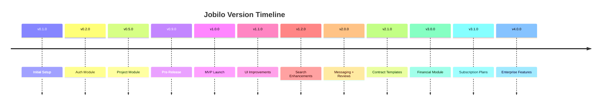
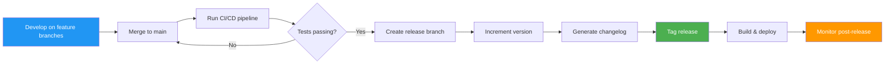
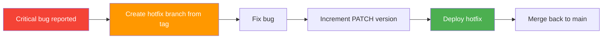

# Versioning Strategy — استراتيجية إدارة الإصدارات

> **Semantic Versioning (SemVer 2.0.0)** for all Jobilo releases.

---

## Overview | نظرة عامة

Jobilo follows [Semantic Versioning 2.0.0](https://semver.org/spec/v2.0.0.html) for all releases. This ensures clear communication about the nature of changes between releases and enables automated tooling for dependency management and changelog generation.

---

## Version Format | تنسيق الإصدار

```
MAJOR.MINOR.PATCH[-PRERELEASE][+BUILD]
```

| Component | المكون | Description | Example |
|-----------|--------|-------------|---------|
| **MAJOR** | رئيسي | Incompatible API changes, significant feature milestones | `2.0.0` |
| **MINOR** | ثانوي | Backward-compatible new functionality | `1.3.0` |
| **PATCH** | تصحيحي | Backward-compatible bug fixes | `1.0.2` |
| **PRERELEASE** | ما قبل الإصدار | Pre-release versions (alpha, beta, rc) | `1.0.0-beta.1` |
| **BUILD** | بناء | Build metadata (automated, not used for precedence) | `1.0.0+build.20260706` |

---

## SemVer Rules | قواعد SemVer

### When to Increment MAJOR | متى يتم زيادة الإصدار الرئيسي

- Breaking changes to the public API (REST endpoints, request/response schemas)
- Database schema changes that require migrations with data loss
- Removal of deprecated features
- Major framework or dependency upgrades with breaking changes
- Significant architectural changes

### When to Increment MINOR | متى يتم زيادة الإصدار الثانوي

- New features that are backward-compatible
- New API endpoints that don't break existing ones
- Adding optional fields to responses (non-breaking)
- Deprecating existing features (without removal)
- Significant performance improvements
- New modules or subsystems

### When to Increment PATCH | متى يتم زيادة الإصدار التصحيحي

- Bug fixes
- Security patches
- Performance optimizations that don't change behavior
- Documentation updates within code
- Dependency updates that don't introduce new features

---

## Pre-release Versions | إصدارات ما قبل الإطلاق

Jobilo uses the following pre-release identifiers:

| Identifier | Usage | Example |
|------------|-------|---------|
| `-alpha.N` | Internal testing, unstable APIs, incomplete features | `1.0.0-alpha.1` |
| `-beta.N` | External testing, feature-complete, may have bugs | `1.0.0-beta.3` |
| `-rc.N` | Release candidate, final testing before release | `1.0.0-rc.2` |

### Precedence Example

```
1.0.0-alpha < 1.0.0-alpha.1 < 1.0.0-alpha.beta < 1.0.0-beta < 1.0.0-beta.2
< 1.0.0-beta.11 < 1.0.0-rc.1 < 1.0.0
```

---

## Release Examples | أمثلة على الإصدارات

### Initial Development (Current Phase)

| Version | الإصدار | Description | التوصيف |
|---------|---------|-------------|---------|
| `0.1.0` | 0.1.0 | Initial project setup, documentation | إعداد أولي للمشروع والتوثيق |
| `0.2.0` | 0.2.0 | Core auth module with JWT | وحدة المصادقة الأساسية |
| `0.5.0` | 0.5.0 | Project management features | ميزات إدارة المشاريع |
| `0.9.0` | 0.9.0 | Feature-complete pre-release | إصدار ما قبل الإطلاق كامل الميزات |
| `1.0.0-rc.1` | 1.0.0-rc.1 | First release candidate | أول مرشح إطلاق |
| `1.0.0` | 1.0.0 | First stable release (MVP launch) | أول إطلاق مستقر (MVP) |

### Stable Releases (Post-MVP)



| Version | Date (est.) | Major Changes |
|---------|-------------|---------------|
| `1.0.0` | Dec 2026 | MVP launch: marketplace, auth, profiles |
| `1.1.0` | Feb 2027 | UI/UX improvements, bug fixes |
| `1.2.0` | Apr 2027 | Arabic search, advanced filtering |
| `2.0.0` | Aug 2027 | Real-time messaging, reviews system |
| `2.1.0` | Nov 2027 | Smart contract templates, notifications |
| `3.0.0` | Jun 2028 | Escrow payments, financial module |
| `3.1.0` | Sep 2028 | Subscription plans, AI matching v2 |
| `3.2.0` | Dec 2028 | Public REST API, webhooks |
| `4.0.0` | Jun 2029 | Enterprise org accounts, mobile apps |

---

## Version Compatibility | التوافق بين الإصدارات

### Backend API Compatibility

| API Version | Status | Notes |
|-------------|--------|-------|
| `v1` | 🏗️ Preview (MVP) | Current development version |
| `v2` | 📋 Planned | Breaking changes from v1 |
| `v3` | 🔮 Future | Major API restructuring expected |

### API Versioning Strategy

Jobilo uses **URL-based versioning** for the REST API:

```
/api/v1/projects
/api/v2/projects
```

When a new MAJOR version is released:
1. The previous version is deprecated with a 6-month sunset period
2. Deprecated endpoints return `Sunset` and `Deprecation` HTTP headers
3. Documentation for deprecated versions is archived
4. At least one MINOR version's notice is given before breaking changes

### Dependency Compatibility

| Dependency | Minimum Version | Recommended Version |
|------------|----------------|-------------------|
| Node.js | 18.x | 20.x LTS |
| PostgreSQL | 16 | 16.x |
| Redis | 7.x | 7.x |
| pnpm | 8.x | 9.x |
| Docker | 24.x | Latest |

---

## Version Management Process | عملية إدارة الإصدارات

### Release Flow



### Version Increment Commands

```bash
# Patch release (bug fix)
pnpm version patch   # 1.0.0 → 1.0.1

# Minor release (new features, backward-compatible)
pnpm version minor   # 1.0.0 → 1.1.0

# Major release (breaking changes)
pnpm version major   # 1.0.0 → 2.0.0

# Pre-release
pnpm version prerelease --preid=beta  # 1.0.0 → 1.0.0-beta.0
```

### Release Checklist

- [ ] All tests pass on main branch
- [ ] Changelog is updated for the new version
- [ ] Version is incremented in `package.json` and `version.ts`
- [ ] API documentation is updated for any changes
- [ ] Migration scripts are tested (if applicable)
- [ ] Release candidate is deployed to staging
- [ ] Smoke tests pass on staging
- [ ] Release notes are drafted
- [ ] Tag is created and pushed (`git tag v1.0.0`)
- [ ] Deployment to production
- [ ] Post-deployment monitoring (24h)

---

## Hotfix Process | عملية الإصلاح العاجل

For critical bugs in production that can't wait for the next scheduled release:



Hotfix version example:
- Current production: `v2.1.0`
- Hotfix: `v2.1.1` (increment PATCH)
- After hotfix, merge back to main

---

## Version File Location

The current version is stored in:

```
apps/api/src/common/version.ts
```

```typescript
// apps/api/src/common/version.ts
export const VERSION = '0.1.0';
export const VERSION_NAME = 'Al-Foundation';
export const BUILD_DATE = '2026-07-06';
```

---

## Links | روابط ذات صلة

- [Changelog](CHANGELOG.md) — Release history
- [Roadmap](ROADMAP.md) — Development phases and timeline
- [Contributing Guide](../CONTRIBUTING.md) — Commit conventions and branching
- [Architecture](ARCHITECTURE.md) — System architecture
