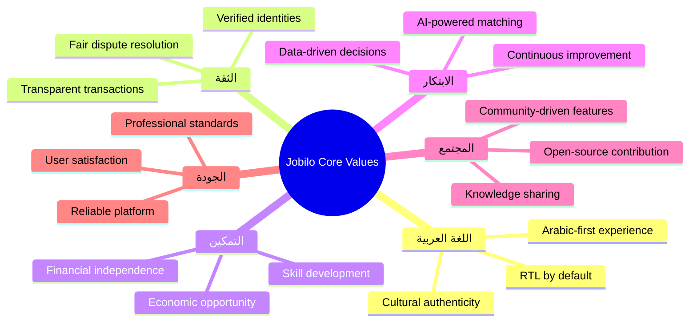
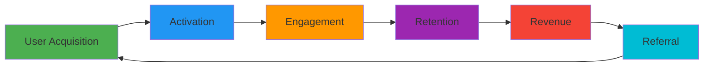
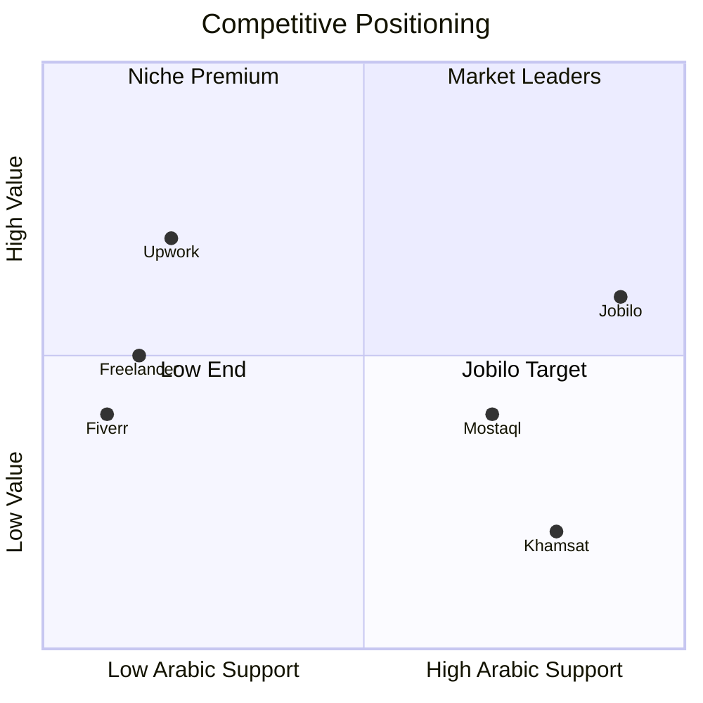

# Vision Document — وثيقة الرؤية

> **Jobilo**: Becoming the definitive freelancing ecosystem for the Arabic-speaking world.

---

## Vision Statement | بيان الرؤية

### 10-Year Vision (2026–2036)

> **"To become the largest and most trusted freelancing ecosystem in the Arab world — where every Arabic-speaking professional can build a thriving career, and every project owner can find the perfect talent within their own language and culture."**
>
> **"أن نصبح أكبر وأكثر نظام بيئي للعمل الحر موثوقية في العالم العربي — حيث يمكن لكل محترف ناطق بالعربية بناء مسيرة مهنية مزدهرة، ويمكن لكل صاحب مشروع إيجاد الموهبة المثالية ضمن لغته وثقافته."**

By 2036, Jobilo aims to:
- Serve **5M+ registered users** across the Arab world and diaspora
- Facilitate **$500M+** in total project value annually
- Employ **500+ people** across offices in Cairo, Riyadh, and Dubai
- Support **50+ skill categories** with AI-powered matching
- Become the default freelancing platform for the **MENA region**

---

## Mission Statement | بيان الرسالة

> **"Empower every Arabic-speaking professional to build a sustainable freelancing career by providing an intuitive, secure, and culturally-aware platform that removes barriers between talent and opportunity."**
>
> **"تمكين كل محترف ناطق بالعربية من بناء مسيرة عمل حر مستدامة من خلال توفير منصة بديهية وآمنة ومراعية للثقافة تزيل الحواجز بين الموهبة والفرصة."**

---

## Core Values | القيم الأساسية

### Detailed Value Descriptions

#### 1. 🇦🇪 اللغة العربية | Arabic Language & Culture (الأصالة)
Arabic is not an afterthought — it's the foundation. Every pixel, every interaction, and every workflow is designed for Arabic speakers first. This means:
- RTL layout as the default, not a CSS hack
- Arabic typography using Cairo font with proper glyph rendering
- Culturally appropriate communication patterns (e.g., formal vs. informal address)
- Islamic finance considerations for future payment features
- Arab business etiquette integrated into dispute resolution

#### 2. 🤝 الثقة | Trust (الموثوقية)
Trust is the currency of freelancing platforms. Jobilo builds trust through:
- Mandatory identity verification for all users
- Transparent transaction histories
- Verified reviews (only from actual project participants)
- Escrow-based payment protection (Phase 3)
- Clear, enforceable terms of service in Arabic

#### 3. 🚀 التمكين | Empowerment (التمكين)
We measure our success by our users' success:
- AI skill suggestions help freelancers grow their capabilities
- Educational resources and templates
- Fair pricing model with no surprise fees
- Portfolio-building tools that showcase real work
- Analytics that help freelancers understand their market position

#### 4. 💡 الابتكار | Innovation (الابتكار)
Continuous improvement driven by data and user feedback:
- Machine learning for matching and recommendations
- Automated quality scoring for proposals
- Trend analysis for in-demand skills
- A/B testing for all major feature releases
- Open-source contribution from the community

#### 5. 🌍 المجتمع | Community (المجتمع)
A platform is nothing without its community:
- Features prioritized by community voting
- Freelancer forums and knowledge base
- Open-source development with public roadmap
- Community events and webinars
- Mentor-mentee matching for new freelancers

#### 6. ✨ الجودة | Quality (الجودة)
Excellence in every aspect:
- Reliable infrastructure with 99.9% uptime target
- Professional UI/UX with consistent design system
- Comprehensive testing (unit, integration, E2E)
- Performance budgets and monitoring
- Accessible design (WCAG 2.1 AA)

---

## Strategic Goals | الأهداف الاستراتيجية

### Phase 1: Foundation (0–12 Months) | التأسيس

| Goal | الهدف | Target | Timeline | Status |
|------|-------|--------|----------|--------|
| Launch MVP with core marketplace | إطلاق الحد الأدنى القابل للتطبيق | 1,000 registered users | Q3 2026 | 🏗️ In Progress |
| Implement AI skill suggestions | تطبيق نظام اقتراح المهارات | 80% suggestion accuracy | Q4 2026 | 📋 Planned |
| Reach 500 active projects | الوصول إلى 500 مشروع نشط | 500 projects | Q1 2027 | 🎯 Target |
| Build admin dashboard | بناء لوحة تحكم المشرفين | Full RBAC implementation | Q2 2027 | 📋 Planned |
| Achieve 4.0+ user rating | تحقيق تقييم مستخدم 4.0+ | NPS ≥ 40 | Q2 2027 | 🎯 Target |
| Establish Arabic content library | إنشاء مكتبة محتوى عربية | 200+ articles/templates | Ongoing | 📋 Planned |

### Phase 2: Growth (12–24 Months) | النمو

| Goal | الهدف | Target | Timeline |
|------|-------|--------|----------|
| Real-time messaging | نظام المراسلة الفورية | <100ms latency | Q3 2027 |
| Review and rating system | نظام التقييم والمراجعات | 60% review rate | Q4 2027 |
| Smart contract templates | قوالب العقود الذكية | 50+ templates | Q1 2028 |
| Mobile responsive app | تطبيق متجاوب للجوال | 90+ Lighthouse mobile | Q1 2028 |
| Reach 10K registered users | الوصول إلى 10 آلاف مستخدم | 10,000 users | Q2 2028 |
| Expand to 3 new countries | التوسع إلى 3 دول جديدة | Egypt, KSA, UAE | Q2 2028 |

### Phase 3: Scale (24–36 Months) | التوسع

| Goal | الهدف | Target | Timeline |
|------|-------|--------|----------|
| Financial module with escrow | الوحدة المالية مع الضمان | <1% dispute rate | Q3 2028 |
| Advanced AI matching | المطابقة المتقدمة بالذكاء الاصطناعي | 90% match satisfaction | Q4 2028 |
| Subscription plans launch | إطلاق خطط الاشتراك | 15% conversion rate | Q1 2029 |
| API for third-party integrations | واجهة برمجة للتكامل الخارجي | 100+ API consumers | Q2 2029 |
| Reach 50K users | الوصول إلى 50 ألف مستخدم | 50,000 users | Q2 2029 |
| Process $5M in project value | معالجة 5 ملايين دولار قيمة مشاريع | $5M total value | Q3 2029 |

### Long-Term (36+ Months) | المدى البعيد

| Goal | الهدف | Target |
|------|-------|--------|
| Enterprise organization accounts | حسابات المؤسسات | 500+ enterprise clients |
| Marketplace API ecosystem | نظام بيئي لواجهات برمجة التطبيقات | Open API marketplace |
| AI-powered contract generation | إنشاء العقود بالذكاء الاصطناعي | Automated legal compliance |
| Arabic NLP for skill parsing | معالجة اللغة العربية الطبيعية | 95% skill extraction accuracy |
| Regional payment gateways integration | دمج بوابات الدفع الإقليمية | 10+ payment methods |
| Mobile native apps (iOS/Android) | تطبيقات أصلية للجوال | 100K+ installs |

---

## Success Metrics | مقاييس النجاح

### Key Performance Indicators (KPIs)

| Metric | المقياس | Current Target | Long-Term Goal |
|--------|---------|----------------|----------------|
| **Monthly Active Users (MAU)** | المستخدمون النشطون شهريًا | 500 (Month 6) | 500K |
| **Project Fill Rate** | نسبة إشغال المشاريع | 60% | 85%+ |
| **Average Time to Match** | متوسط وقت المطابقة | 48 hours | 4 hours |
| **Freelancer Retention (6-month)** | الاحتفاظ بالمستقلين | 40% | 70%+ |
| **Client Repeat Rate** | نسبة تكرار العميل | 25% | 60%+ |
| **Net Promoter Score (NPS)** | صافي نقاط الترويج | 30 | 60+ |
| **Platform Uptime** | وقت تشغيل المنصة | 99.5% | 99.99% |
| **Average Response Time** | متوسط وقت الاستجابة | 500ms P95 | 100ms P95 |
| **User Satisfaction Score** | درجة رضا المستخدمين | 3.5/5 | 4.5/5 |
| **Revenue Run Rate** | معدل الإيرادات السنوي | $0 (MVP) | $10M+ |

---

## Competitive Landscape | المشهد التنافسي

### Direct Competitors | المنافسون المباشرون

| Platform | المنصة | Strengths | Weaknesses | Jobilo Advantage |
|----------|--------|-----------|------------|------------------|
| **Upwork** | أبورك | Global reach, established trust | 20% commission, poor Arabic support, complex UI | Arabic-first, 0% commission MVP, simpler UX |
| **Freelancer.com** | فريلانسر | Large user base, contest system | Cluttered UI, low-quality projects, spam | Curated marketplace, quality focus |
| **Fiverr** | فيفر | Gig-based simplicity, large catalog | Race-to-bottom pricing, limited customization | Project-based model, fair pricing |
| **Mostaql** | مستقل | Arabic platform, local payments | Outdated tech, limited features, poor UX | Modern tech stack, AI features, better UX |
| **Khamsat** | خمسات | Micro-services focus, Arabic audience | Very low prices, limited scope | Professional services, higher value projects |

### Indirect Competitors | المنافسون غير المباشرون

| Platform | المنصة | Threat Level | Notes |
|----------|--------|-------------|-------|
| LinkedIn ProFinder | لينكد إن | Low | Not Arabic-focused, limited freelancing features |
| Toptal | توبتال | Low | Ultra-premium, very selective, expensive |
| Remote OK / We Work Remotely | منصات التوظيف عن بعد | Medium | Job boards, not full marketplace |
| Local Facebook groups | مجموعات فيسبوك | High (initial) | Informal but widely used for freelancing in Arab world |

### Competitive Strategy | الاستراتيجية التنافسية

Jobilo's strategy is to occupy the **top-right quadrant**: maximum Arabic support with high-value positioning — offering premium-quality freelancing services without premium prices, while providing a culturally authentic experience that global competitors cannot match.

---

## Links | روابط ذات صلة

- [Project Overview](PROJECT_OVERVIEW.md) — Detailed project overview
- [Mission Document](MISSION.md) — Detailed mission breakdown
- [Roadmap](ROADMAP.md) — Development phases and timeline
- [Architecture](ARCHITECTURE.md) — Technical architecture
