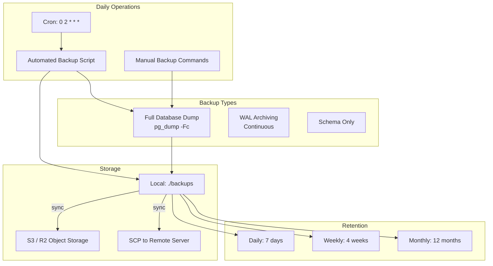
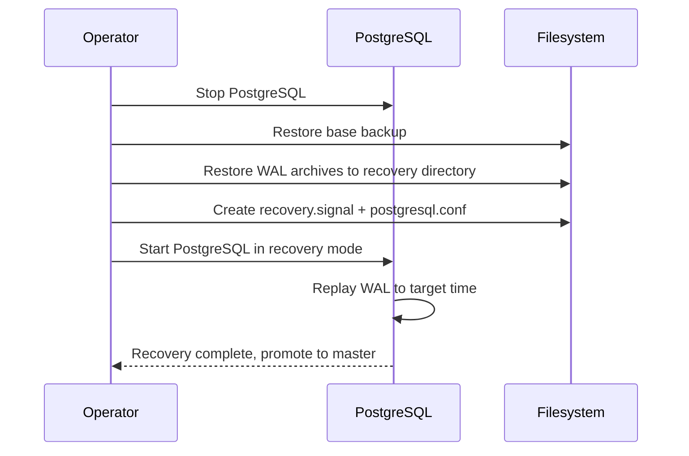
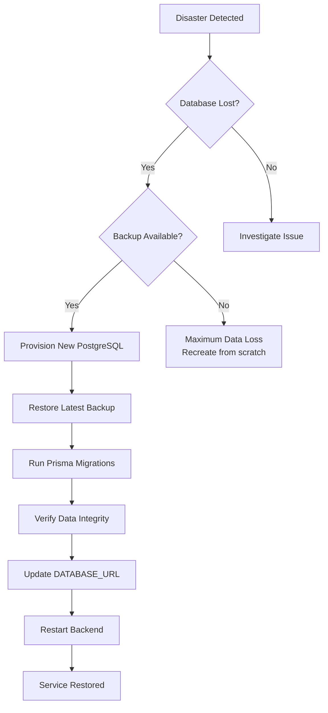

# Backup and Restore Guide

> Comprehensive backup strategy and recovery procedures for the Jobilo PostgreSQL database.

## Backup Architecture



## Backup Strategy

| Type | Frequency | Tool | Recovery Point | Retention |
|------|-----------|------|----------------|-----------|
| Full dump | Daily (02:00 UTC) | `pg_dump -Fc` | Previous day | 7 days |
| Weekly full | Sunday 02:00 UTC | `pg_dump -Fc` | Previous week | 4 weeks |
| Monthly full | 1st of month 02:00 UTC | `pg_dump -Fc` | Previous month | 12 months |
| WAL archiving | Continuous | `archive_command` | Point-in-time | 7 days |

## Automated Backup Script

The `scripts/backup.sh` script handles daily backups:

```bash
#!/usr/bin/env bash
set -euo pipefail

SCRIPT_DIR="$(cd "$(dirname "${BASH_SOURCE[0]}")" && pwd)"
PROJECT_ROOT="$(dirname "$SCRIPT_DIR")"
BACKUP_DIR="$PROJECT_ROOT/backups"
RETENTION_DAYS=7
TIMESTAMP="$(date +%Y-%m-%d_%H%M%S)"
DUMP_FILE="jobilo_${TIMESTAMP}.sql"
COMPRESSED_FILE="${DUMP_FILE}.gz"

mkdir -p "$BACKUP_DIR"

# Source env if needed
if [ -z "${POSTGRES_DB:-}" ]; then
  set -a && . "$PROJECT_ROOT/.env.production" && set +a
fi

export PGPASSWORD="$POSTGRES_PASSWORD"

pg_dump -h "${PGHOST:-localhost}" -p "${PGPORT:-5432}" \
  -U "$POSTGRES_USER" -d "$POSTGRES_DB" \
  --no-owner --no-acl --format=custom \
  > "$BACKUP_DIR/$DUMP_FILE"

gzip -f "$BACKUP_DIR/$DUMP_FILE"

# Clean old backups
find "$BACKUP_DIR" -name "jobilo_*.sql.gz" -mtime +$RETENTION_DAYS -delete
```

### Usage

```bash
# Run manually
./scripts/backup.sh

# Verify backup was created
ls -lh backups/
```

## Manual Backup Commands

### Full Custom Format (Recommended)

```bash
PGPASSWORD=$POSTGRES_PASSWORD \
pg_dump -h $PGHOST -U $POSTGRES_USER -d $POSTGRES_DB \
  --no-owner --no-acl \
  --format=custom \
  --compress=9 \
  -f backups/jobilo_manual_$(date +%Y%m%d_%H%M%S).dump
```

### SQL Script (Portable)

```bash
PGPASSWORD=$POSTGRES_PASSWORD \
pg_dump -h $PGHOST -U $POSTGRES_USER -d $POSTGRES_DB \
  --no-owner --no-acl \
  --format=plain \
  | gzip > backups/jobilo_$(date +%Y%m%d_%H%M%S).sql.gz
```

### Schema Only

```bash
PGPASSWORD=$POSTGRES_PASSWORD \
pg_dump -h $PGHOST -U $POSTGRES_USER -d $POSTGRES_DB \
  --schema-only \
  -f backups/jobilo_schema_$(date +%Y%m%d).sql
```

### Data Only (Exclude Prisma Migrations)

```bash
PGPASSWORD=$POSTGRES_PASSWORD \
pg_dump -h $PGHOST -U $POSTGRES_USER -d $POSTGRES_DB \
  --data-only --exclude-table=_prisma_migrations \
  --format=custom \
  -f backups/jobilo_data_$(date +%Y%m%d).dump
```

## Restore Procedure

### Using Automated Script

```bash
# See scripts/restore.sh
./scripts/restore.sh backups/jobilo_2026-07-07_020000.sql.gz
```

The script will:
1. Prompt for confirmation
2. Detect format (`.sql.gz` or `.dump`)
3. Drop existing data (`--clean --if-exists`)
4. Restore from backup
5. Report success or failure

### Using pg_restore Directly

```bash
# Custom format restore
PGPASSWORD=$POSTGRES_PASSWORD \
pg_restore -h $PGHOST -U $POSTGRES_USER -d $POSTGRES_DB \
  --clean --if-exists --no-owner --no-acl \
  backups/jobilo_2026-07-07_020000.dump

# Compressed SQL restore
gunzip -c backups/jobilo_2026-07-07_020000.sql.gz | \
  PGPASSWORD=$POSTGRES_PASSWORD \
  psql -h $PGHOST -U $POSTGRES_USER -d $POSTGRES_DB
```

### Restore to a Different Database

```bash
# Create target database
PGPASSWORD=$POSTGRES_PASSWORD \
createdb -h $PGHOST -U $POSTGRES_USER jobilo_restore_test

# Restore
PGPASSWORD=$POSTGRES_PASSWORD \
pg_restore -h $PGHOST -U $POSTGRES_USER -d jobilo_restore_test \
  --no-owner --no-acl \
  backups/jobilo_2026-07-07_020000.dump
```

## Point-in-Time Recovery (PITR)

### Prerequisites

PostgreSQL must be configured with WAL archiving:

```ini
# postgresql.conf settings
wal_level = replica
archive_mode = on
archive_command = 'cp %p /backups/wal/%f'
archive_timeout = 60
```

### Recovery Steps



```bash
# 1. Stop the container
docker stop jobilo-postgres

# 2. Restore base backup to data directory
docker run --rm -v pgdata:/pgdata -v ./backups:/backups alpine sh -c \
  "rm -rf /pgdata/* && pg_restore -D /pgdata /backups/jobilo_weekly.dump"

# 3. Place WAL archives
docker cp ./backups/wal/. jobilo-postgres:/var/lib/postgresql/data/pg_wal/

# 4. Create recovery.conf
cat > recovery.conf << EOF
restore_command = 'cp /backups/wal/%f %p'
recovery_target_time = '2026-07-06 14:30:00 UTC'
recovery_target_action = promote
EOF

# 5. Start and verify
docker start jobilo-postgres
docker logs -f jobilo-postgres
```

## Backup Schedule Recommendations

### Crontab Configuration

```bash
# Edit crontab
crontab -e

# Daily full backup at 02:00 UTC
0 2 * * * /path/to/jobilo/scripts/backup.sh >> /var/log/jobilo-backup.log 2>&1

# Weekly full backup (Sunday 02:00)
0 2 * * 0 /path/to/jobilo/scripts/backup.sh --weekly

# Monthly full backup (1st 02:00)
0 2 1 * * /path/to/jobilo/scripts/backup.sh --monthly

# Sync backups to remote storage at 03:30 daily
30 3 * * * /path/to/jobilo/scripts/sync-backups.sh
```

## Off-Site Backup Storage

### S3 / Cloudflare R2

```bash
#!/usr/bin/env bash
# scripts/sync-backups.sh
set -euo pipefail

BACKUP_DIR="./backups"
S3_BUCKET="s3://jobilo-backups"

# Sync to S3-compatible storage (R2, AWS S3, etc.)
aws s3 sync "$BACKUP_DIR" "$S3_BUCKET/$(date +%Y/%m)" \
  --storage-class STANDARD \
  --delete
```

### SCP to Remote Server

```bash
#!/usr/bin/env bash
# Sync via SCP
rsync -avz --remove-source-files \
  ./backups/ \
  backup@remote-server:/backups/jobilo/
```

## Disaster Recovery Plan



### Recovery Time Objectives

| Scenario | RTO | RPO |
|----------|-----|-----|
| Container crash | 5 min | 0 (Docker restart) |
| Data corruption | 30 min | 24 h (daily backup) |
| Full region outage | 2 h | 24 h + WAL |
| Accidental deletion | 1 h | Depends on discovery |

## Testing Backup Integrity

```bash
# 1. Restore to staging environment
./scripts/restore.sh backups/jobilo_2026-07-07_020000.sql.gz

# 2. Verify row counts
docker exec jobilo-postgres psql -U jobilo -d jobilo -c "
SELECT schemaname, tablename, n_live_tup
FROM pg_stat_user_tables
ORDER BY n_live_tup DESC;"

# 3. Run application health check
curl -f http://staging:4000/api/v1/health/db

# 4. Verify specific data
docker exec jobilo-postgres psql -U jobilo -d jobilo -c "
SELECT COUNT(*) AS total_users FROM users;
SELECT COUNT(*) AS total_jobs FROM jobs;"
```

## Retention Policy

| Backup Type | Retention | Cleanup Rule | Storage Estimate |
|-------------|-----------|-------------|-----------------|
| Daily | 7 days | `find ... -mtime +7 -delete` | 7 × 500 MB = 3.5 GB |
| Weekly | 4 weeks | Manual or scripted rename | 4 × 500 MB = 2 GB |
| Monthly | 12 months | Manual archive to S3 | 12 × 500 MB = 6 GB |
| WAL archives | 7 days | `archive_cleanup_command` | ~1 GB/day |

### Automated Retention Cleanup

```bash
# In backup.sh - deletes after 7 days
find "$BACKUP_DIR" -name "jobilo_*.sql.gz" -mtime +7 -delete

# Weekly/monthly backups (preserved by naming convention)
# Weekly: jobilo_weekly_2026-W27.sql.gz
# Monthly: jobilo_monthly_2026-07.sql.gz
```

---

**See also:**
- [DOCKER_DATABASE.md](./DOCKER_DATABASE.md) — PostgreSQL Docker setup
- [POSTGRESQL_CONTAINER.md](./POSTGRESQL_CONTAINER.md) — Detailed container management
- [PRODUCTION_DEPLOYMENT.md](./PRODUCTION_DEPLOYMENT.md) — Full deployment workflow
