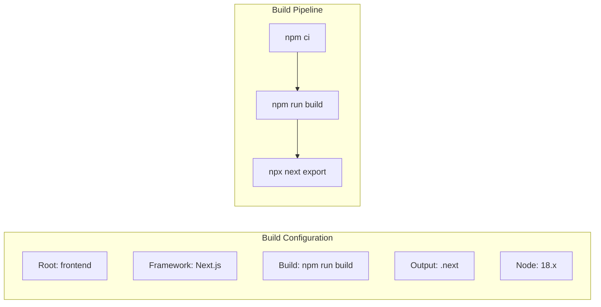
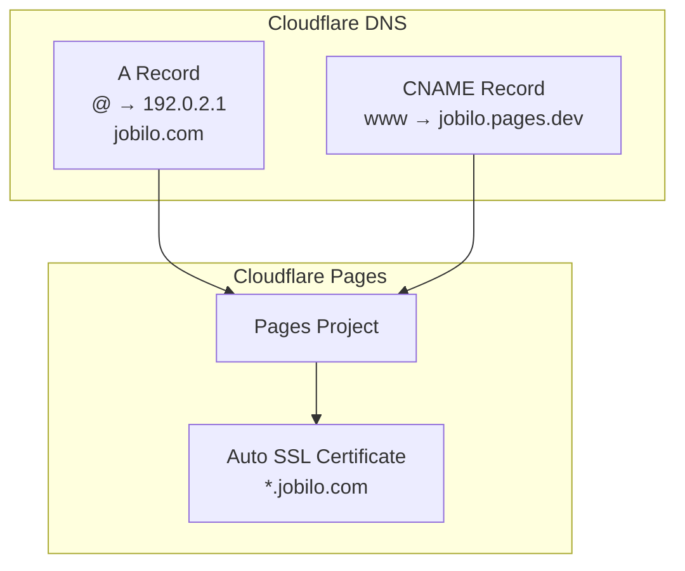
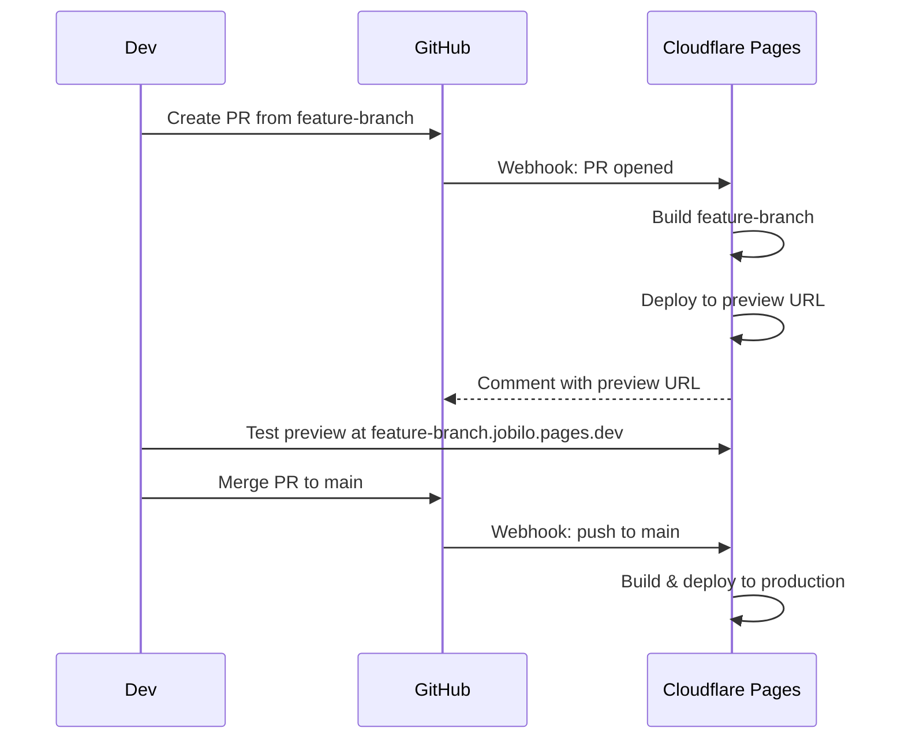
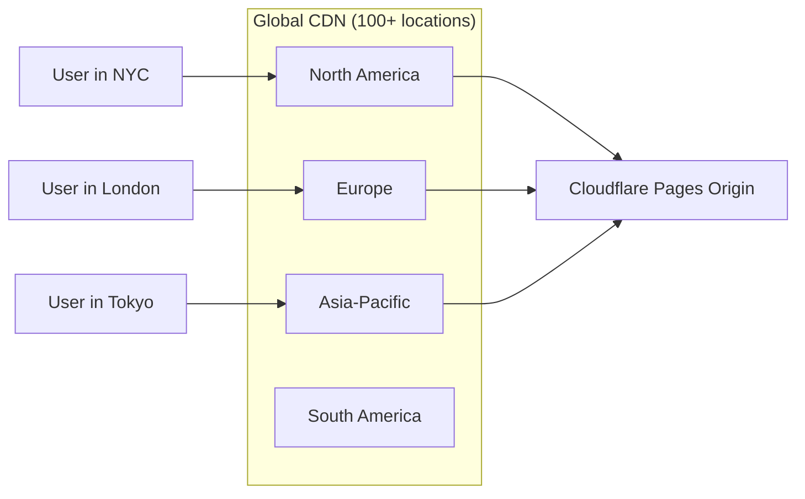

# Cloudflare Pages Deployment Guide

> Detailed guide for deploying the Jobilo frontend to Cloudflare Pages.

## Architecture on Cloudflare

```mermaid
graph TB
    subgraph "Cloudflare Global Network"
        subgraph "Cloudflare Pages"
            CF_BUILD[Build Pipeline<br/>npm run build]
            CF_CDN[CDN Edge Cache<br/>100+ Locations]
            CF_SSL[Auto SSL/TLS]
            CF_PREVIEW[Deploy Previews<br/>per PR branch]
        end
        subgraph "Cloudflare DNS"
            DNS[Custom Domain<br/>jobilo.com]
            PROXY[Orange Cloud Proxy]
        end
    end
    
    subgraph "External"
        GH[GitHub<br/>Mustafa1998-tech/jobilo]
        API[Backend API<br/>Render]
    end

    USER[User Browser] --> DNS
    DNS --> PROXY
    PROXY --> CF_CDN
    GH -- git push --> CF_BUILD
    CF_CDN -- API calls --> API
```



## Prerequisites

- [Cloudflare account](https://cloudflare.com) (free tier)
- GitHub repository: `Mustafa1998-tech/jobilo`
- Domain managed by Cloudflare DNS (recommended)
- Backend API deployed (see [RENDER_DEPLOYMENT.md](./RENDER_DEPLOYMENT.md))

## Step 1: Create Cloudflare Account

1. Go to [cloudflare.com](https://cloudflare.com)
2. Sign up with email or SSO
3. Add your domain (or use the default `<project>.pages.dev` domain)
4. Update nameservers if using a custom domain

## Step 2: Connect GitHub Repository

1. **Cloudflare Dashboard** → **Workers & Pages** → **Pages**
2. Click **Create application** → **Pages** tab → **Connect to Git**
3. Authorize Cloudflare on GitHub
4. Select `Mustafa1998-tech/jobilo`

## Step 3: Configure Build Settings



### Settings Table

| Setting | Value | Notes |
|---------|-------|-------|
| **Production branch** | `main` | Auto-deploys on push |
| **Root directory** | `frontend` | Where `package.json` lives |
| **Build command** | `npm run build` | Next.js build |
| **Build output dir** | `.next` | Next.js output |
| **Node.js version** | `18` (or 20) | Use `.nvmrc` to pin |
| **Environment variables** | See below | At least `NEXT_PUBLIC_API_URL` |

### Environment Variables

| Variable | Value | Purpose |
|----------|-------|---------|
| `NEXT_PUBLIC_API_URL` | `https://jobilo-api.onrender.com/api/v1` | Backend API base URL |

Add in **Settings** → **Environment variables** (both Production and Preview):

```
NEXT_PUBLIC_API_URL=https://jobilo-api.onrender.com/api/v1
```

> **Important:** All Next.js public variables must be prefixed with `NEXT_PUBLIC_`. They are inlined at build time.

## Step 4: Custom Domain Setup



### Add Custom Domain

1. **Cloudflare Pages** → **jobilo** → **Custom domains**
2. Click **Set up a custom domain**
3. Enter your domain: `jobilo.com`
4. Cloudflare auto-configures DNS:

| Type | Name | Value | Proxy |
|------|------|-------|-------|
| CNAME | `jobilo.com` | `jobilo.pages.dev` | Proxied (orange cloud) |
| CNAME | `www` | `jobilo.pages.dev` | Proxied (orange cloud) |

5. Wait 1-2 minutes for SSL provisioning
6. ✅ Custom domain is active

### Update Backend CORS

After setting up the custom domain, update backend env:

```
CORS_ORIGINS=https://jobilo.com,https://www.jobilo.com
APP_URL=https://jobilo.com
```

## Step 5: Automatic HTTPS/SSL

Cloudflare Pages provides:

| Feature | Details |
|---------|---------|
| SSL/TLS | Auto-provisioned (Edge Certificates) |
| Minimum TLS | 1.2 (recommended) |
| Cert type | Cloudflare Edge Certificate (shared) |
| Renewal | Automatic |
| HSTS | Enable in SSL/TLS → Edge Certificates |

**Configuration:**
1. **SSL/TLS** → **Overview** → **Full (strict)**
2. **Edge Certificates** → Enable **Always Use HTTPS**
3. **Security** → **SSL/TLS** → **Minimum TLS Version** → **1.2**

## Step 6: Deploy Previews for PR Branches



- Enabled by default when you connect the repo
- Each PR gets a unique URL: `<pr-number>-<project>.pages.dev`
- Environment variables inherit from production (can be overridden)
- Preview branch variables can point to staging API

## Step 7: Cache Configuration

### Default Caching

Cloudflare Pages automatically caches static assets:

| Asset Type | Cache TTL | Cache-Control |
|------------|-----------|---------------|
| HTML | 60 min | `public, max-age=0, s-maxage=3600` |
| JS/CSS | 1 year | `public, max-age=31536000, immutable` |
| Images | 1 year | `public, max-age=31536000, immutable` |
| Fonts | 1 year | `public, max-age=31536000, immutable` |

### Custom Cache Rules

In **Cloudflare Dashboard** → **Caching** → **Cache Rules**:

```json
{
  "description": "Cache API responses",
  "expression": "http.request.uri.path contains \"/api/\"",
  "actions": {
    "cache": false
  }
}
```

Or disable cache for API routes:

```
*.jobilo.com/api/* → Bypass cache
*.jobilo.com/_next/data/* → Bypass cache
```

## Step 8: Performance Optimization

### Cloudflare CDN Benefits



### Optimization Features

| Feature | Benefit | How to Enable |
|---------|---------|--------------|
| **Auto Minify** | Reduces HTML/JS/CSS size | Speed → Optimization → Auto Minify |
| **Brotli Compression** | Better compression than gzip | On by default |
| **Rocket Loader** | Async JS loading (test carefully) | Speed → Optimization → Rocket Loader |
| **Polish** | Image optimization | Speed → Optimization → Polish |
| **Early Hints** | Faster page loads | Speed → Optimization → Early Hints |
| **HTTP/2 & HTTP/3** | Multiplexed connections | Enabled automatically |

## Step 9: Troubleshooting

### Build Failures

```bash
# Common issues and solutions:

# 1. Node version mismatch
# Fix: Add .nvmrc at frontend root
echo "18" > frontend/.nvmrc

# 2. Missing environment variable
# Fix: In Cloudflare dashboard, add NEXT_PUBLIC_API_URL

# 3. TypeScript errors
# Fix: Check tsconfig.json, ensure strict mode is compatible

# 4. ESLint errors
# Fix: Check eslint.config.mjs, disable strict rules for build

# 5. Build timeout (free tier: 15 min)
# Fix: Optimize next.config.js, reduce dependencies
```

### 404 Errors

```bash
# 1. Check if file exists in build output
# Frontend: Ensure _routes.json or next.config.js has rewrites

# 2. SPA fallback (if using client-side routing)
# In Cloudflare Pages → Settings → SPA → Enable

# 3. Custom 404 page
# Create pages/404.tsx for Next.js
```

### API Connection Errors

```
Error: Failed to fetch /api/v1/health
       net::ERR_CONNECTION_REFUSED
```

**Causes and fixes:**

| Cause | Check | Fix |
|-------|-------|-----|
| CORS misconfiguration | Browser console | Update `CORS_ORIGINS` in backend |
| Incorrect API URL | Network tab | Verify `NEXT_PUBLIC_API_URL` |
| Backend down | `curl https://api.jobilo.com/api/v1/health` | Restart Render service |
| SSL mismatch | SSL/TLS setting | Set Cloudflare to Full (strict) |

## Post-Deployment Verification

```bash
# 1. Check frontend is live
curl -s -o /dev/null -w "%{http_code}" https://jobilo.com
# Expected: 200

# 2. Verify API connectivity
curl -s https://jobilo.com/api/v1/health | head -c 200

# 3. Check SSL
curl -sI https://jobilo.com | grep -i "cf-ray\|server: cloudflare"

# 4. Check CDN headers
curl -sI https://jobilo.com/_next/static/chunks/main-*.js | grep -i "cf-cache-status"
# Expected: HIT or MISS

# 5. Verify preview deployment
# Open PR URL: https://<pr-number>-jobilo.pages.dev
```

---

**See also:**
- [RENDER_DEPLOYMENT.md](./RENDER_DEPLOYMENT.md) — Backend deployment on Render
- [PRODUCTION_DEPLOYMENT.md](./PRODUCTION_DEPLOYMENT.md) — Full deployment workflow
- [ENVIRONMENT_VARIABLES.md](./ENVIRONMENT_VARIABLES.md) — All env vars reference
