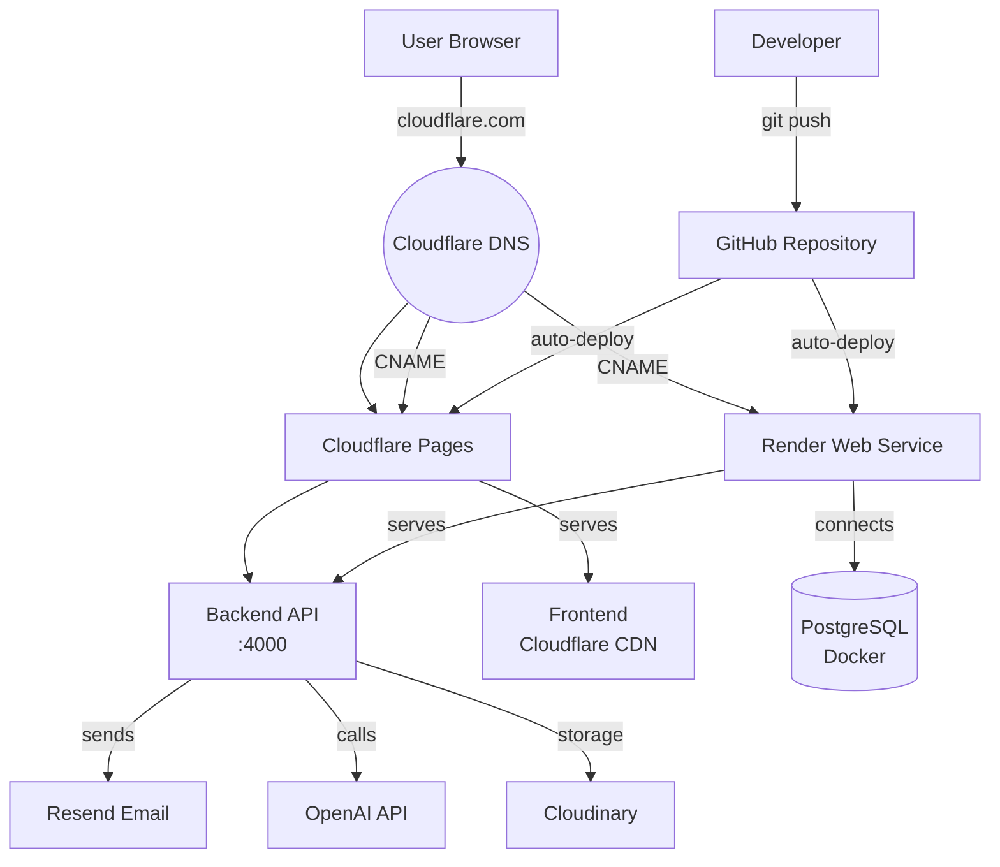
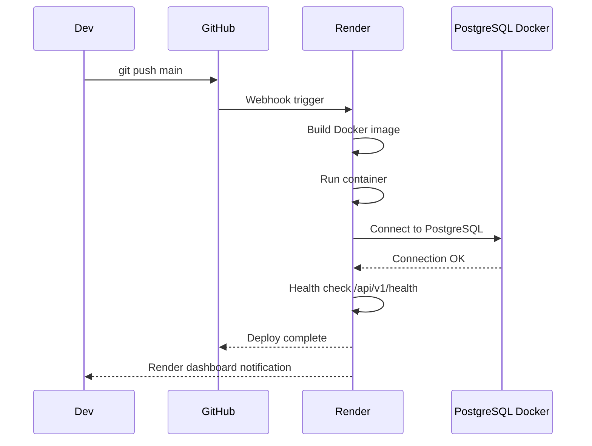
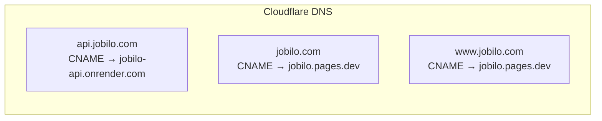

# Production Deployment Guide

> Complete step-by-step deployment guide for the Jobilo platform to production infrastructure.

## Deployment Architecture



## Prerequisites

| Requirement | Version | Purpose |
|-------------|---------|---------|
| Docker | 24.x | Container runtime for PostgreSQL |
| Docker Compose | 2.20+ | Multi-container orchestration |
| Node.js | 18+ | Local build tooling |
| Git | 2.40+ | Source control |
| Render Account | — | Backend hosting |
| Cloudflare Account | — | Frontend hosting + DNS |
| GitHub Account | — | Repository hosting |

## Step-by-Step Deployment

### Step 1: Clone Repository

```bash
git clone https://github.com/Mustafa1998-tech/jobilo.git
cd jobilo
```

### Step 2: Configure Environment

```bash
# Copy production env template
cp .env.production .env.production.local

# Edit with production values
# CRITICAL: Generate strong secrets
echo "JWT_ACCESS_SECRET=$(openssl rand -hex 32)" >> .env.production.local
echo "JWT_REFRESH_SECRET=$(openssl rand -hex 32)" >> .env.production.local
echo "POSTGRES_PASSWORD=$(openssl rand -hex 32)" >> .env.production.local
```

**Verification:**
```bash
grep -E "(SECRET|PASSWORD)" .env.production.local | wc -l
# Expected: 3 non-empty secrets
```

### Step 3: Start PostgreSQL

```bash
# Pull and start PostgreSQL container
docker compose -f docker-compose.production.yml up -d postgres

# Wait for healthy status
docker compose -f docker-compose.production.yml ps

# Verify connection
docker exec -it $(docker ps -q -f name=postgres) pg_isready -U jobilo -d jobilo
```

**Verification:** Container shows `(healthy)` in status output.

### Step 4: Run Prisma Migrations

```bash
cd backend
npm ci
npx prisma migrate deploy
npx prisma db seed
```

**Verification:**
```bash
npx prisma db execute --stdin <<< "SELECT COUNT(*) FROM information_schema.tables WHERE table_schema = 'public';"
# Expected: > 0
```

### Step 5: Seed Database

```bash
# Seeds run via Prisma seed configuration
npx prisma db seed

# Verify seed data
npx prisma db execute --stdin <<< "SELECT COUNT(*) FROM users;"
```

### Step 6: Build Backend Docker Image

```bash
docker build -t jobilo-api:latest ./backend
```

**Verification:**
```bash
docker images jobilo-api
# Expected: TAG=latest, CREATED=recent
```

### Step 7: Deploy Backend to Render



**Manual setup in Render dashboard:**

1. Go to [dashboard.render.com](https://dashboard.render.com)
2. Click **New +** → **Web Service**
3. Connect GitHub repository `Mustafa1998-tech/jobilo`
4. Configure:

| Setting | Value |
|---------|-------|
| Name | `jobilo-api` |
| Runtime | `Docker` |
| Branch | `main` |
| Build Context | `./backend` |
| Dockerfile Path | `./backend/Dockerfile` |
| Health Check Path | `/api/v1/health` |
| Auto-Deploy | `Yes` |

5. Add Environment Variables (see [ENVIRONMENT_VARIABLES.md](./ENVIRONMENT_VARIABLES.md))
6. Click **Create Web Service**

### Step 8: Deploy Frontend to Cloudflare Pages

**Manual setup in Cloudflare dashboard:**

1. Go to [dash.cloudflare.com](https://dash.cloudflare.com)
2. **Workers & Pages** → **Pages** → **Create application**
3. Connect GitHub repository
4. Configure:

| Setting | Value |
|---------|-------|
| Framework | `Next.js` |
| Build command | `npm run build` |
| Build output | `.next` |
| Root directory | `frontend` |
| Node version | `18` |

5. Add environment variables:

| Variable | Value |
|----------|-------|
| `NEXT_PUBLIC_API_URL` | `https://jobilo-api.onrender.com/api/v1` |

6. Click **Save and Deploy**

**Verification:**
```bash
curl -s -o /dev/null -w "%{http_code}" https://jobilo.pages.dev
# Expected: 200
```

### Step 9: Configure Custom Domains



**Backend:**
```bash
# In Render dashboard:
# Settings → Custom Domain → Add Domain
# Set CNAME: api.jobilo.com → jobilo-api.onrender.com
```

**Frontend:**
```bash
# In Cloudflare Pages:
# jobilo.pages.dev → Custom Domain → jobilo.com
# Cloudflare auto-provisions SSL certificate
```

Update environment:

```
CORS_ORIGINS=https://jobilo.com,https://www.jobilo.com
APP_URL=https://jobilo.com
API_URL=https://api.jobilo.com
```

### Step 10: Set Up Monitoring

**Sentry:**
```bash
# Set up Sentry project, copy DSN to env
SENTRY_DSN=https://<key>@o<org>.ingest.sentry.io/<project>
```

**Render Dashboard:**
- Built-in metrics: CPU, Memory, Network
- Logs streaming
- Alerts for service health

**Uptime Monitoring:**
```bash
# Using Render's built-in health check
curl -f https://api.jobilo.com/api/v1/health
# Expected: {"status":"ok","timestamp":"2026-07-07T12:00:00.000Z"}
```

## Health Check Endpoints

| Endpoint | Method | Expected Response | Purpose |
|----------|--------|-----------------|---------|
| `/api/v1/health` | GET | `{"status":"ok","timestamp":"..."}` | Basic liveness |
| `/api/v1/health/db` | GET | `{"status":"ok","db":"connected","latency_ms":2}` | Database connectivity |

## Rollback Procedures

### Backend Rollback (Render)

```bash
# Option 1: Revert to previous deploy
# Render Dashboard → Deploy → Rollback → Select version

# Option 2: Git revert + push
git revert HEAD
git push origin main

# Option 3: Manual Docker rollback
docker pull jobilo-api:previous-tag
docker tag jobilo-api:previous-tag jobilo-api:latest
```

### Frontend Rollback (Cloudflare)

```bash
# Cloudflare Pages Dashboard → Deployments
# Find last known good deployment → ... → Rollback to this
```

### Database Rollback

See [BACKUP_RESTORE.md](./BACKUP_RESTORE.md) for detailed procedures.

```bash
# Quick restore from latest backup
./scripts/restore.sh backups/jobilo_latest.sql.gz
```

## Post-Deployment Checklist

- [ ] Health check returns 200
- [ ] Database migrations applied
- [ ] Cron jobs / scheduled tasks running
- [ ] SSL certificates valid (auto-renew)
- [ ] Custom domains resolving
- [ ] Sentry errors monitoring active
- [ ] Email sending functional (Resend)
- [ ] File uploads working (Cloudinary)
- [ ] AI features responding (OpenAI)
- [ ] Rate limiting active

---

**See also:**
- [DOCKER_DATABASE.md](./DOCKER_DATABASE.md) — PostgreSQL Docker setup
- [RENDER_DEPLOYMENT.md](./RENDER_DEPLOYMENT.md) — Detailed Render guide
- [CLOUDFLARE_DEPLOYMENT.md](./CLOUDFLARE_DEPLOYMENT.md) — Detailed Cloudflare guide
- [ENVIRONMENT_VARIABLES.md](./ENVIRONMENT_VARIABLES.md) — All env vars reference
- [BACKUP_RESTORE.md](./BACKUP_RESTORE.md) — Backup and recovery
