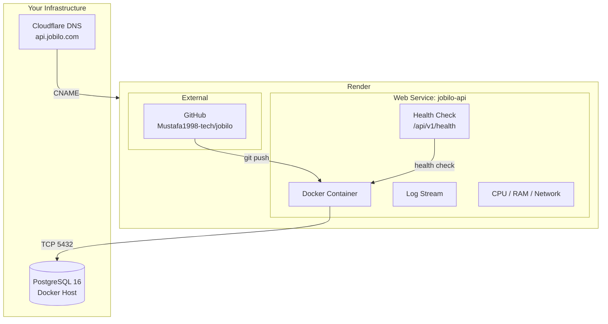
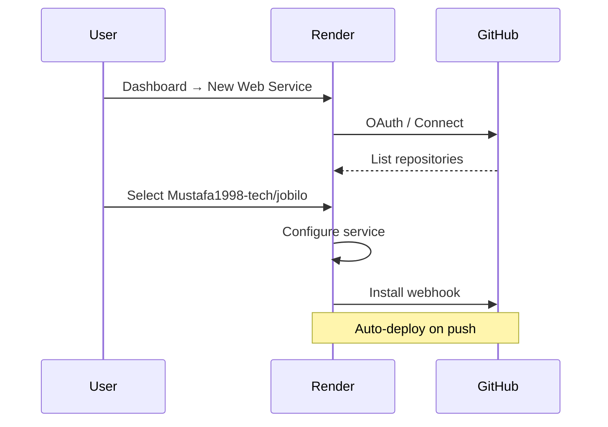
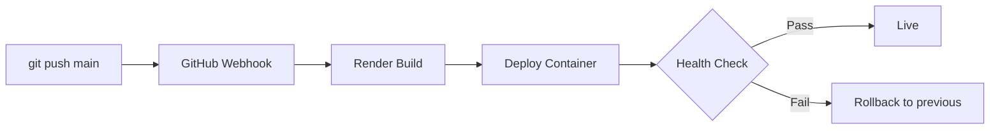
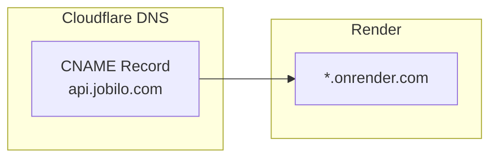
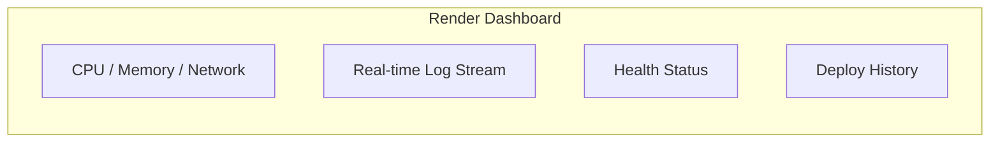

# Render Deployment Guide

> Detailed guide for deploying the Jobilo backend API to Render.

## Architecture on Render



## Prerequisites

- [Render account](https://render.com) (free tier available)
- GitHub repository: `Mustafa1998-tech/jobilo`
- PostgreSQL running externally (see [DOCKER_DATABASE.md](./DOCKER_DATABASE.md))
- Domain ready for custom setup (optional)

## Step 1: Create Render Account

1. Go to [render.com](https://render.com)
2. Sign up with GitHub (recommended) or email
3. Verify email address
4. Free tier limits:

| Resource | Free Tier Limit |
|----------|----------------|
| RAM | 512 MB |
| CPU | 0.1 vCPU (shared) |
| Bandwidth | 100 GB/month |
| Build hours | 500 hours/month |
| Sleep after inactivity | 15 minutes |
| Custom domains | Yes (with Render cert) |

## Step 2: Connect GitHub Repository



1. Dashboard → **New +** → **Web Service**
2. Click **Connect GitHub repository**
3. Authorize Render if prompted
4. Search and select `Mustafa1998-tech/jobilo`

## Step 3: Create Web Service

Configure with these exact settings:

| Setting | Value |
|---------|-------|
| **Name** | `jobilo-api` |
| **Runtime** | `Docker` |
| **Repository** | `Mustafa1998-tech/jobilo` |
| **Branch** | `main` |
| **Build Context** | `./backend` |
| **Dockerfile Path** | `./backend/Dockerfile` |
| **Health Check Path** | `/api/v1/health` |
| **Auto-Deploy** | `Yes` |

**Dockerfile context:** Render reads `backend/Dockerfile` which does a multi-stage build:

```dockerfile
# Stage 1: Build
FROM node:20-alpine AS build
WORKDIR /app
COPY package.json package-lock.json ./
RUN npm ci
COPY prisma ./prisma
RUN npx prisma generate
COPY tsconfig.json nest-cli.json ./
COPY src ./src
RUN npm run build

# Stage 2: Production
FROM node:20-alpine AS production
WORKDIR /app
RUN apk add --no-exec curl
COPY package.json package-lock.json ./
RUN npm ci --omit=dev
COPY prisma ./prisma
RUN npx prisma generate
COPY --from=build /app/dist ./dist
EXPOSE 4000
USER node
HEALTHCHECK CMD curl -f http://localhost:4000/api/v1/health || exit 1
CMD ["node", "dist/main"]
```

## Step 4: Set Environment Variables

In Render Dashboard → **Environment** tab, add these variables:

```bash
# Database (required)
DATABASE_URL=postgresql://jobilo:<password>@<your-host>:5432/jobilo
POSTGRES_DB=jobilo
POSTGRES_USER=jobilo
POSTGRES_PASSWORD=<your-password>

# JWT (required - generate unique secrets)
JWT_ACCESS_SECRET=<openssl rand -hex 32>
JWT_REFRESH_SECRET=<openssl rand -hex 32>
JWT_ACCESS_EXPIRY=15m
JWT_REFRESH_EXPIRY=7d

# Server (required)
NODE_ENV=production
PORT=4000
CORS_ORIGINS=https://jobilo.com,https://www.jobilo.com
APP_URL=https://jobilo.com
API_URL=https://jobilo-api.onrender.com

# Rate Limiting
RATE_LIMIT_TTL=60
RATE_LIMIT_MAX=100

# OpenAI
OPENAI_API_KEY=sk-proj-...
OPENAI_MODEL=gpt-4o-mini
OPENAI_MAX_TOKENS=2000

# Cloudinary
CLOUDINARY_CLOUD_NAME=your-cloud
CLOUDINARY_API_KEY=1234567890
CLOUDINARY_API_SECRET=your-secret
CLOUDINARY_FOLDER=jobilo

# Email (Resend)
RESEND_API_KEY=re_abc123...
RESEND_FROM=noreply@jobilo.com

# Monitoring
SENTRY_DSN=https://key@o123.ingest.sentry.io/project
```

**Security:** Use Render's **Secret Files** for the `.env` and mark sensitive vars as **Secret**.

## Step 5: Health Check Configuration

```yaml
# In Dockerfile
HEALTHCHECK --interval=30s --timeout=10s --start-period=40s --retries=3 \
  CMD curl -f http://localhost:4000/api/v1/health || exit 1
```

Render will:
- Poll `/api/v1/health` every 30s
- Mark service as **Unhealthy** after 3 failures
- Restart the container automatically

## Step 6: Auto-Deploy Configuration

Auto-deploy is enabled by default. Workflow:



**Disable auto-deploy (if needed):**
- Dashboard → **Settings** → **Auto-Deploy** → **No**

## Step 7: Custom Domain Setup



1. **Render Dashboard** → **Settings** → **Custom Domain**
2. Add `api.jobilo.com`
3. Render generates a verification value
4. **Cloudflare DNS** → Add CNAME:

| Type | Name | Target | Proxy |
|------|------|--------|-------|
| CNAME | `api` | `jobilo-api.onrender.com` | DNS only (grey cloud) |

5. Wait for SSL provisioning (up to 5 minutes)
6. Update environment:

```
CORS_ORIGINS=https://jobilo.com,https://www.jobilo.com,https://api.jobilo.com
API_URL=https://api.jobilo.com
```

## Free Tier Limitations

| Limitation | Impact | Mitigation |
|------------|--------|------------|
| Spins down after 15 min idle | Cold start delay (5-10s) | Use Render's cron-job keepalive or UptimeRobot ping every 10 min |
| 512 MB RAM | May cause OOM under load | Optimize Node memory, add swap |
| 0.1 vCPU | Slower responses | Pay-as-you-go upgrade ($7/mo for 1 CPU + 2GB RAM) |
| 500 build hours/mo | Limited deploys | Use Docker cache, reduce build frequency |
| 100 GB bandwidth | Enough for small-mid app | Monitor usage in dashboard |

## Scaling Options (Paid)

| Plan | Price | RAM | CPU | Bandwidth |
|------|-------|-----|-----|-----------|
| Free | $0 | 512 MB | 0.1 vCPU | 100 GB |
| Starter | $7/mo | 2 GB | 0.5 vCPU | 500 GB |
| Professional | $25/mo | 8 GB | 2 vCPU | 1 TB |
| Advanced | $100/mo | 32 GB | 8 vCPU | 5 TB |

**Auto-scaling:** Not available natively. Use multiple services with a load balancer.

## Monitoring and Logs

### Built-in Monitoring

Render Dashboard provides:



### Log Access

```bash
# Via Render Dashboard
Web Service → jobilo-api → Logs → View logs

# Logs show:
# - Build output (Docker layers)
# - Runtime stdout/stderr
# - Health check results
# - Crash reports
```

### Metrics

- **CPU Usage** — Should be <70% sustained
- **Memory Usage** — Stay under 80% (monitor for leaks)
- **Network I/O** — Bandwidth tracking

## Cost Estimation

| Component | Free Tier | Paid (Starter) |
|-----------|-----------|----------------|
| Web Service | $0/mo | $7/mo |
| PostgreSQL | Self-hosted | Self-hosted |
| Domain | Free (Cloudflare) | Free (Cloudflare) |
| SSL | Free (Render) | Free (Render) |
| Bandwidth | Free (100 GB) | Free (500 GB) |

**Total: $0/month** (free tier) or **$7/month** (starter).

---

**See also:**
- [PRODUCTION_DEPLOYMENT.md](./PRODUCTION_DEPLOYMENT.md) — Full deployment workflow
- [ENVIRONMENT_VARIABLES.md](./ENVIRONMENT_VARIABLES.md) — All env vars reference
- [DOCKER_DATABASE.md](./DOCKER_DATABASE.md) — PostgreSQL setup
- [CLOUDFLARE_DEPLOYMENT.md](./CLOUDFLARE_DEPLOYMENT.md) — Frontend deployment
