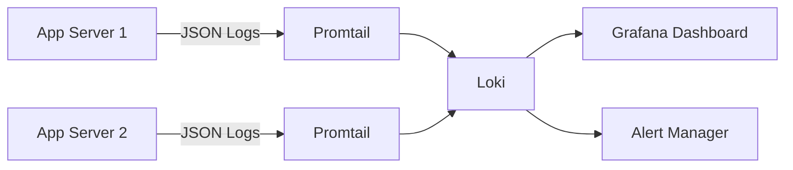

# إعدادات التسجيل | Logging Configuration

> **آخر تحديث:** يوليو 2026  
> **الهدف:** توثيق نظام التسجيل والمراقبة في Jobilo

---

## 1. مستويات التسجيل | Log Levels

| المستوى | القيمة | الاستخدام | لون الترميز |
|---------|--------|-----------|-------------|
| **ERROR** | 0 | أخطاء تتطلب تدخلًا فوريًا | 🔴 أحمر |
| **WARN** | 1 | تحذيرات قد تؤدي إلى مشاكل | 🟡 أصفر |
| **INFO** | 2 | معلومات عامة عن سير العمل | 🔵 أزرق |
| **DEBUG** | 3 | تفاصيل تصحيح الأخطاء | 🟢 أخضر |
| **VERBOSE** | 4 | تفاصيل كاملة جدًا (للتطوير فقط) | ⚪ رمادي |

**الإعدادات حسب البيئة:**

| البيئة | المستوى الأدنى | السبب |
|--------|----------------|-------|
| **Local** | DEBUG | رؤية كل التفاصيل أثناء التطوير |
| **Dev** | DEBUG | تتبع المشكلات في بيئة مشتركة |
| **Testing** | INFO | تقليل الضوضاء أثناء الاختبارات |
| **Staging** | INFO | توازن بين التفاصيل والأداء |
| **Production** | WARN | تقليل حجم السجلات وتحسين الأداء |

```typescript
// مثال: تسجيل حسب المستوى
logger.error('فشل الاتصال بقاعدة البيانات', { error: err.message });
logger.warn('اقتراب حد معدل الطلبات', { current: 45, max: 50 });
logger.info('مستخدم جديد سجل الدخول', { userId: 'uuid' });
logger.debug('تفاصيل الطلب', { method, path, params });
```

---

## 2. تنسيق السجلات | Log Format (JSON Structured)

يستخدم Jobilo **سجلات JSON منظمة** لسهولة التحليل الآلي:

```json
{
  "timestamp": "2026-07-06T10:30:00.123Z",
  "level": "info",
  "context": "AuthService",
  "message": "User login successful",
  "metadata": {
    "userId": "550e8400-e29b-41d4-a716-446655440000",
    "ip": "192.168.1.100",
    "userAgent": "Mozilla/5.0...",
    "requestId": "req-abc-123"
  },
  "environment": "production",
  "service": "jobilo-api",
  "version": "1.2.0"
}
```

**الحقول الإلزامية في كل سجل:**

| الحقل | الوصف | مثال |
|-------|-------|------|
| `timestamp` | الوقت بصيغة ISO 8601 | `2026-07-06T10:30:00.123Z` |
| `level` | مستوى الخطورة | `info` |
| `message` | رسالة السجل | `User login successful` |
| `context` | السياق (الخدمة/الوحدة) | `AuthService` |
| `requestId` | معرف فريد للطلب | `req-abc-123` |

---

## 3. وجهات السجلات | Log Destinations

| الوجهة | Local | Dev | Testing | Staging | Production |
|--------|-------|-----|---------|---------|------------|
| **Console (stdout)** | ✅ | ✅ | ✅ | ✅ | ✅ |
| **ملف (jobilo.log)** | ✅ | ❌ | ❌ | ❌ | ❌ |
| **Sentry** | ❌ | ✅ | ❌ | ✅ | ✅ |
| **Loki + Grafana** | ❌ | ✅ | ❌ | ✅ | ✅ |
| **CloudWatch** | ❌ | ❌ | ❌ | ❌ | ✅ (احتياطي) |

```typescript
// تكوين وجهات السجلات
const loggerConfig = {
  pinoHttp: {
    transport: isProduction
      ? undefined  // JSON خام لـ Loki
      : { target: 'pino-pretty' },  // تنسيق مقروء للبشر
    level: isProduction ? 'warn' : 'debug',
  },
};
```

---

## 4. سياسة الاحتفاظ بالسجلات | Log Retention Policy

| البيئة | المدة | الإجراء |
|--------|-------|---------|
| **Local** | غير محدود (ملفات محلية) | يحذفها المطور يدويًا |
| **Dev** | 7 أيام | حذف تلقائي |
| **Staging** | 14 يومًا | حذف تلقائي + أرشفة |
| **Production** | 30 يومًا (نشط) + 90 يومًا (أرشيف) | تصدير إلى S3 قبل الحذف |

```bash
# تنظيف السجلات المحلية
rm backend/logs/*.log

# ضغط وأرشفة سجلات الإنتاج
tar -czf logs_20260701.tar.gz /var/log/jobilo/
aws s3 cp logs_20260701.tar.gz s3://jobilo-logs-archive/
```

---

## 5. إخفاء البيانات الحساسة | Sensitive Data Masking

**يتم إخفاء البيانات التالية تلقائيًا في السجلات:**

| النمط | المثال | الإخفاء |
|-------|--------|---------|
| كلمة المرور | `password=secret123` | `password=***` |
| JWT Token | `Bearer eyJhbGci...` | `Bearer ***` |
| رقم البطاقة | `4111-1111-1111-1111` | `****-****-****-1111` |
| البريد الإلكتروني | `user@example.com` | `u***@example.com` |
| IP Address | `192.168.1.100` | `192.168.*.*` |

```typescript
// مثال على إخفاء البيانات
function maskSensitiveData(data: Record<string, any>): Record<string, any> {
  const sensitiveKeys = ['password', 'token', 'secret', 'authorization'];
  for (const key of sensitiveKeys) {
    if (data[key]) {
      data[key] = '***';
    }
  }
  return data;
}
```

---

## 6. إعداد التسجيل المركزي | Centralized Logging Setup



**المكونات:**
- **Promtail** — جامع السجلات من كل خادم
- **Loki** — مخزن السجلات المركزي
- **Grafana** — تصور وتحليل السجلات
- **Alert Manager** — إرسال تنبيهات عند اكتشاف أنماط خطأ

**الوصول:**
- `https://grafana.jobilo.com/d/logs` — لوحة سجلات الإنتاج
- `https://grafana.jobilo.com/d/logs-staging` — لوحة سجلات Staging

---

## 7. أدوات تحليل السجلات | Log Analysis Tools

| الأداة | الغرض | مثال استعلام |
|--------|-------|-------------|
| **Grafana Explore** | بحث وتصفح السجلات | `{service="jobilo-api"} \|= "error"` |
| **LogQL** | لغة استعلام Loki | `rate({service="jobilo-api"} \|= "ERROR" [5m])` |
| **Sentry** | تتبع الأخطاء والتجميع | لوحة Sentry Dashboard |
| **jq** | تحليل JSON في الطرفية | `cat log.json \| jq '.level'` |

> راجع [TROUBLESHOOTING.md](./TROUBLESHOOTING.md) لاستخدام السجلات في حل المشكلات.

---

## 8. مثال للتكوين | Configuration Example

```typescript
import { WinstonModule } from 'nest-winston';
import * as winston from 'winston';

const logger = WinstonModule.createLogger({
  transports: [
    new winston.transports.Console({
      format: winston.format.combine(
        winston.format.timestamp(),
        winston.format.json(),
      ),
    }),
    ...(process.env.NODE_ENV === 'production'
      ? [new winston.transports.File({ filename: '/var/log/jobilo/error.log', level: 'error' })]
      : []),
  ],
});
```

---

> **مواضيع ذات صلة:**  
> [PRODUCTION.md](./PRODUCTION.md) | [SECURITY_CONFIGURATION.md](./SECURITY_CONFIGURATION.md) | [TROUBLESHOOTING.md](./TROUBLESHOOTING.md) | [ENVIRONMENTS.md](./ENVIRONMENTS.md)
