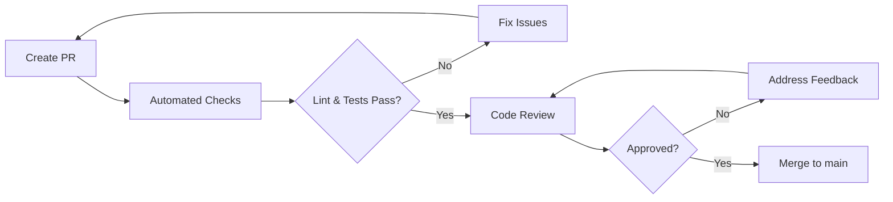

# قائمة فحص الإصدار | Release Checklist

> **آخر تحديث:** يوليو 2026  
> **الهدف:** ضمان جودة الإصدارات قبل النشر إلى الإنتاج

---

## 1. قائمة الفحص الأساسية | Basic Checklist

| # | البند | المسؤول | ✅/❌ | ملاحظات |
|---|-------|---------|------|---------|
| 1 | **مراجعة الكود مكتملة** | Tech Lead | ☐ | راجع [PR](#code-review) |
| 2 | **جميع الاختبارات ناجحة** | CI/CD | ☐ | وحدة + تكامل + E2E |
| 3 | **فحص أمني نظيف** | DevOps | ☐ | GitLeaks + SonarCloud |
| 4 | **التوثيق محدث** | Developer | ☐ | APIs, env vars, README |
| 5 | **ترحيلات DB جاهزة** | Developer | ☐ | اختبار في Staging |
| 6 | **متغيرات البيئة مضافة** | DevOps | ☐ | تحقق من Vault |
| 7 | **نسخة احتياطية مأخوذة** | DevOps | ☐ | قبل نشر الإنتاج |
| 8 | **خطة التراجع جاهزة** | Developer | ☐ | راجع [ROLLBACK_GUIDE.md](./ROLLBACK_GUIDE.md) |
| 9 | **ملاحظات الإصدار مكتوبة** | Product Owner | ☐ | للمستخدمين والفريق |
| 10 | **إشعار الجهات المعنية** | Product Owner | ☐ | فريق, عملاء, مستخدمين |

---

## 2. مراجعة الكود | Code Review



**معايير المراجعة:**
- ✅ اتباع نمط الكود (ESLint, Prettier)
- ✅ عدم وجود ثغرات أمنية
- ✅ تغطية اختبارية مناسبة
- ✅ لا توجد أسرار في الكود
- ✅ التوثيق محدث (JSDoc, README)
- ✅ أداء مقبول (لا استعلامات N+1)

---

## 3. قائمة الاختبارات | Test Checklist

| نوع الاختبار | الحد الأدنى | ✅/❌ |
|-------------|-------------|------|
| ✅ Unit Tests | تغطية ≥ 80% | ☐ |
| ✅ Integration Tests | جميع APIs رئيسية | ☐ |
| ✅ E2E Tests | سيناريوهات حرجة | ☐ |
| ✅ Snapshot Tests | مكونات UI رئيسية | ☐ |
| ✅ Performance Tests | وقت استجابة < 200ms | ☐ |
| ✅ Security Scan | لا ثغرات عالية/حرجة | ☐ |

```bash
# تشغيل جميع الاختبارات
npm run test:ci      # وحدة + تكامل
npm run test:e2e     # E2E
npm run test:coverage # تقرير التغطية
```

> راجع [TESTING.md](./TESTING.md) لتفاصيل الاختبارات.

---

## 4. الفحص الأمني | Security Scan

| الأداة | الفحص | النتيجة |
|--------|-------|---------|
| **GitLeaks** | تسريب الأسرار في الكود | ☐ نظيف |
| **npm audit** | ثغرات في الاعتماديات | ☐ 0 حرجة |
| **SonarCloud** | جودة الكود والثغرات | ☐ Quality Gate ناجح |
| **ESLint (security)** | أنماط غير آمنة | ☐ لا تحذيرات أمنية |
| **Dependency Check** | تراخيص وثغرات | ☐ نظيف |

> راجع [SECURITY_CONFIGURATION.md](./SECURITY_CONFIGURATION.md).

---

## 5. التوثيق | Documentation Updated

| المستند | التفاصيل | ✅/❌ |
|---------|---------|------|
| **CHANGELOG.md** | أضف الإصدار الجديد مع الميزات والإصلاحات | ☐ |
| **ENV_VARIABLES.md** | أي متغيرات بيئة جديدة | ☐ |
| **API Documentation** | (Swagger تحديث تلقائي) | ☐ تلقائي |
| **README.md** | أي تغييرات في الإعداد | ☐ |
| **Release Notes** | ملخص للمستخدمين | ☐ |

---

## 6. ترحيلات قاعدة البيانات | Database Migrations

```bash
# قائمة التحقق:
# ✅ تم اختبار الترحيل في Local
# ✅ تم اختبار الترحيل في Dev
# ✅ تم اختبار الترحيل في Staging
# ✅ الترحيل قابل للتراجع (Down migration)
# ✅ نسخة احتياطية من DB قبل الترحيل في الإنتاج
```

```bash
# إنشاء ترحيل
npx prisma migrate dev --name my_migration

# اختبار التطبيق
npx prisma migrate deploy  # يجب أن ينجح بدون أخطاء

# اختبار التراجع
npx prisma migrate down    # (إذا كان مدعومًا)
```

> راجع [DATABASE_CONFIGURATION.md](./DATABASE_CONFIGURATION.md).

---

## 7. متغيرات البيئة | Environment Variables

```bash
# تحقق من إضافة أي متغيرات بيئة جديدة
# في جميع البيئات: local, dev, staging, production

# مقارنة ملفات .env
diff backend/.env.example backend/.env

# تحقق من Vault (للإنتاج)
vault kv list prod/jobilo/
```

> راجع [ENV_VARIABLES.md](./ENV_VARIABLES.md).

---

## 8. النسخ الاحتياطي | Backup Taken

```bash
# قبل نشر الإنتاج
pg_dump -Fc -h db-primary -U app -d jobilo > /backups/pre-release_$(date +%Y%m%d_%H%M%S).dump

# تحقق من حجم النسخة
ls -lh /backups/pre-release_*.dump

# تحقق من Integrity (اختياري)
pg_restore -l /backups/pre-release_*.dump | head -5
```

> راجع [DATABASE_CONFIGURATION.md](./DATABASE_CONFIGURATION.md).

---

## 9. خطة التراجع | Rollback Plan

```bash
# ✅ تحديد إصدار Docker السابق
docker images jobilo-api

# ✅ تحديد Tag Git السابق
git tag -l "v*" | tail -5

# ✅ كتابة خطة التراجع (في RELEASE_CHECKLIST أو PR)
# راجع: ROLLBACK_GUIDE.md
```

> راجع [ROLLBACK_GUIDE.md](./ROLLBACK_GUIDE.md).

---

## 10. إشعار الجهات المعنية | Stakeholder Notification

| الجهة | وقت الإشعار | الوسيلة | الرسالة |
|-------|-------------|---------|---------|
| **الفريق الداخلي** | قبل 24 ساعة | Slack `#releases` | إصدار جديد، وقت الصيانة |
| **العملاء (B2B)** | قبل 48 ساعة | البريد الإلكتروني | تحديثات مهمة، وقت التوقف |
| **المستخدمون** | وقت الإصدار | إشعار في التطبيق | تحسينات وإصلاحات |
| **DevOps** | قبل ساعة | Telegram/PagerDuty | استعداد للنشر |

---

> **مواضيع ذات صلة:**  
> [ROLLBACK_GUIDE.md](./ROLLBACK_GUIDE.md) | [TESTING.md](./TESTING.md) | [STAGING.md](./STAGING.md) | [PRODUCTION.md](./PRODUCTION.md) | [ENVIRONMENTS.md](./ENVIRONMENTS.md)
