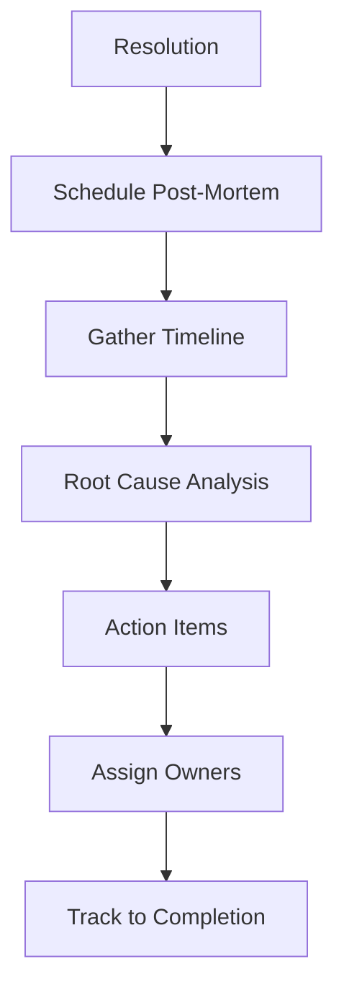

# دليل التراجع عن الإصدارات | Rollback Guide

> **آخر تحديث:** يوليو 2026  
> **الهدف:** توثيق إجراءات التراجع عن الإصدارات في جميع البيئات

---

## 1. دوافع التراجع | Rollback Triggers

| المستوى | الحالة | مثال | الإجراء |
|---------|--------|------|---------|
| **P0** | انقطاع تام للخدمة | 500 لجميع الطلبات | تراجع فوري |
| **P1** | ميزة حرجة معطلة | لا يمكن تسجيل الدخول | تراجع خلال 15 دقيقة |
| **P2** | مشكلة أداء حادة | وقت الاستجابة > 5 ثوانٍ | تراجع خلال ساعة |
| **P3** | خطأ في البيانات | فقدان بيانات المستخدمين | تراجع + استعادة DB |
| **P4** | مشكلة أمنية | ثغرة أمنية مكتشفة | تراجع فوري + إخطار |

**قاعدة القرار:**  
> إذا استغرق الإصلاح > 30 دقيقة، قم بالتراجع فورًا.

---

## 2. التراجع عن قاعدة البيانات | Database Rollback (Prisma Migrations)

```bash
# 1. تحديد آخر ترحيل ناجح
npx prisma migrate status

# 2. التراجع عن ترحيل واحد
npx prisma migrate down 1

# 3. التراجع عن ترحيلات متعددة
npx prisma migrate down 3

# 4. استعادة قاعدة البيانات من نسخة احتياطية (إذا فشل التراجع)
pg_restore -h db-host -U app -d jobilo --clean /backups/pre-release_20260706.dump
```

**ملاحظات مهمة:**
- `prisma migrate down` غير مدعوم افتراضيًا في Prisma — قد تحتاج إلى استعادة من نسخة احتياطية
- **دائمًا** خذ نسخة احتياطية قبل النشر
- اختبر التراجع في Staging أولاً

> راجع [DATABASE_CONFIGURATION.md](./DATABASE_CONFIGURATION.md).

---

## 3. التراجع عن التطبيق | Application Rollback

### عبر Docker Images:

```bash
# 1. عرض الصور المتاحة
docker images jobilo-api --format "table {{.Tag}}\t{{.CreatedAt}}"

# 2. إيقاف الحاوية الحالية
docker stop jobilo-api-1

# 3. تشغيل الإصدار السابق
docker run -d \
  --name jobilo-api-1 \
  -p 4000:4000 \
  --env-file .env.production \
  jobilo-api:v1.1.0   # الإصدار السابق المستقر

# 4. التحقق من الصحة
curl -f http://localhost:4000/api/health
```

### عبر Git Tags:

```bash
# 1. عرض tags
git tag -l "v*" --sort=-version:refname

# 2. التحقق من الفرق
git diff v1.2.0 v1.1.0 --stat

# 3. التراجع إلى tag سابق (على خادم النشر)
git checkout tags/v1.1.0
npm ci
npm run build
systemctl restart jobilo-api
```

### عبر CI/CD (GitHub Actions):

```yaml
# استخدم workflow يدوي للتراجع
name: Rollback
on:
  workflow_dispatch:
    inputs:
      version:
        description: 'Version to rollback to (e.g., v1.1.0)'
        required: true
jobs:
  rollback:
    steps:
      - uses: actions/checkout@v4
        with:
          ref: ${{ github.event.inputs.version }}
      - run: |
          echo "Rolling back to ${{ github.event.inputs.version }}"
          # أوامر النشر
```

> راجع [STAGING.md](./STAGING.md) و [PRODUCTION.md](./PRODUCTION.md).

---

## 4. التراجع عن الواجهة الأمامية | Frontend Rollback

```bash
# إذا كان Next.js يعمل مع SSR:

# 1. تحديد الإصدار السابق من Docker
docker images jobilo-frontend

# 2. التراجع
docker stop jobilo-frontend-1
docker run -d \
  --name jobilo-frontend-1 \
  -p 3005:3000 \
  jobilo-frontend:v1.1.0
```

**للنشر الثابت (Static Export):**

```bash
# 1. استعادة الملفات الثابتة من CDN
# Cloudflare / Cloudinary قد تحتفظ بالنسخة السابقة

# 2. إعادة توجيه DNS للإصدار السابق
# (إذا كنت تستخدم Blue-Green Deployment)
```

---

## 5. خطة الاتصال | Communication Plan

| الوقت | الإجراء | الجمهور |
|-------|---------|---------|
| **فورًا** | إخطار فريق DevOps و Tech Lead | Slack `#incidents` |
| **خلال 5 دقائق** | إخطار Product Owner | هاتف / Slack DM |
| **خلال 15 دقيقة** | تحديث حالة الخدمة | `status.jobilo.com` |
| **بعد الحل** | إخطار المستخدمين | بريد إلكتروني / إشعار في التطبيق |

**قوالب الإشعارات:**

```
🚨 [INCIDENT] انقطاع الخدمة - Jobilo
التاريخ: 2026-07-06
التأثير: ${تأثير}
الحالة: جاري التحقيق / تم الحل
الوقت المقدر للحل: ${وقت}
```

---

## 6. التحقق بعد التراجع | Post-Rollback Verification

```bash
# 1. التحقق من صحة API
curl -f https://api.jobilo.com/api/health
# متوقع: { "status": "ok", "version": "v1.1.0" }

# 2. التحقق من قاعدة البيانات
psql -h db-host -U app -d jobilo -c "SELECT count(*) FROM users;"

# 3. اختبار تسجيل الدخول
curl -X POST https://api.jobilo.com/api/v1/auth/login \
  -H "Content-Type: application/json" \
  -d '{"email":"test@jobilo.com","password":"test"}' \
  -w "\nHTTP Status: %{http_code}"

# 4. التحقق من سجلات Sentry
# تأكد من عدم وجود أخطاء جديدة

# 5. التحقق من أداء الصفحة الرئيسية
curl -o /dev/null -s -w "Time: %{time_total}s\n" https://jobilo.com
```

**قائمة التحقق:**

| البند | ✅/❌ |
|-------|------|
| API يعمل ويعيد الإصدار الصحيح | ☐ |
| قاعدة البيانات سليمة (لا فقدان بيانات) | ☐ |
| يمكن للمستخدمين تسجيل الدخول | ☐ |
| الوظائف الأساسية تعمل (إنشاء مشروع، إرسال رسالة) | ☐ |
| لا توجد أخطاء جديدة في Sentry | ☐ |
| أداء مقبول (استجابة < 500ms) | ☐ |

---

## 7. عملية ما بعد الحادث | Post-Mortem Process



**يجب أن تحتوي المراجعة (Post-Mortem) على:**

| القسم | المحتوى |
|-------|---------|
| **الملخص** | وصف مختصر للحادث |
| **الجدول الزمني** | متى بدأ، اكتشف، استجيب، حُلّ |
| **السبب الجذري** | ما هو الخطأ الأساسي |
| **التأثير** | عدد المستخدمين المتأثرين، وقت التوقف |
| **الإجراءات التصحيحية** | قائمة بالمهام لمنع التكرار |
| **الدروس المستفادة** | تحسينات للعملية |

**قالب Post-Mortem:**

```markdown
# Post-Mortem: [عنوان الحادث]

## الملخص
- التاريخ: 2026-07-06
- المدة: 45 دقيقة
- التأثير: 500 مستخدم

## الجدول الزمني
- 10:00 - بداية الانقطاع
- 10:05 - اكتشاف المشكلة
- 10:15 - بدء التحقيق
- 10:30 - قرار التراجع
- 10:45 - اكتمال التراجع

## السبب الجذري
[وصف السبب]

## الإجراءات
- [ ] #1 إضافة اختبارات E2E لهذه الحالة
- [ ] #2 تحسين مراقبة خطأ معين
```

---

> **مواضيع ذات صلة:**  
> [RELEASE_CHECKLIST.md](./RELEASE_CHECKLIST.md) | [PRODUCTION.md](./PRODUCTION.md) | [DATABASE_CONFIGURATION.md](./DATABASE_CONFIGURATION.md) | [TROUBLESHOOTING.md](./TROUBLESHOOTING.md)
