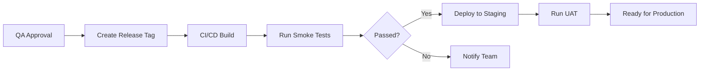

# بيئة ما قبل الإنتاج | Staging Environment

> **آخر تحديث:** يوليو 2026  
> **URL:** `https://staging.jobilo.com`  
> **الهدف:** التحقق النهائي قبل الإنتاج وعروض العملاء

---

## 1. الغرض | Purpose

بيئة Staging هي **المرحلة الأخيرة قبل الإنتاج**. تُستخدم لـ:
- **التحقق النهائي** (Pre-Production Validation)
- **عروض توضيحية للعملاء** (Client Demos)
- **اختبار قبول المستخدم** (UAT — User Acceptance Testing)
- **اختبار الأداء** قبل الإطلاق
- **التدريب** لأعضاء الفريق الجدد

---

## 2. مطابقة الإنتاج | Production Mirroring

تسعى بيئة Staging إلى أن تكون **مطابقة للإنتاج قدر الإمكان**:

| الخاصية | Staging | Production |
|----------|---------|------------|
| إصدار الكود | نفس إصدار الإنتاج | أحدث إصدار مستقر |
| بنية الخادم | مشابهة (أصغر حجمًا) | إنتاجية كاملة |
| قاعدة البيانات | PostgreSQL 16 | PostgreSQL 16 |
| CDN | ✅ Cloudinary | ✅ Cloudinary |
| SSL/TLS | ✅ Let's Encrypt | ✅ Enterprise |
| Load Balancer | ❌ (خادم واحد) | ✅ (متعدد) |
| النسخ الاحتياطي | ✅ يومي | ✅ كل 6 ساعات |

---

## 3. إعدادات Staging الخاصة | Staging-Specific Configuration

```env
NODE_ENV=staging
PORT=4000
CORS_ORIGINS=https://staging.jobilo.com
APP_URL=https://staging.jobilo.com
API_URL=https://staging-api.jobilo.com
RATE_LIMIT_TTL=60
RATE_LIMIT_MAX=150

# توجيه البريد الإلكتروني إلى صندوق اختبار (لا يرسل حقيقيًا)
RESEND_API_KEY=re_test_key_xxx
RESEND_FROM=staging@jobilo.com
```

**اختلافات رئيسية عن الإنتاج:**
- `NODE_ENV=staging` — تفعيل بعض ميزات التصحيح
- `RATE_LIMIT_MAX` — 150 (أقل من Dev، أعلى من الإنتاج)
- البريد الإلكتروني يُوجّه إلى **صندوق اختبار** (لا يصل إلى المستخدمين الحقيقيين)
- استخدام مفاتيح API اختبارية (Test Mode)

---

## 4. عملية النشر إلى Staging | Deployment Process



**الخطوات:**
1. **موافقة فريق QA** على الاختبارات
2. **إنشاء Tag إصدار** (مثل `v1.2.0-rc.1`)
3. **CI/CD** يبني الصور وينشرها
4. **اختبارات التدخين** (Smoke Tests) تُشغل تلقائيًا
5. **فريق UAT** يتحقق يدويًا
6. **جاهز للإنتاج** بعد الموافقة

---

## 5. خصوصية البيانات | Data Privacy

**في بيئة Staging:**
- 🚫 **لا توجد بيانات حقيقية للمستخدمين**
- ✅ يتم استخدام **بيانات مجهولة المصدر** (Anonymized Data)
- ✅ جميع عناوين البريد الإلكتروني وهمية (مثل `user-001@test.jobilo.com`)
- ✅ يتم تشويه (Obfuscate) أي بيانات قد تبدو حقيقية
- ❌ لا يمكن تسجيل الدخول بحسابات إنتاج حقيقية

**مصادر البيانات:**
- استيراد من إنتاج: مجهولة المصدر ← تُستخدم لاختبار الأداء
- بيانات وهمية: من `prisma/seed.ts` المعدّل
- بيانات UAT: ينشئها فريق الاختبار يدويًا

---

## 6. اختبارات التدخين | Smoke Tests

تُشغل **تلقائيًا** بعد كل نشر إلى Staging:

```bash
# 1. التحقق من صحة الخدمة
curl -f https://staging-api.jobilo.com/api/health

# 2. تسجيل الدخول بمستخدم اختبار
curl -X POST https://staging-api.jobilo.com/api/v1/auth/login \
  -H "Content-Type: application/json" \
  -d '{"email":"test@jobilo.com","password":"Test@123"}'

# 3. إنشاء مشروع اختبار
# 4. إرسال رسالة
# 5. رفع ملف
```

**قائمة الفحص (Smoke Test Checklist):**

| الاختبار | الوصف |
|----------|--------|
| Health Check | هل API يعمل؟ |
| Auth | تسجيل الدخول والتسجيل |
| CRUD Projects | إنشاء وقراءة وتحديث المشاريع |
| Search | البحث عن المشاريع والمستخدمين |
| File Upload | رفع الصور والملفات |
| Email | إرسال البريد (يُحتجز في الصندوق الاختباري) |

---

## 7. عملية UAT | UAT Process

| الدور | المسؤولية | التوقيت |
|-------|-----------|---------|
| **Product Owner** | الموافقة على الميزات الجديدة | بعد كل إصدار |
| **QA Team** | التحقق من الجودة | مستمر |
| **Client** | اختبار قبول المستخدم | قبل الإطلاق |
| **DevOps** | مراقبة الأداء | أثناء الاختبار |

---

> **مواضيع ذات صلة:**  
> [TESTING.md](./TESTING.md) | [PRODUCTION.md](./PRODUCTION.md) | [RELEASE_CHECKLIST.md](./RELEASE_CHECKLIST.md) | [ROLLBACK_GUIDE.md](./ROLLBACK_GUIDE.md)
