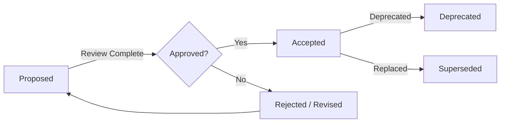

# Architecture Decision Record Template

> Use this template to document all architectural decisions. Save files in `docs/governance/adr/adr-NNN-title.md` and update [TECHNICAL_DECISIONS.md](./TECHNICAL_DECISIONS.md) and [DECISION_LOG.md](./DECISION_LOG.md) after approval.

---

```markdown
# ADR-{NNN}: {Title}

**Status:** {Proposed | Accepted | Deprecated | Superseded}
**Date:** {YYYY-MM-DD}
**Author:** @{github-username}
**Supersedes:** ADR-{NNN} (if applicable)
**Superseded by:** ADR-{NNN} (if applicable)

---

## Context

Describe the problem that needs to be solved, the forces at play, and the
background information needed to understand the decision. Include:

- Business requirements driving this decision
- Technical constraints (language, infrastructure, budget)
- Existing systems or patterns that may be affected
- Relevant non-functional requirements (performance, security, scalability)

### Problem Statement

> {Clear, concise statement of the problem}

### Requirements

- Requirement 1
- Requirement 2
- Requirement 3

---

## Decision

State the decision clearly. Include:

- What was decided
- Who made the decision
- How it will be implemented (high-level)

> We will use {Technology/Pattern/Approach} for {Purpose}.

### Implementation Details

```typescript
// Key code examples showing the decision in practice
```

---

## Consequences

### Positive (+)

- Benefit 1
- Benefit 2
- Benefit 3

### Negative (-)

- Drawback 1
- Drawback 2

### Neutral (=)

- Observation 1
- Observation 2

---

## Alternatives Considered

| Alternative | Pros | Cons | Reason for Rejection |
|-------------|------|------|---------------------|
| Alternative A | Pro 1, Pro 2 | Con 1, Con 2 | Rejected because... |
| Alternative B | Pro 1 | Con 1, Con 2, Con 3 | Rejected because... |
| Alternative C | Pro 1, Pro 2, Pro 3 | Con 1 | Selected ✅ |

---

## References

- [ADR-{NNN}](./adr/adr-NNN-title.md) — Related decision
- [Link to RFC PR](https://github.com/jobilo/jobilo/pull/{NNN})
- [Link to external resource](https://example.com)
- [GOVERNANCE.md](../GOVERNANCE.md) — Decision-making process
```
---

## Template Usage Guide

### When to Write an ADR

Write an ADR when you make a decision that:

- Has significant architectural impact
- Is irreversible or hard to reverse
- Involves choosing between multiple alternatives
- Has cross-team impact
- Changes an existing pattern or convention

### When NOT to Write an ADR

Minor decisions that do not need an ADR:

- Choosing a variable name or file structure
- Bug fixes that don't change architecture
- Routine dependency updates (use `chore(deps)` commits)
- Configuration changes that don't affect behavior

### ADR Lifecycle



---

## Related Documents

- [TECHNICAL_DECISIONS.md](./TECHNICAL_DECISIONS.md) — ADR index
- [DECISION_LOG.md](./DECISION_LOG.md) — Full decision log
- [GOVERNANCE.md](./GOVERNANCE.md) — Decision-making process
- [ARCHITECTURE_PRINCIPLES.md](./ARCHITECTURE_PRINCIPLES.md) — Guiding principles
