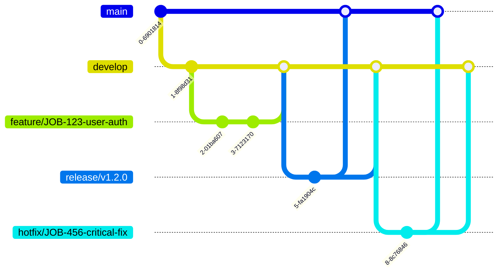
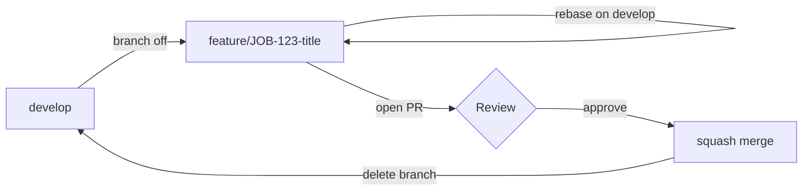
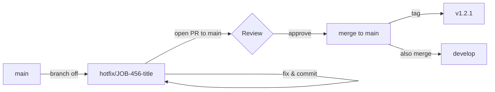

# Branching Strategy

> Last Updated: 2026-07-06

This document defines the Git branching model for Jobilo. See [DEVELOPMENT_GUIDELINES.md](./DEVELOPMENT_GUIDELINES.md) for branch naming conventions and [COMMIT_CONVENTION.md](./COMMIT_CONVENTION.md) for commit message format.

---

## 1. Git Flow Diagram



---

## 2. Branch Overview

| Branch | Source | Target | Lifetime | Purpose |
|--------|--------|--------|----------|---------|
| `main` | — | — | Permanent | Production-ready code |
| `develop` | `main` | `main` | Permanent | Integration branch |
| `feature/*` | `develop` | `develop` | Short-lived | New features |
| `fix/*` | `develop` | `develop` | Short-lived | Bug fixes |
| `hotfix/*` | `main` | `main` + `develop` | Emergency | Production bugs |
| `release/*` | `develop` | `main` + `develop` | Temporary | Release prep |
| `docs/*` | `develop` | `develop` | Short-lived | Documentation |
| `refactor/*` | `develop` | `develop` | Short-lived | Code restructuring |

---

## 3. Branch Lifecycle

### 3.1 Feature Branches



```
git checkout develop
git pull origin develop
git checkout -b feature/JOB-123-user-auth
# ... work, commit, push ...
git rebase develop   # before opening PR
gh pr create
# after approval
git checkout develop && git pull
git merge --squash feature/JOB-123-user-auth
git branch -D feature/JOB-123-user-auth
```

### 3.2 Hotfix Branches



```
git checkout main
git pull origin main
git checkout -b hotfix/JOB-456-critical-fix
# ... fix & commit ...
gh pr create --base main
# after approval & merge to main
git checkout develop
git merge main        # or cherry-pick the fix commit
```

### 3.3 Release Branches

```
git checkout develop
git pull origin develop
git checkout -b release/v1.2.0
# bump version, update changelog, final testing
git commit -m "chore(release): v1.2.0"
gh pr create --base main
# after merge to main
git tag v1.2.0
git checkout develop && git merge main
```

---

## 4. Merge Strategy

| Scenario | Strategy | Command |
|----------|----------|---------|
| Feature → Develop | **Squash merge** | `git merge --squash feature/xyz` |
| Hotfix → Main | **Squash merge** | `git merge --squash hotfix/xyz` |
| Release → Main | **Merge commit** | `git merge --no-ff release/v1.2.0` |
| Main → Develop | **Merge commit** | `git merge main` |

### Rationale

- **Squash merge** keeps `develop` history clean — 1 feature = 1 commit
- **Merge commit** on `main` preserves release boundaries
- **No fast-forward** merges on `main` (always `--no-ff`)

---

## 5. Branch Protection Rules

### `main` branch

| Rule | Setting |
|------|---------|
| Require PR | ✅ |
| Required reviewers | 2 |
| Dismiss stale reviews | ✅ |
| Require status checks | `lint`, `typecheck`, `test`, `build` |
| Require branch up-to-date | ✅ |
| Require signed commits | ✅ |
| Include administrators | ✅ |
| Linear history | ✅ |
| No force push | ✅ |

### `develop` branch

| Rule | Setting |
|------|---------|
| Require PR | ✅ |
| Required reviewers | 1 |
| Require status checks | `lint`, `typecheck`, `test` |
| Require branch up-to-date | ✅ |
| No force push | ✅ |

---

## 6. Tagging Convention

```
v<major>.<minor>.<patch>
```

Examples: `v1.0.0`, `v1.2.3`, `v2.0.0-rc.1`

Tags are created only from `main` after release merges.

---

## 7. Related Documents

- [DEVELOPMENT_GUIDELINES.md](./DEVELOPMENT_GUIDELINES.md) — Branch naming, PR workflow
- [COMMIT_CONVENTION.md](./COMMIT_CONVENTION.md) — Commit message format
- [DEFINITION_OF_DONE.md](./DEFINITION_OF_DONE.md) — Completion criteria
- [GOVERNANCE.md](./GOVERNANCE.md) — Role permissions for merge
