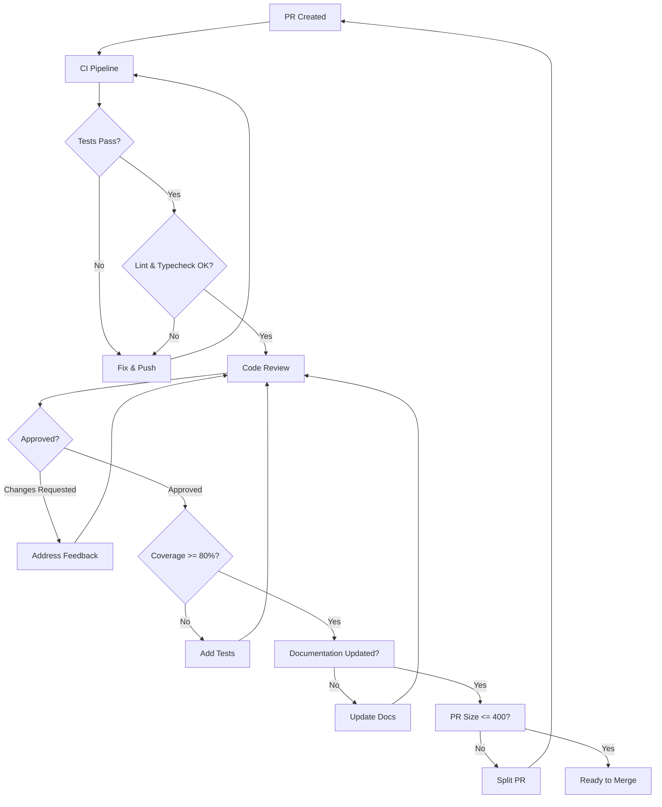

# Definition of Done

> Last Updated: 2026-07-06

This document defines the completion criteria for all work items in the Jobilo project. No PR can be merged, and no story can be marked complete, unless ALL items below are satisfied. See [DEFINITION_OF_READY.md](./DEFINITION_OF_READY.md) for pre-development criteria.

---

## 1. DoD Checklist

### 1.1 Code Implementation

| # | Criterion | Verification Method | Automated? |
|---|-----------|---------------------|------------|
| 1 | Code implements all acceptance criteria | Manual review against AC | ❌ |
| 2 | No dead code, commented-out code, or `console.log` | `pnpm lint`, manual review | ✅ |
| 3 | Feature flags used for incomplete functionality | Check for feature toggle | ❌ |
| 4 | Database migrations are idempotent (if applicable) | `prisma migrate dev` | ✅ |

### 1.2 Testing

| # | Criterion | Threshold | Command |
|---|-----------|-----------|---------|
| 5 | Unit tests pass | 100% pass | `pnpm test:unit` |
| 6 | Integration tests pass | 100% pass | `pnpm test:int` |
| 7 | E2E tests pass (if applicable) | 100% pass | `pnpm test:e2e` |
| 8 | Test coverage | >= 80% | `pnpm test -- --coverage` |
| 9 | New code has corresponding tests | Manual review | ❌ |

### 1.3 Code Quality

| # | Criterion | Tool | Command |
|---|-----------|------|---------|
| 10 | No ESLint errors | ESLint | `pnpm lint` |
| 11 | No TypeScript errors | tsc | `pnpm typecheck` |
| 12 | Prettier formatting | Prettier | `pnpm format:check` |
| 13 | Imports follow ordering rules | ESLint import plugin | `pnpm lint` |

### 1.4 Code Review

| # | Criterion | Detail |
|---|-----------|--------|
| 14 | PR reviewed and approved | At least 1 approval for `develop`, 2 for `main` |
| 15 | Reviewer feedback addressed | All conversations resolved |
| 16 | No self-approval | Always request external review |

### 1.5 Documentation

| # | Criterion | Location |
|---|-----------|----------|
| 17 | JSDoc on all public APIs | In code |
| 18 | OpenAPI spec updated (if API change) | `docs/api/openapi.yaml` |
| 19 | ADR created (if architectural decision) | `docs/governance/DECISION_LOG.md` |
| 20 | README updated (if workflow change) | Project README |
| 21 | Changelog updated | `CHANGELOG.md` |

### 1.6 PR Quality

| # | Criterion | Rule |
|---|-----------|------|
| 22 | PR title follows Conventional Commits | See [COMMIT_CONVENTION.md](./COMMIT_CONVENTION.md) |
| 23 | PR description template completed | Summary, testing, screenshots |
| 24 | Branch name follows convention | See [BRANCHING_STRATEGY.md](./BRANCHING_STRATEGY.md) |
| 25 | PR size <= 400 lines changed | Excludes generated files |
| 26 | Commit history is clean (squash before merge) | Single commit per feature |

### 1.7 Operational Readiness

| # | Criterion | Detail |
|---|-----------|--------|
| 27 | Migration scripts ready (if DB changes) | Must be reversible |
| 28 | Rollback plan documented (if sensitive) | How to revert the change |
| 29 | Feature flag configured (if gradual rollout) | Flag name + default value |
| 30 | Observability: logging/metrics added | Structured logs, relevant metrics |

### 1.8 Security

| # | Criterion | Detail |
|---|-----------|--------|
| 31 | Security review completed (if sensitive area) | Auth, payments, PII |
| 32 | No secrets committed | Check `.env`, hardcoded keys |
| 33 | Input validation in place | class-validator DTOs |
| 34 | Output sanitization (if user-generated content) | XSS prevention |
| 35 | Rate limiting considered (if public endpoint) | ThrottleGuard or similar |

### 1.9 Performance

| # | Criterion | Method |
|---|-----------|--------|
| 36 | Performance impact assessed | Load test results or reasoning |
| 37 | No N+1 queries | Prisma `include`/`select` checked |
| 38 | Database indexes considered | `EXPLAIN ANALYZE` for new queries |
| 39 | Bundle size impact assessed (if frontend) | `next build` analysis |

---

## 2. DoD Verification Flow

---

## 3. Exceptions

Exceptions to the DoD must be approved by a Maintainer and documented in the PR description:

| Exception | Approval Required | Example |
|-----------|------------------|---------|
| Skip security review | Maintainer | Trivial UI change |
| Coverage < 80% | Maintainer | Prototype / PoC |
| PR > 400 lines | Committer + Maintainer | Generated code |
| Missing documentation | Committer | Internal-only change |

---

## 4. Related Documents

- [DEFINITION_OF_READY.md](./DEFINITION_OF_READY.md) — Pre-development criteria
- [CODE_REVIEW_GUIDE.md](./CODE_REVIEW_GUIDE.md) — Review process
- [CODING_STANDARDS.md](./CODING_STANDARDS.md) — Style enforcement
- [ARCHITECTURE_PRINCIPLES.md](./ARCHITECTURE_PRINCIPLES.md) — Design review
- [DEVELOPMENT_GUIDELINES.md](./DEVELOPMENT_GUIDELINES.md) — PR workflow
