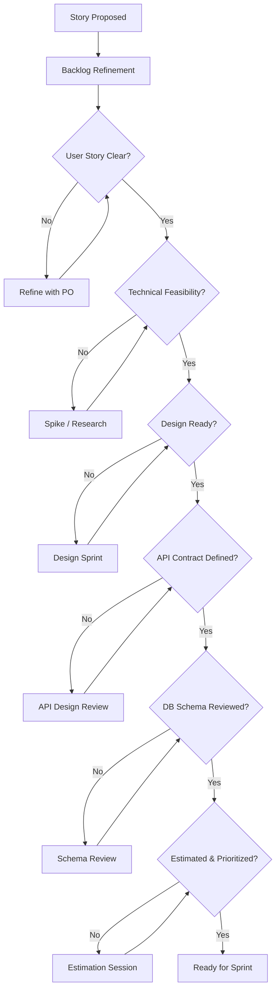

# Definition of Ready

> Last Updated: 2026-07-06

This document defines the pre-development criteria that must be met before work can begin on any story, task, or feature in the Jobilo project. See [DEFINITION_OF_DONE.md](./DEFINITION_OF_DONE.md) for post-development completion criteria.

---

## 1. DoR Checklist

### 1.1 Story Clarity

| # | Criterion | Verification Method |
|---|-----------|---------------------|
| 1 | User story follows the "As a... I want... So that..." format | Product owner review |
| 2 | Acceptance criteria are specific, measurable, and testable | QA review |
| 3 | Edge cases and error states are described in AC | QA review |
| 4 | Non-functional requirements are documented (performance, security, accessibility) | Tech lead review |

**Example User Story:**

```markdown
**As a** job seeker
**I want** to filter job listings by salary range
**So that** I can find positions within my expected compensation

**Acceptance Criteria:**
- AC1: User can set minimum and maximum salary values
- AC2: Results update in real-time (debounced, 300ms)
- AC3: Salary filter persists in URL query params for sharing
- AC4: Empty state shown when no results match filters
- AC5: Filter is keyboard accessible (tab, enter, arrow keys)
- AC6: Screen reader announces filtered result count
```

### 1.2 Technical Feasibility

| # | Criterion | Owner |
|---|-----------|-------|
| 5 | Technical feasibility confirmed | Tech lead |
| 6 | Architecture approach agreed (with diagram if complex) | Tech lead |
| 7 | Dependencies on other teams/modules identified | Tech lead |
| 8 | Third-party service integration validated | Infrastructure lead |
| 9 | Database schema changes reviewed and approved | DBA / backend lead |

### 1.3 Design Readiness

| # | Criterion | Owner |
|---|-----------|-------|
| 10 | Wireframes or mockups ready (if UI change) | Designer |
| 11 | Design system components identified | Designer |
| 12 | Responsive/adaptive layouts defined | Designer |
| 13 | Animation/micro-interaction specs documented | Designer |
| 14 | Accessibility considerations addressed | Designer + Developer |

### 1.4 API Contract

| # | Criterion | Owner |
|---|-----------|-------|
| 15 | API endpoints defined (method, path, request/response) | Backend lead |
| 16 | Request/response schemas documented (OpenAPI) | Backend lead |
| 17 | Error response codes and formats defined | Backend lead |
| 18 | Rate limiting requirements documented | Backend lead |
| 19 | Authentication/authorization requirements specified | Security lead |

**Example API Contract:**

```yaml
# OpenAPI 3.1 snippet
GET /api/jobs
Parameters:
  - name: salaryMin
    in: query
    schema: { type: number, minimum: 0 }
  - name: salaryMax
    in: query
    schema: { type: number, minimum: 0 }
Responses:
  200:
    content:
      application/json:
        schema:
          type: array
          items:
            $ref: '#/components/schemas/JobListing'
  401:
    description: Unauthenticated
```

### 1.5 Database

| # | Criterion | Owner |
|---|-----------|-------|
| 20 | Database schema changes reviewed (Prisma schema diff) | Backend lead |
| 21 | Migration strategy defined (expand-contract, etc.) | Backend lead |
| 22 | Index requirements identified | Backend lead |
| 23 | Data migration scripts specified (if data transformation needed) | Backend lead |
| 24 | RLS policies defined (if multi-tenant) | Backend lead |

### 1.6 Estimation & Planning

| # | Criterion | Owner |
|---|-----------|-------|
| 25 | Story estimated in story points (Fibonacci: 1, 2, 3, 5, 8, 13) | Team |
| 26 | Story broken down if > 13 points | Tech lead + PO |
| 27 | Task breakdown created (sub-tasks for > 1 day of work) | Developer |
| 28 | Dependencies on other stories identified | PO |
| 29 | Priority assigned in backlog | PO |
| 30 | Sprint assigned (or flagged for backlog refinement) | PO |

### 1.7 Dependencies & Blockers

| # | Criterion | Owner |
|---|-----------|-------|
| 31 | External dependencies identified (other services, libraries) | Tech lead |
| 32 | No unresolved external blockers | PO |
| 33 | Required secrets / environment variables configured | DevOps |
| 34 | Feature flag created (if gradual rollout) | Developer |

---

## 2. DoR Verification Flow



---

## 3. What Happens When a Story Is Not Ready

| Scenario | Action |
|----------|--------|
| AC is unclear | Schedule refinement session with PO |
| Technical uncertainty | Create a spike (time-boxed research, max 2 days) |
| Missing design | Flag in sprint planning, swap with ready story |
| Blocked by external dependency | Update story status to "Blocked", add blocker note |
| Exceeds 13 points | Split into smaller stories |

---

## 4. DoR Gate

The DoR gate is checked at **Sprint Planning**. A story that does not meet DoR:
- **Cannot be committed** to the sprint
- Must be moved back to **Backlog** or **Refinement**
- Exception: PO + Tech lead can jointly waive specific criteria for time-sensitive items

---

## 5. Related Documents

- [DEFINITION_OF_DONE.md](./DEFINITION_OF_DONE.md) — Post-development completion criteria
- [ARCHITECTURE_PRINCIPLES.md](./ARCHITECTURE_PRINCIPLES.md) — Design approach
- [CODING_STANDARDS.md](./CODING_STANDARDS.md) — Implementation rules
- [DEVELOPMENT_GUIDELINES.md](./DEVELOPMENT_GUIDELINES.md) — Dev workflow
- [GOVERNANCE.md](./GOVERNANCE.md) — Decision-making process
