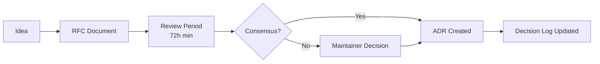

# Technical Decisions Log

> Last Updated: 2026-07-06

This document indexes all Architecture Decision Records (ADRs) for the Jobilo project. ADRs are created following the RFC process described below. Each decision is documented using the [ADR_TEMPLATE.md](./ADR_TEMPLATE.md).

---

## 1. Decision-Making Framework (RFC Process)

Major technical decisions follow an RFC (Request for Comments) process:

### Steps

1. **Idea** — Anyone identifies a need for a technical decision
2. **RFC Document** — Author writes a proposal following [ADR_TEMPLATE.md](./ADR_TEMPLATE.md) and opens a PR in `docs/`
3. **Review Period** — Minimum 72 hours for comments from the team
4. **Consensus** — Decision reached per [GOVERNANCE.md](./GOVERNANCE.md#decision-making-process)
5. **ADR Created** — Finalized ADR is merged to `docs/governance/`
6. **Log Updated** — Entry added to [DECISION_LOG.md](./DECISION_LOG.md)

---

## 2. ADR Index

| ADR # | Title | Status | Date | Author |
|-------|-------|--------|------|--------|
| [ADR-001](./DECISION_LOG.md#adr-001) | Use NestJS for Backend | ✅ Accepted | 2026-06-01 | @tech-lead |
| [ADR-002](./DECISION_LOG.md#adr-002) | Use Next.js 14+ App Router for Frontend | ✅ Accepted | 2026-06-01 | @tech-lead |
| [ADR-003](./DECISION_LOG.md#adr-003) | PostgreSQL 16 with Prisma ORM | ✅ Accepted | 2026-06-02 | @backend-lead |
| [ADR-004](./DECISION_LOG.md#adr-004) | JWT for Authentication with Refresh Tokens | ✅ Accepted | 2026-06-05 | @security-lead |
| [ADR-005](./DECISION_LOG.md#adr-005) | No Payment Module in MVP | ✅ Accepted | 2026-06-10 | @product-owner |
| [ADR-006](./DECISION_LOG.md#adr-006) | Turborepo for Monorepo Management | ✅ Accepted | 2026-06-15 | @devops-lead |
| [ADR-007](./DECISION_LOG.md#adr-007) | Zustand for Client-State Management | ⏳ Proposed | 2026-06-20 | @frontend-lead |
| [ADR-008](./DECISION_LOG.md#adr-008) | Sentry for Error Monitoring | ⏳ Proposed | 2026-06-22 | @devops-lead |
| [ADR-009](./DECISION_LOG.md#adr-009) | Redis for Session Caching and Rate Limiting | ✅ Accepted | 2026-06-25 | @backend-lead |

---

## 3. Status Definitions

| Status | Meaning |
|--------|---------|
| **Proposed** | RFC is under review, no decision made |
| **Accepted** | Decision has been made and approved |
| **Deprecated** | Decision is no longer relevant, but not replaced |
| **Superseded** | Decision has been replaced by a newer ADR |

---

## 4. How to Propose a New ADR

1. Copy the template from [ADR_TEMPLATE.md](./ADR_TEMPLATE.md)
2. Name the file `docs/governance/adr/adr-XXX-title.md`
3. Open a PR with the ADR as the only change
4. Add the `adr` label to the PR
5. Update this index and [DECISION_LOG.md](./DECISION_LOG.md) with the new entry after approval

---

## 5. Related Documents

- [ADR_TEMPLATE.md](./ADR_TEMPLATE.md) — ADR template
- [DECISION_LOG.md](./DECISION_LOG.md) — Full decision log with details
- [GOVERNANCE.md](./GOVERNANCE.md) — Decision-making process
- [ARCHITECTURE_PRINCIPLES.md](./ARCHITECTURE_PRINCIPLES.md) — Guiding principles
